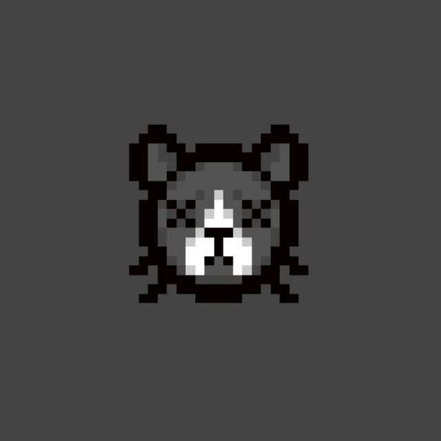
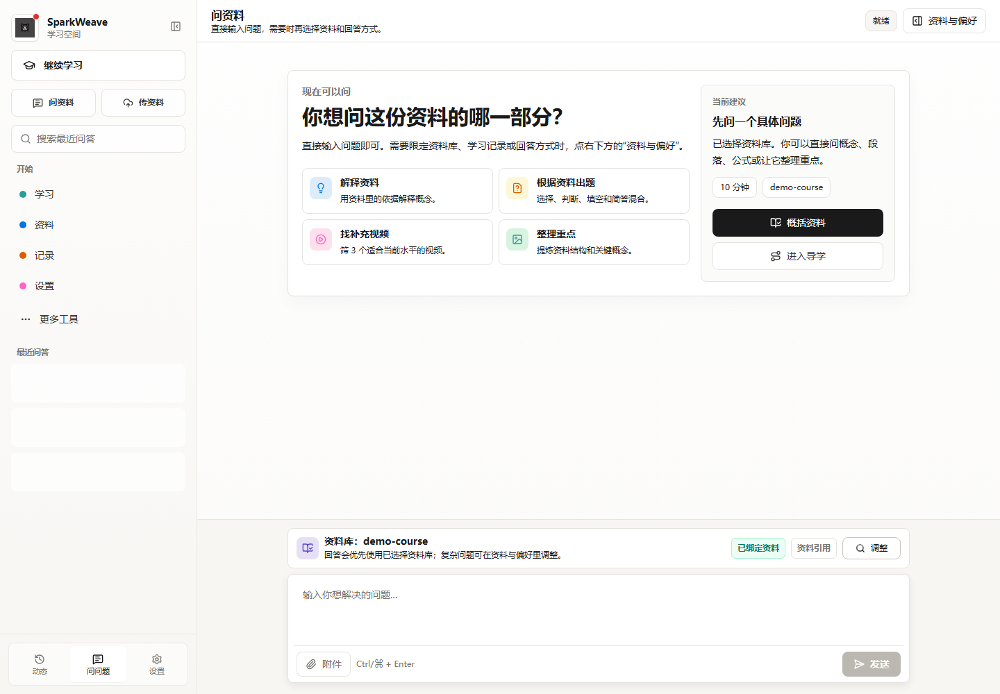
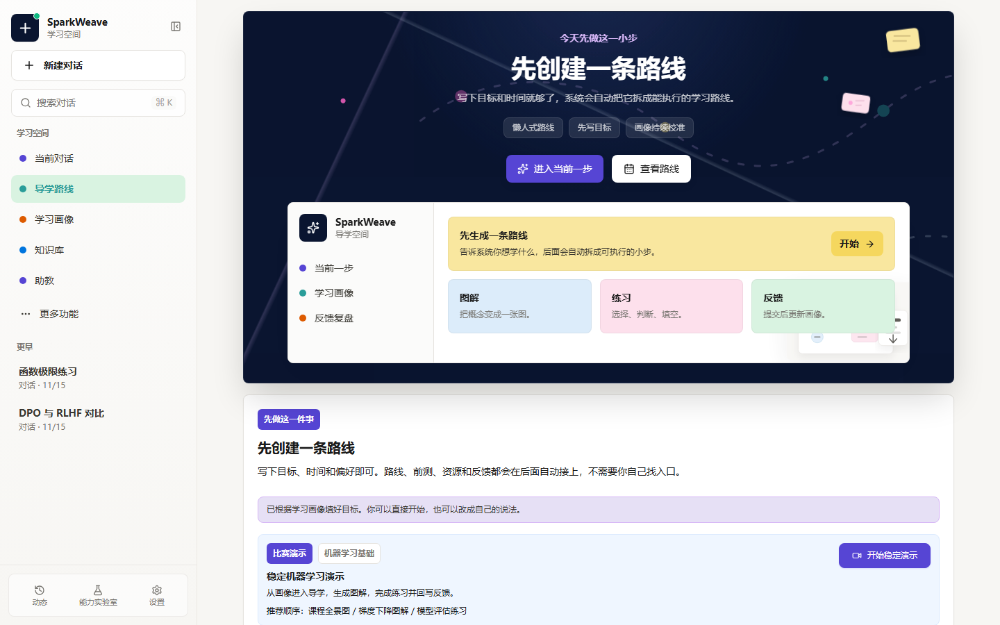
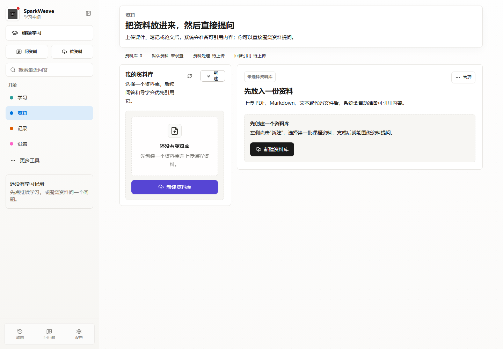
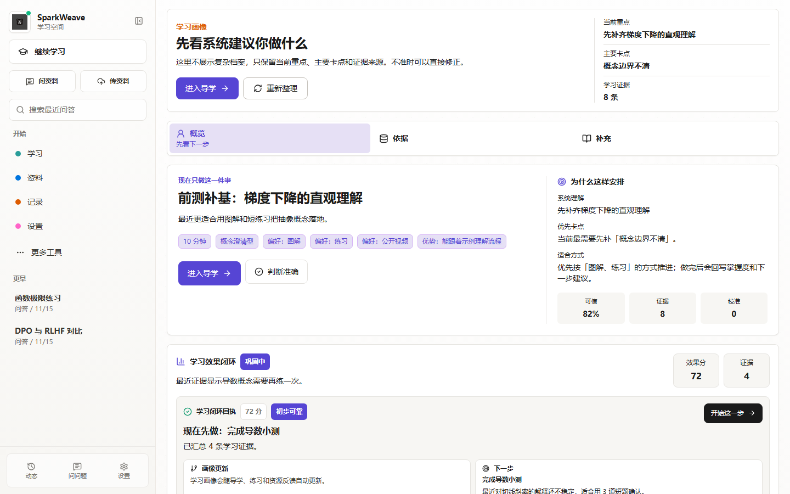
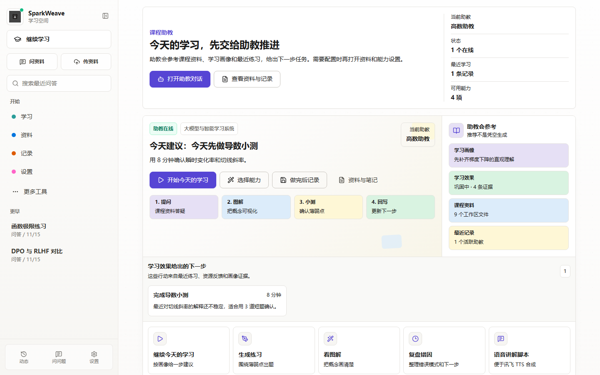
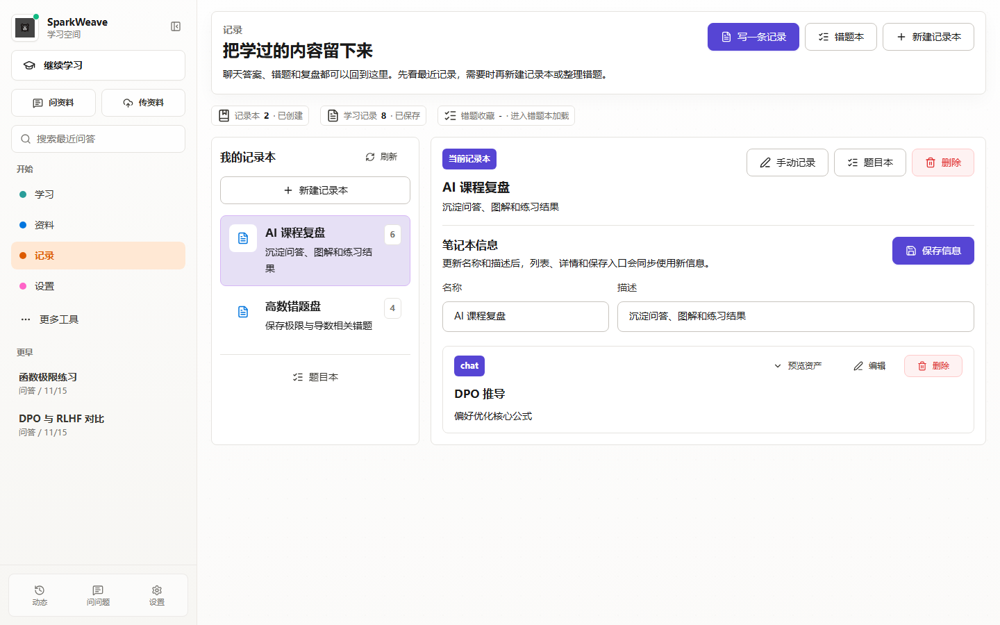

<p align="center">
  
</p>

<h1 align="center">SparkWeave 星火织学</h1>

<p align="center">
  <strong>面向个性化学习的 Agent-Native 智能学习系统</strong>
</p>

<p align="center">
  用可追踪的智能体编排、证据驱动的学习画像与 Evidence RAG，把课程资料转化为答疑、练习、导学、可视化讲解和学习效果闭环。
</p>

<p align="center">
  <a href="https://github.com/Benzoquinone000/sparkweave/actions/workflows/ci.yml">
    
  </a>
  
  
  
  
  
</p>

<p align="center">
  <a href="#核心能力">核心能力</a> ·
  <a href="#使用路径">使用路径</a> ·
  <a href="#系统架构">系统架构</a> ·
  <a href="#界面预览">界面预览</a> ·
  <a href="#快速开始">快速开始</a> ·
  <a href="#设计文档">设计文档</a>
</p>

## 项目定位

SparkWeave 是一个面向真实学习场景的智能学习工作台。它不是单一聊天机器人，而是把 CLI、WebSocket API、Python SDK 接入同一套 Agent Runtime，让 Chat、RAG、学习画像、导学、题目生成和可视化能力在后台协同。

产品入口保持简单：学习、资料、记录、设置。工程能力默认后台化，用户只需要继续学习、上传资料、问资料或查看记录。

## 使用路径

| 用户要做什么 | 推荐入口 | SparkWeave 在后台做什么 |
| --- | --- | --- |
| 继续学习 | 学习 / Guide | 结合画像、课程资料和历史练习生成下一步任务 |
| 上传并询问资料 | 资料 / Chat | 建立知识库、检索证据、生成带来源的回答 |
| 复盘错题和笔记 | 记录 / Notebook | 保存题目、笔记、会话证据，并更新学习状态 |
| 校准学习画像 | 记录 / Memory | 展示依据，支持确认、否定和修正画像判断 |
| 调整模型与服务 | 设置 | 管理 LLM、Embedding、搜索、OCR、TTS 等 provider |

## 核心能力

| 能力 | 对学习用户的价值 | 后台实现 |
| --- | --- | --- |
| Agent 编排 | 不需要手动选择工具，直接表达学习任务 | Tool + Capability 双层架构、统一 Orchestrator、LangGraph capability graph |
| Evidence RAG | 问资料时看到答案依据，而不是只得到泛泛回答 | Milvus-first、retrieval policy、HyDE、Agentic 多路召回、rerank、Context Pack |
| 学习画像 / 记忆 | 系统能记住目标、薄弱点、偏好和上下文 | Markdown Memory、Evidence Ledger、Learner Profile、Profile Context |
| 学习闭环 | 对话、练习、资源、导学和评估能串成连续学习过程 | Guide V2、Notebook、Learning Effect、turn event 持久化 |
| 多端入口 | 前端、CLI、SDK 和 WebSocket 使用同一套能力 | `SparkWeaveApp`、`/api/v1/ws`、Typer CLI |

<p align="center">
  
</p>

## 系统架构

SparkWeave 的主链路是统一的 turn runtime：

```text
CLI / WebSocket / Python SDK
  -> SparkWeaveApp / ChatOrchestrator
  -> RuntimeRoutingTurnManager
  -> LangGraphTurnRuntimeManager
  -> UnifiedContext
  -> LangGraphRunner
  -> ChatGraph / 专业 Capability Graph
  -> StreamEvent 持久化、订阅、重放
```

<p align="center">
  
</p>

## 界面预览

| 问资料 | 个性化导学 |
| --- | --- |
|  |  |
| 默认聚焦提问、资料选择和来源证据。 | 根据画像生成任务、资源建议、练习反馈和下一步行动。 |

| 资料工作区 | 学习画像 / 记忆 |
| --- | --- |
|  |  |
| 上传、提问、处理记录是主入口，高级诊断后置。 | 展示长期偏好、薄弱点、证据来源和校准反馈。 |

| 课程助教 | 学习记录 |
| --- | --- |
|  |  |
| 基于课程资料、学习画像和最近练习生成今日任务。 | 保存笔记、题目、资料引用和学习过程，方便复盘。 |

## 快速开始

准备环境：

- Git
- Docker Desktop（含 Docker Compose v2）

Provider auth (`openai-codex` OAuth login; `github-copilot` validates an existing Copilot auth session).

1. 克隆项目并准备环境变量：

```powershell
git clone https://github.com/Benzoquinone000/sparkweave.git
cd sparkweave
copy .env.example .env
```

2. 打开 `.env`，至少填写模型和 embedding 配置。使用本机 LM Studio / Ollama / vLLM 时，容器内不能写 `localhost`，请把 host 改成 `host.docker.internal`，例如：

```dotenv
LLM_BINDING=openai
LLM_MODEL=your-model
LLM_API_KEY=your-key
LLM_HOST=https://api.openai.com/v1

EMBEDDING_BINDING=openai
EMBEDDING_MODEL=text-embedding-3-large
EMBEDDING_API_KEY=your-key
EMBEDDING_HOST=https://api.openai.com/v1
```

3. 构建并启动开发服务：

```powershell
docker compose up --build
```

4. 查看状态和日志：

```powershell
docker compose ps
docker compose logs -f backend
docker compose logs -f frontend
```

5. 停止服务：

```powershell
docker compose down
```

默认入口：

| 服务 | 地址 |
| --- | --- |
| 前端工作台 | http://localhost:3782 |
| 后端 API | http://localhost:8001 |
| API 文档 | http://localhost:8001/docs |
| Milvus Web UI | http://localhost:9091/webui/ |

常用 Docker 命令：

```powershell
docker compose up -d milvus
docker compose logs -f milvus
docker compose up --build
```

默认 Docker 启动就是前后端分离热启动：

| 服务 | 地址 | 热更新 |
| --- | --- | --- |
| `backend` | http://localhost:8001 | `uvicorn --reload`，挂载 `sparkweave/`、`sparkweave_cli/` |
| `frontend` | http://localhost:3782 | Vite HMR，挂载 `web/` |

只看前端日志：

```powershell
docker compose logs -f frontend
```

只看后端日志：

```powershell
docker compose logs -f backend
```

## 设计文档

| 想了解 | 入口 |
| --- | --- |
| 文档总览 | [docs/README.md](docs/README.md) |
| 智能体编排 | [docs/agent-orchestration-design.md](docs/agent-orchestration-design.md) |
| RAG 系统 | [docs/rag-system-design.md](docs/rag-system-design.md) |
| 学习画像 / 记忆 | [docs/learner-profile-memory-design.md](docs/learner-profile-memory-design.md) |
| RAG 评测样例 | [docs/examples/rag_eval_dataset.sample.jsonl](docs/examples/rag_eval_dataset.sample.jsonl) |
| 机器学习课程评测样例 | [docs/examples/rag_eval_dataset.ml_course.sample.jsonl](docs/examples/rag_eval_dataset.ml_course.sample.jsonl) |

## 目录结构

```text
sparkweave/        后端服务、Agent Runtime、LangGraph 能力图与业务服务
sparkweave_cli/    Typer CLI 入口
web/               Vite + React + TypeScript 前端
scripts/           启动、检查、导出与维护脚本
requirements/      CLI、Server、Dev、Math Animator 等分层依赖
docs/              Agent 编排、RAG、学习画像与评测样例
assets/            Logo 与系统素材
data/              本地知识库、记忆、用户画像和运行数据
```

## 质量检查

```powershell
python scripts/check_install.py
python scripts/check_release_safety.py
python -m compileall -q sparkweave tests

cd web
npm run lint
npm run check:api-contract
npm run build
```

## License

Apache License 2.0
