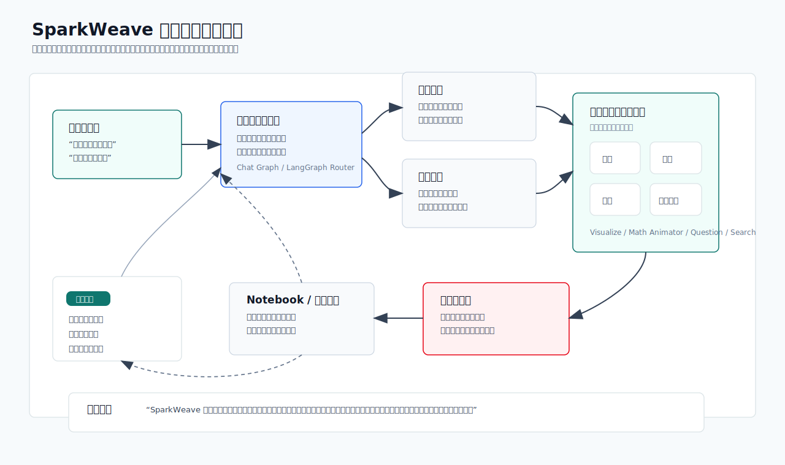
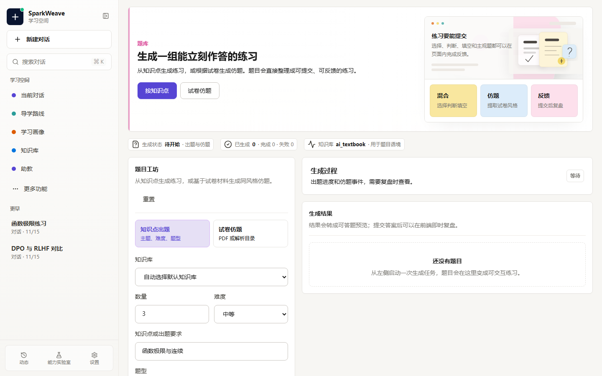
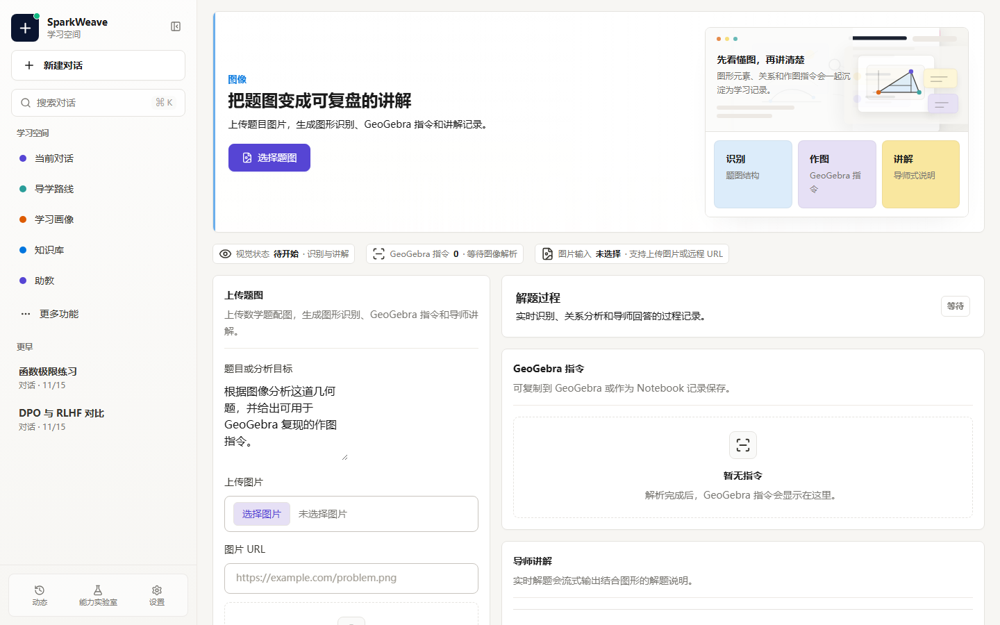
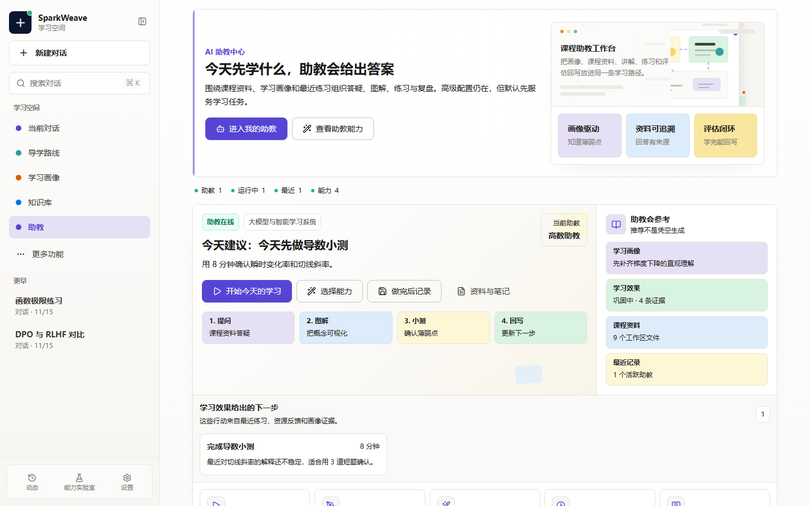
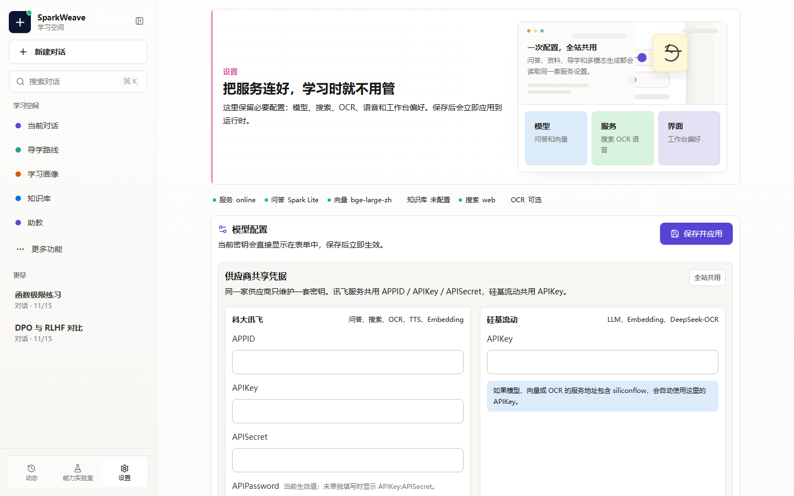
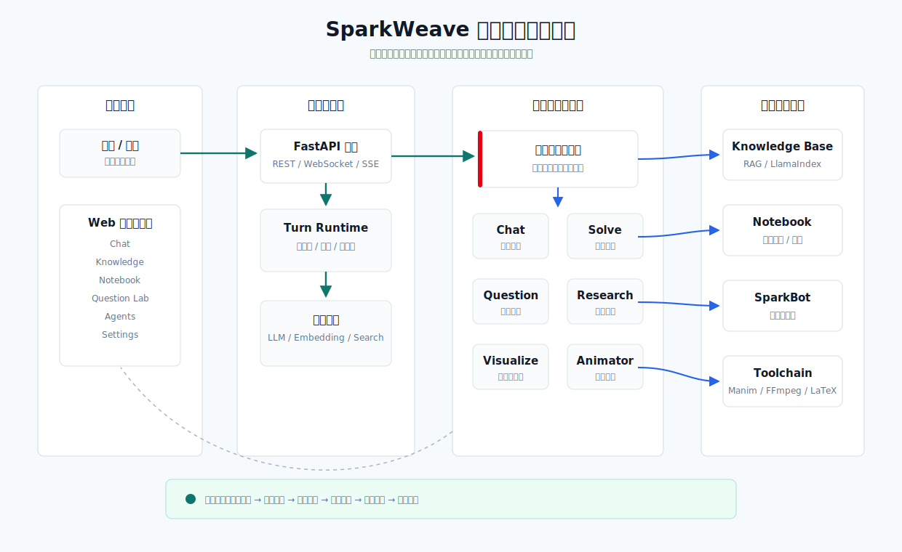
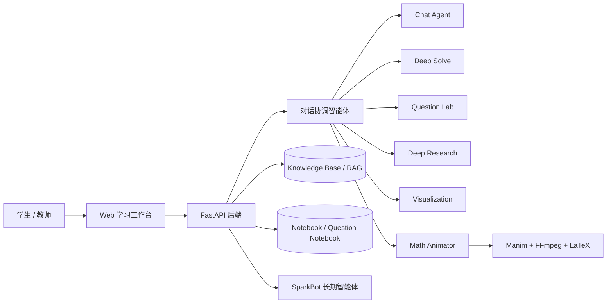

<p align="center">
  
</p>

<h1 align="center">SparkWeave 星火织学</h1>

<p align="center">
  面向高校课程学习的多智能体个性化学习系统
</p>

<p align="center">
  <a href="https://github.com/Benzoquinone000/sparkweave/actions/workflows/ci.yml">
    
  </a>
  
  
  
  
</p>

SparkWeave 星火织学围绕“对话式学习画像自主构建、多智能体协同资源生成、个性化学习路径规划、智能辅导、学习效果评估”构建。系统后端由 `sparkweave` 提供，前端由 `web` 提供，支持在同一学习工作台内完成资料导入、知识问答、题目生成、可视化解释、数学动画视频讲解、Notebook 沉淀与 SparkBot 长期陪伴。

## 60 秒看懂

| 你想了解 | 直接看这里 |
| --- | --- |
| 项目解决什么问题 | 学生只跟着“当前任务”走，系统在背后完成画像、资源、练习、反馈和路径调整。 |
| 比赛五项如何对齐 | [赛题对齐路线](docs/competition-roadmap.md)、`dist/demo_materials/sparkweave-competition-scorecard.md` |
| 多智能体协作在哪里 | [多智能体协作蓝图](docs/guided-learning.md#课程产出包与比赛材料)、[静态架构图](docs/assets/agent-collaboration-blueprint.svg)、`sparkweave-agent-collaboration-blueprint.md` |
| 7 分钟视频怎么录 | [演示者 5 分钟入口](docs/demo-quickstart.md)、[比赛 Runbook](docs/competition-demo-runbook.md) |
| 科大讯飞工具怎么用 | [科大讯飞能力接入说明](docs/iflytek-integration.md) |

最快演示路径：启动项目后打开 `http://localhost:3782/guide`，选择“大模型教育智能体系统开发”课程，按“当前任务 -> 生成资源 -> 提交反馈 -> 学习报告 -> 课程产出包”走一遍。

## 项目亮点

| 方向 | 能力 |
| --- | --- |
| 学习画像 | 从对话、知识库引用、题目练习、Notebook 记录中持续沉淀学习偏好和薄弱点。 |
| 多智能体协作 | 对话协调智能体按任务自动唤醒求解、出题、研究、可视化、数学动画等能力图。 |
| 资源生成 | 支持课程问答、练习题、学习路径、图表说明、SVG/Mermaid 可视化和 Manim 视频讲解。 |
| 个性化推送 | 结合 RAG、历史会话、学习记录和题目反馈，形成下一步学习建议。 |
| 效果评估 | 通过交互式题库、答题回写和学习记录，形成“学习-练习-反馈-再规划”闭环。 |

## 多智能体协作蓝图

<p align="center">
  
</p>

## 页面展示

以下截图来自 `web/` 目录，展示当前前端的主要学习场景。

| 学习工作台 | 知识库管理 |
| --- | --- |
|  |  |

| 题目生成 | 图像解题 |
| --- | --- |
|  |  |

| Notebook 沉淀 | SparkBot 助教中心 |
| --- | --- |
|  |  |

| 懒人式导学 | 系统设置 |
| --- | --- |
|  |  |

| 页面 | 说明 |
| --- | --- |
| `/chat` | 主学习工作台，支持能力切换、知识库引用、多智能体轨迹、数学动画和可视化结果展示。 |
| `/knowledge` | 知识库创建、资料上传、索引进度、默认知识库切换和 RAG 状态管理。 |
| `/notebook` | 保存学习记录、查看题目收藏、沉淀课程笔记和生成结果。 |
| `/guide` | 个性化学习路径规划、课程引导和资源推荐。 |
| `/co-writer` | 写作辅助、结构改写、内容润色和反馈建议。 |
| `/agents` | SparkBot 管理、多智能体工作区、渠道配置和长期记忆。 |
| `/settings` | LLM、Embedding、搜索、运行环境和依赖检测。 |

## 系统架构

<p align="center">
  
</p>

<details>
<summary>查看 Mermaid 架构源码</summary>



</details>

## 演示路线

1. 在 `/knowledge` 上传课程资料并完成索引。
2. 在 `/chat` 选择知识库，围绕课程内容进行问答。
3. 请求“生成一组选择题和判断题”，进入交互式练习并回写结果。
4. 请求“把这个概念画成图”或“生成教学视频”，展示可视化和 Manim 动画。
5. 保存关键结果到 Notebook，查看学习记录和后续路径建议。
6. 在 `/agents` 展示 SparkBot 的长期工作区和多智能体协作能力。

## GitHub 上传前检查

```powershell
git status
python scripts/check_install.py
python scripts/check_ng_replacement.py
python scripts/check_web_api_contract.py
python scripts/check_course_templates.py
python scripts/check_release_safety.py
python scripts/check_competition_readiness.py
python scripts/export_demo_materials.py
python scripts/export_competition_package.py
python -m sparkweave_cli competition-check
python -m sparkweave_cli competition-package
python -m sparkweave_cli competition-verify dist/sparkweave_competition_package.zip
python -m sparkweave_cli competition-verify dist/sparkweave_competition_package.zip --format json --output dist/competition-package-verify.json
python -m sparkweave_cli competition-preflight
python -m sparkweave_cli competition-preflight --with-build --report dist/competition-readiness.json --summary dist/competition-readiness.md --archive dist/sparkweave_competition_package.zip --verify-report dist/competition-package-verify.json
python -m sparkweave_cli learning-effect summary --output dist/learning-effect-summary.md
python scripts/render_competition_summary.py dist/competition-readiness.json --output dist/competition-readiness.md
cd web
npm run lint
npm run build
cd ..
```

`scripts/export_demo_materials.py` 会离线生成 PPT 骨架、可打印演示页、7 分钟录屏讲稿、多智能体协作蓝图、赛题评分点证据表、答辩问答预案和最终答辩材料清单，适合作为赛前起稿材料。
`scripts/export_competition_package.py` 会把比赛文档、课程模板、页面截图、架构图和运行配置样例整理到 `dist/competition_package/`，并生成 `START_HERE.md`、解压后可直接打开的 `index.html` 材料导航页和 `checksums.sha256` 完整性校验清单；可用 `--template higher_math_limits_derivatives` 为不同课程样例生成对应演示材料。
`scripts/verify_competition_package.py` 可独立验证导出的目录或 zip：检查必备文件、危险条目和 SHA256 校验清单，适合下载 artifact 后复核；加上 `--format json --output dist/competition-package-verify.json` 可留下机器可读验证报告。
`scripts/check_competition_readiness.py` 会在临时目录中生成演示材料和提交包，并检查文档、截图、课程模板、运行脚本等关键交付物是否齐全；需要归档时可运行 `python -m sparkweave_cli competition-check --format json --output dist/competition-readiness.json` 生成结构化报告。
`scripts/render_competition_summary.py` 会把结构化就绪报告压缩成一页 Markdown 摘要；GitHub Actions 也会把这份摘要写到运行页面，并上传 `competition-readiness` artifact。
CLI 也提供赛前入口：`python -m sparkweave_cli competition-templates` 列出课程模板，`python -m sparkweave_cli competition-demo` 导出演示材料，`python -m sparkweave_cli competition-package` 导出提交包；想少记命令时直接运行 `python -m sparkweave_cli competition-preflight`，它会先检查再打包并自动验证最终提交包。正式录屏或提交前建议使用 `python -m sparkweave_cli competition-preflight --with-build --report dist/competition-readiness.json --summary dist/competition-readiness.md --archive dist/sparkweave_competition_package.zip --verify-report dist/competition-package-verify.json`，它会在打包前额外运行前端生产构建，同时生成一页式就绪摘要、最终提交包验证报告和可直接上传的 zip 提交包。
学习效果评估可用 `python -m sparkweave_cli learning-effect summary --output dist/learning-effect-summary.md` 单独导出一页证据摘要，用于说明“证据如何写回画像、系统如何生成下一步处方、错因如何补救复测闭环”。

上传前请确认 `.env`、`data/user/`、`data/memory/`、`web/node_modules/`、`web/dist/` 等本地配置、运行数据和构建产物没有进入暂存区。

首次上传 GitHub 可以使用：

```powershell
git init
git add .
git status
git commit -m "Initial SparkWeave release"
git branch -M main
git remote add origin https://github.com/<your-name>/<repo-name>.git
git push -u origin main
```

## 目录结构

```text
sparkweave/        后端服务、LangGraph 能力图、多智能体与业务服务
sparkweave_cli/    命令行入口
web/               Vite + React + TypeScript 前端
scripts/           启动、检查和维护脚本
requirements/      全量运行依赖与分层依赖集合
assets/            Logo 与项目展示素材
data/              本地用户数据、记忆、知识库和运行产物
```

## 运行环境

- Docker Desktop（推荐启动方式，负责前端、后端、Milvus、etcd、MinIO）
- Python 3.11+
- Node.js 20+
- 可用的 LLM API Key 和 Embedding API Key
- FFmpeg：数学动画视频编码
- MiKTeX：`MathTex`/`Tex` 公式渲染
- Manim、MinerU、Milvus/LlamaIndex、SparkBot 等 Python 依赖会通过全量依赖安装

## 全量配置与启动

以下命令默认在项目根目录执行：

```powershell
cd C:\Users\hjk\sparkweave
```

建议使用独立 Conda 环境。新机器推荐创建 `sparkweave` 环境：

```powershell
conda create -n sparkweave python=3.11 -y
conda activate sparkweave
```

安装系统级视频依赖：

```powershell
conda install -c conda-forge ffmpeg -y
```

安装 LaTeX。Windows 推荐安装 MiKTeX，用于 Manim 的 `MathTex`/`Tex` 公式渲染：

- 官方下载页：https://miktex.org/howto/install-miktex
- 下载并运行 Windows installer。
- 安装范围建议选 `Only for me`，避免权限问题。
- 缺包安装建议选 `Always install missing packages on-the-fly`；如果安装器没有出现该选项，安装后打开 MiKTeX Console，在 `Settings` 中把 `Install missing packages on-the-fly` 改为 `Yes`。
- 关闭并重新打开 PowerShell，让 `latex`、`dvisvgm`、`mpm` 等命令进入 `PATH`。
- 补齐 Manim 常用公式包并刷新索引：

  ```powershell
  mpm --install=preview
  initexmf --update-fndb
  kpsewhich preview.sty
  ```

- 验证命令：

  ```powershell
  latex --version
  dvisvgm --version
  kpsewhich preview.sty
  ```

安装 Python 全量运行依赖：

```powershell
python -m pip install --upgrade pip setuptools wheel
pip install -r requirements.txt
pip install -e .
```

安装前端依赖：

```powershell
cd web
npm install
cd ..
```

复制并填写配置：

```powershell
copy .env.example .env
```

至少填写 `.env` 中的 `LLM_*` 与 `EMBEDDING_*`。以后默认通过 Docker 启动完整项目，前端、后端、Milvus、etcd、MinIO 都由 Docker Compose 管理：

```powershell
python scripts/start_docker.py
```

默认访问地址：

- 前端：`http://localhost:3782`
- 后端：`http://localhost:8001`
- API 文档：`http://localhost:8001/docs`
- Milvus Web UI：`http://localhost:9091/webui/`

常用 Docker 命令：

```powershell
python scripts/start_docker.py --status
python scripts/start_docker.py --logs
python scripts/start_docker.py --down
```

如果你已经在本机直接运行后端和前端，只需要为 RAG 启动向量数据库，可以使用轻量入口：

```powershell
python scripts/start_docker.py --milvus-only
python scripts/start_docker.py --milvus-only --status
```

开发时需要 Docker 热加载，可以启动开发覆盖配置：

```powershell
python scripts/start_docker.py --dev --logs
```

这个模式会把本地 `sparkweave/`、`sparkweave_cli/`、`scripts/` 和 `web/src`、`web/public` 等目录挂载到容器内。后端使用 `uvicorn --reload`，前端使用 Vite HMR；在 Windows / Docker Desktop 下已经开启文件轮询，避免保存文件后容器没有感知变化。改依赖、Dockerfile、`package.json` 或底层系统包时仍然需要重新构建：

```powershell
python scripts/start_docker.py --dev --recreate
```

`scripts/start_web.py` 仅保留为本地开发备用入口，不再作为推荐启动方式。全量配置完成后，聊天、知识库 RAG、题目生成、Notebook、SparkBot、多智能体协作、图表可视化、数学动画视频和 PDF 题目仿写能力都会使用同一套 Docker 环境运行。

比赛提交相关材料可直接参考：

- [赛题对齐与后续开发路线](docs/competition-roadmap.md)
- [演示脚本：画像驱动导学闭环](docs/demo-script-profile-guide-loop.md)
- [稳定课程 Demo 模板](docs/demo-course-templates.md)
- [AI Coding 工具使用说明](docs/ai-coding-statement.md)

## 配置 `.env`

可以从示例文件复制：

```powershell
copy .env.example .env
```

至少需要配置问答模型：

```env
LLM_BINDING=openai
LLM_MODEL=gpt-4o-mini
LLM_API_KEY=your-api-key
LLM_HOST=https://api.openai.com/v1
```

设置页按供应商维护共享凭据：科大讯飞服务共用 `IFLYTEK_APPID`、`IFLYTEK_API_KEY`、`IFLYTEK_API_SECRET`、可选 `IFLYTEK_API_PASSWORD`；硅基流动服务共用 `SILICONFLOW_API_KEY`。除非使用旧配置迁移，服务级密钥字段可以留空。

如果希望使用科大讯飞星火大模型，请在设置页选择 `iFlytek Spark X`，或直接配置：

```env
IFLYTEK_APPID=your-appid
IFLYTEK_API_KEY=your-api-key
IFLYTEK_API_SECRET=your-api-secret
LLM_BINDING=iflytek_spark_ws
LLM_MODEL=spark-x
LLM_API_KEY=
LLM_HOST=https://spark-api-open.xf-yun.com/x2/
```

讯飞星火大模型在本项目中仅保留 X2 与 X1.5 两个 OpenAI 兼容 HTTP 入口，模型名统一为 `spark-x`。X2 使用 `LLM_HOST=https://spark-api-open.xf-yun.com/x2/`，X1.5 使用 `LLM_HOST=https://spark-api-open.xf-yun.com/v2/`。若 `IFLYTEK_API_PASSWORD` 留空，运行时会按官方说明使用 `IFLYTEK_API_KEY:IFLYTEK_API_SECRET`。
比赛答辩中如需说明讯飞能力接入，可直接参考 [科大讯飞能力接入说明](docs/iflytek-integration.md)。

使用知识库 RAG 时，还需要配置 Embedding：

```env
EMBEDDING_BINDING=openai
EMBEDDING_MODEL=text-embedding-3-large
EMBEDDING_API_KEY=your-api-key
EMBEDDING_HOST=https://api.openai.com/v1
EMBEDDING_DIMENSION=3072
```

也可以在设置页选择 `iFlytek Spark Embedding`，或直接配置科大讯飞向量服务：

```env
IFLYTEK_APPID=your-appid
IFLYTEK_API_KEY=your-api-key
IFLYTEK_API_SECRET=your-api-secret
EMBEDDING_BINDING=iflytek_spark
EMBEDDING_MODEL=llm-embedding
EMBEDDING_API_KEY=
EMBEDDING_HOST=https://emb-cn-huabei-1.xf-yun.com/
EMBEDDING_DIMENSION=2560
```

讯飞 llm Embedding 使用 `APPID`、`APIKey`、`APISecret` 三项共享凭据。系统会按文档自动为文档向量使用 `domain=para`，为查询向量使用 `domain=query`，返回 2560 维 float32 向量。官方文档：https://www.xfyun.cn/doc/spark/Embedding_api.html

知识库向量检索默认使用 Milvus。Windows 原生 Python 环境建议先启动 Milvus Standalone，然后使用本地端口连接：

```env
RAG_PROVIDER=milvus
MILVUS_URI=http://localhost:19530
MILVUS_COLLECTION_PREFIX=sparkweave
```

如果使用 Docker Compose 启动整套项目，`docker compose up -d` 会同时启动 Milvus、etcd 和 MinIO；容器内会默认使用 `DOCKER_MILVUS_URI=http://milvus:19530`，不需要把容器里的 Milvus 地址写成 `localhost`。

Linux、macOS 或 WSL 环境可以使用 Milvus Lite 文件模式：`MILVUS_URI=./data/milvus/sparkweave.db`。如果要连接 Zilliz Cloud，把 `MILVUS_URI` 改成远程地址，并按需填写 `MILVUS_TOKEN`。旧的本地 LlamaIndex JSON 索引仍可作为回退方案，配置 `RAG_PROVIDER=llamaindex` 即可。更多说明见 [Milvus RAG 设计说明](docs/milvus-rag.md)。

如需让扫描版 PDF 优先走科大讯飞 OCR，可配置：

```env
IFLYTEK_APPID=your-appid
IFLYTEK_API_KEY=your-api-key
IFLYTEK_API_SECRET=your-api-secret
SPARKWEAVE_OCR_PROVIDER=iflytek
SPARKWEAVE_PDF_OCR_STRATEGY=iflytek_first
```

`iflytek_first` 表示知识库 PDF 会先调用讯飞 OCR；当 OCR 未配置、网络失败、接口报错或返回为空时，会自动回退到默认 PyMuPDF 文本层解析。若希望优先使用默认解析，只在文本过少时 OCR，可设为 `SPARKWEAVE_PDF_OCR_STRATEGY=auto`。

常用端口：

```env
BACKEND_PORT=8001
FRONTEND_PORT=3782
VITE_API_BASE=http://localhost:8001
```

本地模型可把 `LLM_HOST` 或 `EMBEDDING_HOST` 指向 LM Studio、Ollama、vLLM 等兼容服务。

联网搜索支持 DuckDuckGo、SearXNG、Jina、Brave、Tavily、Perplexity、Serper 和科大讯飞 ONE SEARCH。讯飞搜索按官方 Search API 使用 `APIPassword`：

```env
IFLYTEK_API_KEY=your-api-key
IFLYTEK_API_SECRET=your-api-secret
SEARCH_PROVIDER=iflytek_spark
SEARCH_API_KEY=
SEARCH_BASE_URL=https://search-api-open.cn-huabei-1.xf-yun.com/v2/search
```

也可以直接填写 `IFLYTEK_API_PASSWORD`；旧配置仍兼容 `SEARCH_API_KEY` 或 `IFLYTEK_SEARCH_API_PASSWORD`。官方文档：https://www.xfyun.cn/doc/spark/Search_API/search_API.html

## Web 前端

推荐通过脚本运行：

```powershell
python scripts/start_web.py
```

也可以手动运行：

```powershell
cd web
npm install
$env:VITE_API_BASE = "http://localhost:8001"
npm run dev
```

常用页面：

- `/chat`：主学习工作台，支持能力切换、工具选择、知识库引用、Notebook 保存。
- `/knowledge`：创建知识库、上传文件、查看索引进度、设置默认知识库。
- `/notebook`：保存学习记录、查看题目收藏、管理笔记本。
- `/guide`：引导式学习路径与页面生成。
- `/co-writer`：写作辅助、改写和结构化反馈。
- `/agents`：SparkBot 管理、多智能体工作区、渠道与记忆文件。
- `/settings`：模型、Embedding、搜索和系统检测。

## CLI 使用

安装完成后会提供 `sparkweave` 命令：

```powershell
sparkweave --help
```

如果命令找不到，可以使用等价入口：

```powershell
python -m sparkweave_cli.main --help
```

聊天：

```powershell
sparkweave chat
```

带知识库和工具进入聊天：

```powershell
sparkweave chat --kb code --tool rag --tool web_search
```

常用聊天斜杠命令：

```text
/new                      新建会话
/session                  查看当前会话 ID
/tool on rag              打开工具
/tool off web_search      关闭工具
/kb code                  切换知识库
/kb none                  清除知识库
/cap deep_solve           切换能力
/refs                     查看当前引用
/quit                     退出
```

一次性运行能力：

```powershell
sparkweave run chat "解释一下 DPO 的核心思想" -l zh
sparkweave run deep_solve "求极限 lim_{x->0} (sin(2x)-2x)/x^3" -l zh
sparkweave run deep_question "线性代数：特征值与特征向量" --config num_questions=5 -l zh
```

比赛材料：

```powershell
sparkweave competition-templates
sparkweave competition-check
sparkweave competition-demo --template ai_learning_agents_systems
sparkweave competition-package --template ai_learning_agents_systems
sparkweave competition-preflight --template ai_learning_agents_systems
sparkweave competition-preflight --template ai_learning_agents_systems --with-build --report dist/competition-readiness.json --summary dist/competition-readiness.md --archive dist/sparkweave_competition_package.zip --verify-report dist/competition-package-verify.json
```

## 知识库与 RAG

创建知识库：

```powershell
sparkweave kb create code --doc .\examples\intro.pdf
```

追加文件：

```powershell
sparkweave kb add code --doc .\notes.md
```

在前端可以进入 `/knowledge` 上传资料、查看索引进度并设置默认知识库。RAG 失败时优先检查 `.env` 中的 `EMBEDDING_*` 配置、文件 MIME 类型和后端日志。

默认向量数据库是 Milvus；Windows 推荐连接本机 Docker/Standalone 服务，Linux、macOS 或 WSL 可用 Milvus Lite 文件模式。如果改了 Embedding 模型或向量维度，已有知识库会提示需要重建索引。扫描版 PDF 的知识库索引支持可选讯飞 OCR：配置 `IFLYTEK_OCR_*` 后，`SPARKWEAVE_PDF_OCR_STRATEGY=iflytek_first` 会先识别页面图像，再进入当前 RAG 索引；OCR 不可用时仍保留默认 PyMuPDF 回退，不会阻断知识库创建。

旧知识库迁移或向量配置变化后，可以在前端资料库页面点击“重建索引”，也可以使用：

```powershell
sparkweave kb doctor code --no-connect
sparkweave kb reindex code --provider milvus
```

## SparkBot

SparkBot 是项目内置的长期运行学习智能体，可在 `/agents` 中管理，也可以通过 CLI 使用。

```powershell
sparkweave bot list
sparkweave bot start 机器人助教
sparkweave bot stop 机器人助教
```

SparkBot 的工作区和技能文件位于 `data/memory/sparkbots/`。这些文件属于运行数据，不建议随意删除。

## 依赖说明

根目录 `requirements.txt` 是全量运行依赖，覆盖 API、CLI、LangGraph、RAG、SparkBot、渠道 SDK、Manim 数学动画和 MinerU PDF 解析：

```powershell
pip install -r requirements.txt
```

开发和测试环境使用：

```powershell
pip install -r requirements/dev.txt
```

分层依赖仍然保留，便于排查或瘦身部署：

```powershell
pip install -r requirements/cli.txt
pip install -r requirements/server.txt
pip install -r requirements/sparkbot.txt
pip install -r requirements/math-animator.txt
```

Manim/FFmpeg 用于数学动画，MiKTeX 用于 `MathTex`/`Tex` 公式渲染，MinerU 用于 PDF 题目仿写和解析。

Windows 上使用 `MathTex`/`Tex` 需要 MiKTeX。安装方式见上方“全量配置与启动”中的 MiKTeX 步骤。若渲染时报 `preview.sty not found`，安装并刷新 MiKTeX 包：

```powershell
mpm --install=preview
initexmf --update-fndb
kpsewhich preview.sty
```

数学动画默认只使用后端当前 Python 环境中的 Manim。若确实需要跨环境调用，
可以在 `.env` 中显式指定：

```powershell
SPARKWEAVE_MANIM_PYTHON=C:\Users\hjk\anaconda3\envs\sparkweave\python.exe
```

## 检查与构建

全量环境检查：

```powershell
python -c "import sys, importlib.util, shutil; print(sys.executable); print('manim=', bool(importlib.util.find_spec('manim'))); print('ffmpeg=', shutil.which('ffmpeg')); print('latex=', shutil.which('latex')); print('dvisvgm=', shutil.which('dvisvgm'))"
kpsewhich preview.sty
```

后端替换检查：

```powershell
python scripts/check_ng_replacement.py
```

前后端 API 静态检查：

```powershell
python scripts/check_web_api_contract.py
```

前端构建：

```powershell
cd web
npm run build
```

安装检查：

```powershell
python scripts/check_install.py
```

发布安全检查：

```powershell
python scripts/check_release_safety.py
```

运行时烟测：

```powershell
python scripts/smoke_ng_runtime.py
```

## Provider Auth

Provider auth (`openai-codex` OAuth login; `github-copilot` validates an existing Copilot auth session) is supported by the provider-aware CLI flow. Use the CLI help output for the exact provider subcommands available in the current environment.

## 常见问题

前端空白：

- 确认后端已经启动。
- 确认 `VITE_API_BASE` 指向正确后端地址。
- 在 `web/` 中运行 `npm install` 后重新启动。

RAG 初始化失败：

- 检查 `EMBEDDING_BINDING`、`EMBEDDING_MODEL`、`EMBEDDING_API_KEY`、`EMBEDDING_HOST`、`EMBEDDING_DIMENSION`。
- 查看后端日志中的具体异常。
- Python、C++ 等源码文件如被 MIME 校验拦截，需要确认知识库允许的文件类型。

端口冲突：

```env
BACKEND_PORT=8002
FRONTEND_PORT=3783
VITE_API_BASE=http://localhost:8002
```

修改后重新启动后端和前端。
