<p align="center">
  
</p>

<h1 align="center">SparkWeave 星火织学</h1>

<p align="center">
  <strong>面向真实学习场景的 Agent-Native 智能学习工作台</strong>
</p>

<p align="center">
  SparkWeave 把课程资料、问答、练习、学习记录、学习画像和多智能体能力收进一个低噪声的学习入口，让用户先完成学习任务，而不是先理解工程系统。
</p>

<p align="center">
  <a href="https://github.com/Benzoquinone000/sparkweave/actions/workflows/ci.yml">
    
  </a>
  
  
  
  
</p>

<p align="center">
  <a href="#功能说明">功能说明</a> ·
  <a href="#页面截图">页面截图</a> ·
  <a href="#docker-部署">Docker 部署</a> ·
  <a href="#参赛交付">参赛交付</a> ·
  <a href="#系统架构">系统架构</a> ·
  <a href="#项目结构">项目结构</a>
</p>

## 项目定位

SparkWeave 是一个个性化学习工作台。默认入口保持简洁：学习、资料、记录、设置。Agent、RAG、画像、诊断、演示和调试能力默认后台化，真正暴露给用户的是继续学习、上传资料、问资料、做练习和复盘记录。

后端使用 FastAPI、LangGraph、Milvus 和统一的 Agent Runtime；前端使用 React、TypeScript、TanStack Router 和 Vite。项目当前推荐且唯一写入 README 的启动方式是 Docker Compose。

## 功能说明

| 功能 | 用户看到的价值 | 后台能力 |
| --- | --- | --- |
| 个性化学习路线 | 打开首页就知道今天下一步学什么 | Guide、Learning Effect、Learner Profile |
| 资料库 | 上传课程 PDF、笔记或资料后用于问答 | Milvus、Embedding、RAG 入库与检索 |
| 问资料 | 围绕资料直接提问，回答保留证据链 | Chat Graph、Agentic Evidence RAG、Context Pack |
| 练习生成 | 根据主题生成练习并沉淀错题 | Deep Question、Question Notebook |
| 学习记录 | 保存对话、笔记、题目和资料引用 | Notebook、Session Store |
| 学习画像 | 查看系统为什么这样推荐，并校准偏好 | Memory、Evidence Ledger、Learner Profile |
| 课程助教 | 用课程文件驱动一个长期课程助手 | SparkBot、课程文件、历史对话 |
| 写作助手 | 对选中文本做润色、扩写和改写 | Co-writer tool chain |
| 图像解题 | 上传题图，提取结构并生成解题结果 | Vision pipeline、GeoGebra command |
| 设置与诊断 | 配置模型、Embedding、搜索、OCR、TTS | Provider catalog、健康检查 |
| 调试台 | 给开发者检查工具、能力和运行状态 | Plugin / capability playground |

## 页面截图

以下截图由当前前端重新生成，保存在 `web/` 目录。

| 学习 | 资料 |
| --- | --- |
| 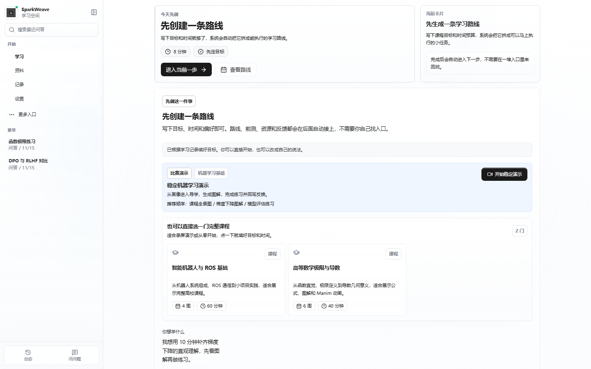 | 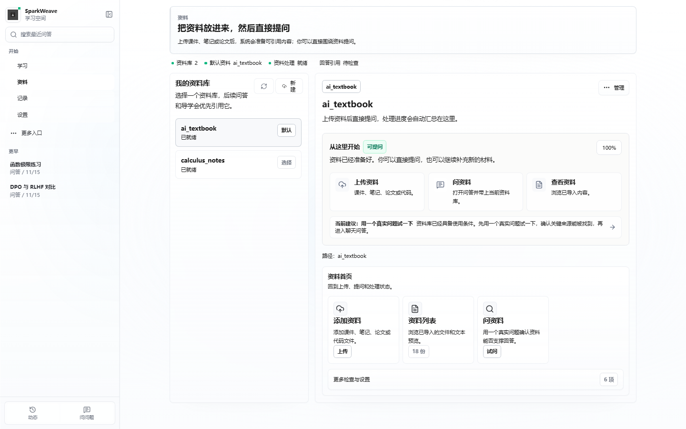 |
| 个性化学习入口，聚焦下一步任务、学习路线和反馈。 | 管理资料库、上传资料、查看索引状态并进入资料问答。 |

| 记录 | 设置 |
| --- | --- |
| 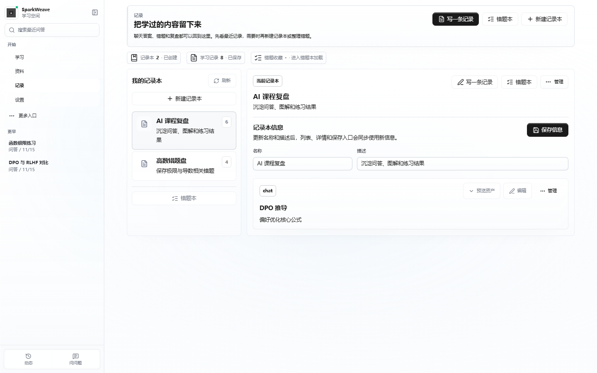 | 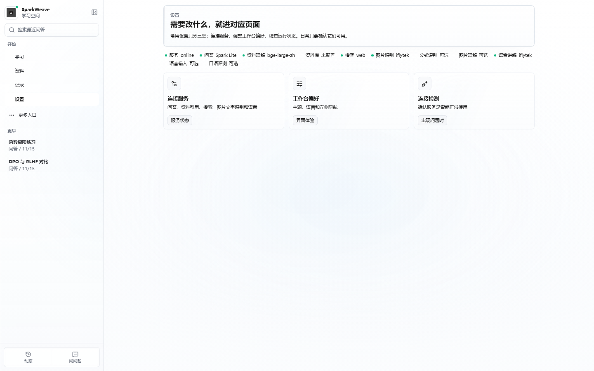 |
| 复盘笔记、题目、对话结果和资料引用。 | 管理模型、Embedding、搜索、OCR、TTS 与工作台偏好。 |

| 问问题 | 练习 |
| --- | --- |
| 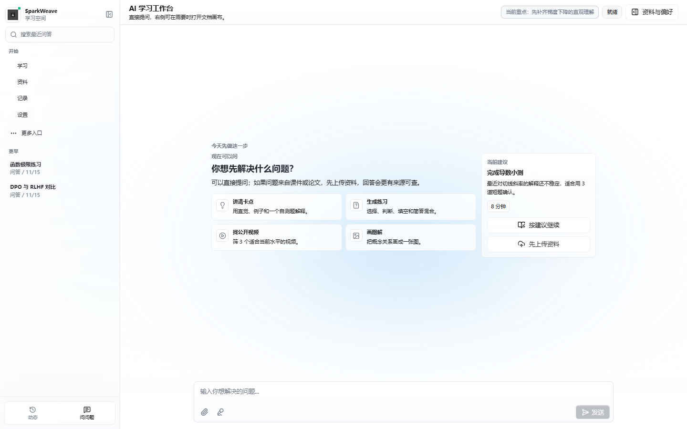 | 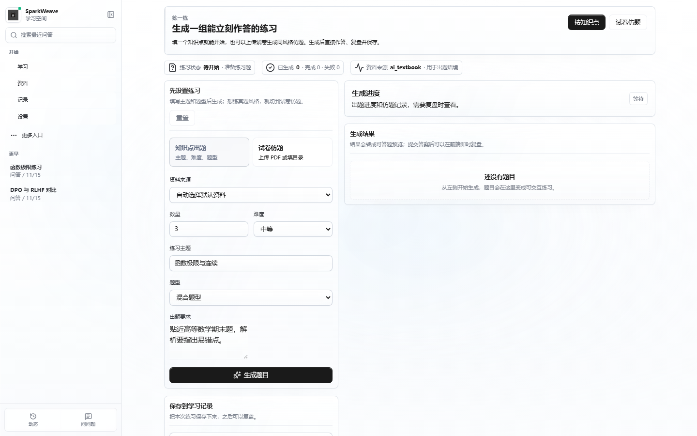 |
| 简洁对话输入，支持资料上下文和智能体结果。 | 生成练习、查看题目记录并追踪答题结果。 |

| 学习画像 | 课程助教 |
| --- | --- |
| 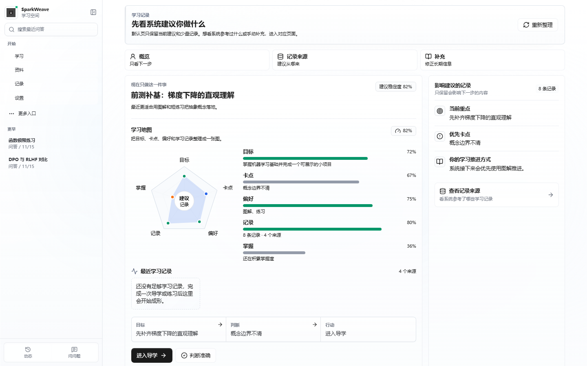 | 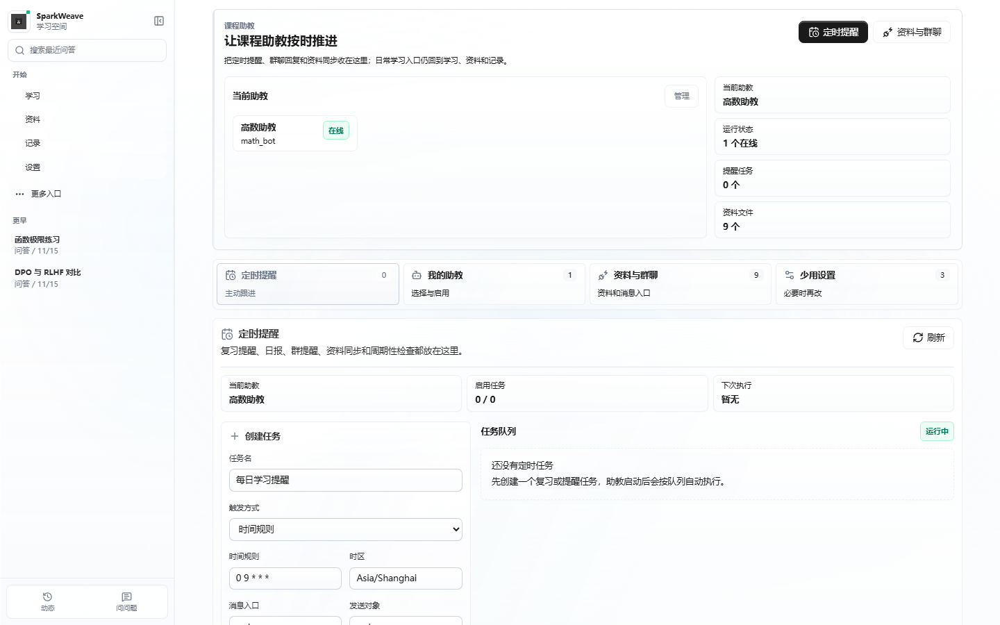 |
| 展示偏好、薄弱点、证据来源和画像校准入口。 | 管理课程助教、课程文件、渠道与历史消息。 |

| 写作助手 | 图像解题 |
| --- | --- |
| 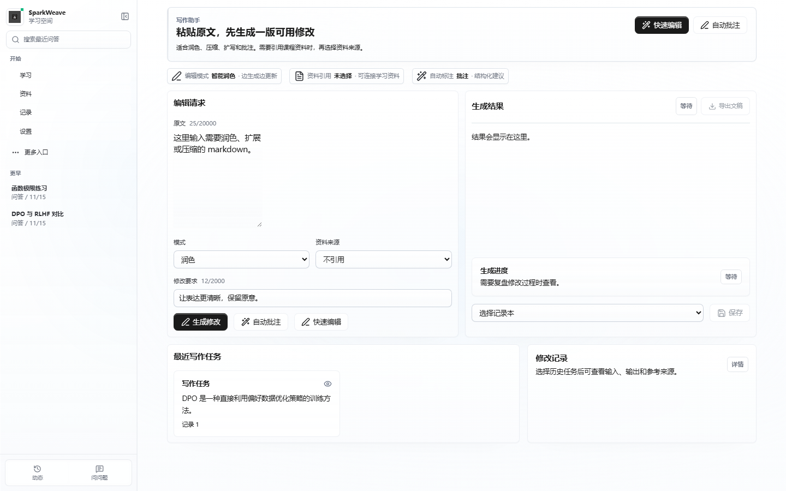 | 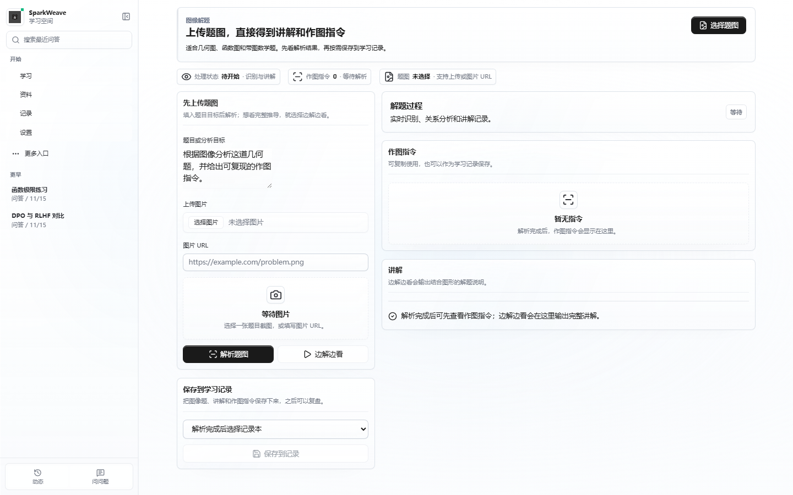 |
| 对学习材料和答案文本进行改写、润色、扩写。 | 上传题图，生成结构化分析和可复用命令。 |

| 调试台 | 移动端入口 |
| --- | --- |
| 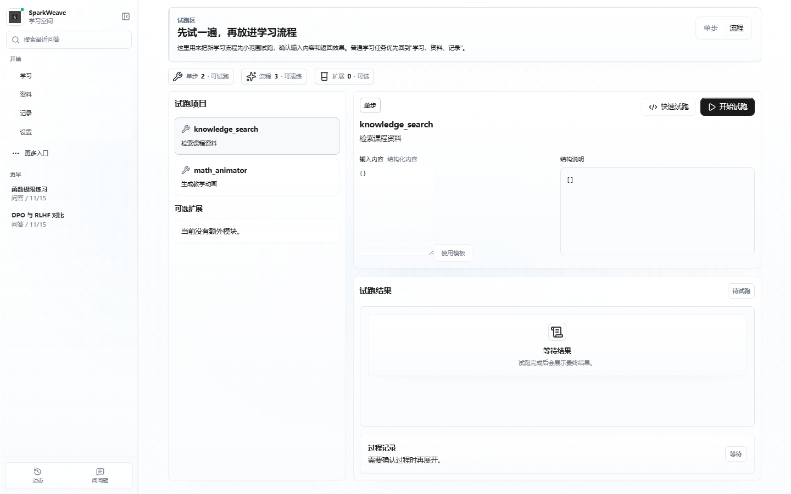 | 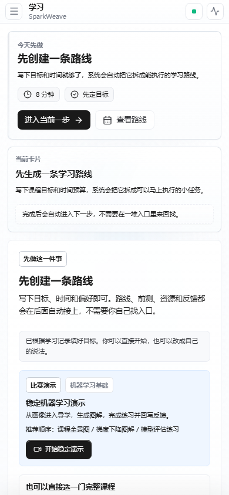 |
| 面向开发者的工具、能力和运行状态检查入口。 | 移动端保持学习入口优先，适合随手继续学习。 |

## Docker 部署

### 1. 准备环境

- Git
- Docker Desktop，或 Docker Engine + Docker Compose v2
- 一个可用的 LLM API Key
- 一个可用的 Embedding API Key，资料库和 RAG 需要它

Windows PowerShell：

```powershell
git clone https://github.com/Benzoquinone000/sparkweave.git
cd sparkweave
copy .env.example .env
```

macOS / Linux：

```bash
git clone https://github.com/Benzoquinone000/sparkweave.git
cd sparkweave
cp .env.example .env
```

### 2. 配置 `.env`

最小可运行配置如下：

```dotenv
BACKEND_PORT=8001
FRONTEND_PORT=3782

LLM_BINDING=openai
LLM_MODEL=gpt-5.4-mini
LLM_API_KEY=your-llm-key
LLM_HOST=https://api.openai.com/v1

EMBEDDING_BINDING=openai
EMBEDDING_MODEL=text-embedding-3-large
EMBEDDING_API_KEY=your-embedding-key
EMBEDDING_HOST=https://api.openai.com/v1
EMBEDDING_DIMENSION=3072

RAG_PROVIDER=milvus
DOCKER_MILVUS_URI=http://milvus:19530
```

也可以先用 Docker 启动后进入 `设置 -> 模型配置`，在 OpenAI、科大讯飞、DeepSeek、Gemini、通义千问、智谱、Kimi、Claude、硅基流动等预设中选择模型；如果供应商刚发布新模型，直接在模型名称里输入新的模型 ID 即可。

如果 LLM 或 Embedding 服务跑在宿主机，例如 LM Studio、Ollama、vLLM，不要在容器里写 `localhost`。Windows / macOS 使用：

```dotenv
LLM_HOST=http://host.docker.internal:1234/v1
EMBEDDING_HOST=http://host.docker.internal:1234/v1
```

Linux 可以改成宿主机局域网 IP，例如 `http://192.168.1.100:1234/v1`。

### 3. 启动

前台启动，适合首次部署和看日志：

```powershell
docker compose up --build
```

后台启动：

```powershell
docker compose up -d --build
```

启动完成后访问：

| 服务 | 地址 |
| --- | --- |
| 前端工作台 | http://localhost:3782 |
| 后端 API | http://localhost:8001 |
| API 文档 | http://localhost:8001/docs |
| Milvus Web UI | http://localhost:9091/webui/ |

### 4. 运维命令

```powershell
docker compose ps
docker compose logs -f backend
docker compose logs -f frontend
docker compose restart backend
docker compose restart frontend
docker compose down
```

重新构建：

```powershell
docker compose build --no-cache
docker compose up -d
```

清理容器和 Compose volume：

```powershell
docker compose down -v
```

`down -v` 会删除 Compose 管理的 volume，例如前端 `node_modules` 缓存；项目目录下的 `data/` 仍由本地文件夹保存。

### 5. Docker 服务说明

| 服务 | 作用 | 默认端口 |
| --- | --- | --- |
| `backend` | FastAPI 后端，`uvicorn --reload` 热更新 | `8001` |
| `frontend` | Vite 前端，HMR 热更新 | `3782` |
| `milvus` | 向量数据库，资料库检索默认依赖 | `19530`, `9091` |
| `milvus-etcd` | Milvus 元数据服务 | 内部端口 |
| `milvus-minio` | Milvus 对象存储 | 内部端口 |

数据落点：

| 路径 | 内容 |
| --- | --- |
| `data/user/` | 用户设置、记忆、画像、会话相关数据 |
| `data/knowledge_bases/` | 本地资料库文件与处理结果 |
| `data/milvus/` | Milvus etcd、minio、standalone 数据 |
| `sparkweave_node_modules` | Docker Compose 管理的前端依赖缓存 |

### 6. 常见问题

| 问题 | 处理 |
| --- | --- |
| 前端第一次启动较慢 | `frontend` 容器会先执行 `npm ci`，首次等待即可 |
| 端口被占用 | 在 `.env` 改 `BACKEND_PORT` 或 `FRONTEND_PORT` |
| 容器访问不到本机模型 | 把 `localhost` 改为 `host.docker.internal` 或宿主机局域网 IP |
| 上传资料后无法检索 | 确认 Embedding 配置和 Milvus 服务状态 |
| Milvus 启动慢 | 首次启动需要初始化，查看 `docker compose logs -f milvus` |
| `.env` 修改不生效 | 执行 `docker compose up -d --force-recreate` |

## 科大讯飞工具链

比赛场景建议优先使用讯飞相关能力形成一条可展示链路：

| 讯飞能力 | SparkWeave 落点 | 演示价值 |
| --- | --- | --- |
| 星火大模型 | LLM provider `iflytek_spark_ws` | 对话式辅导、资源生成、学习处方 |
| MaaS Coding / Astron Code | LLM provider `iflytek_maas_coding` | 代码智能体、工具编排、赛题工程化实现 |
| 星火 Embedding | Embedding provider `iflytek_spark` | 课程资料向量化与 RAG 检索 |
| ONE SEARCH | Search provider `iflytek_spark` | 外部资料补充和视频/公开资料发现 |
| OCR for LLM | 图片文字识别 / 扫描 PDF 入库 | 讲义截图、题图、扫描件转资料 |
| 公式识别 | 工具 `iflytek_formula_ocr` | 手写公式、题图公式先转文本，再进入解题 / RAG / 验证链路 |
| 图片理解 | 工具 `iflytek_image_understanding` | 板书、截图、示意图和实验图先被解释，再进入智能辅导 |
| 超拟人 TTS | 语音讲解预览与短视频旁白 | 多模态讲解成品 |
| 语音听写 ASR | 聊天语音输入 | 学生口述问题、课堂录音转写 |
| 语音评测 ISE | 口语练习评分并写入证据 | 学习效果评估闭环 |
| 星辰工作流 | 工具 `iflytek_workflow` | 接入讯飞智能体工作流，生成 PPT 大纲、课程资源或诊断报告 |

7 分钟录屏建议按三句话展开：

- 开场：打开“学习”页的比赛演示驾驶舱，说明项目已把星火、Embedding、ONE SEARCH、OCR、公式识别、图片理解、语音和星辰工作流接到同一条学习链。
- 中段：展示资料上传 / 问资料 / 图片或公式题解析，强调多模态输入会先被讯飞能力结构化，再进入 Agentic RAG、智能辅导和资源生成。
- 收尾：展示学习报告、练习反馈、语音讲解或星辰工作流结果，说明系统把过程记录转成学习效果评估和下一步资源推送。

如果已经在讯飞星辰平台发布了工作流，在 `.env` 中填写 `IFLYTEK_WORKFLOW_API_KEY`、`IFLYTEK_WORKFLOW_API_SECRET` 和 `IFLYTEK_WORKFLOW_FLOW_ID`，然后在聊天页打开“讯飞工作流”工具即可调用。

讯飞 MaaS Coding / Astron Code 可作为问答模型或代码智能体模型使用。在 `.env` 中设置：

```env
LLM_BINDING=iflytek_maas_coding
LLM_MODEL=astron-code-latest
LLM_HOST=https://maas-coding-api.cn-huabei-1.xf-yun.com/v2
IFLYTEK_MAAS_API_PASSWORD=your-maas-apipassword
```

也可以把 MaaS APIPassword 直接写入 `LLM_API_KEY`。如需使用 Anthropic-compatible 入口，
可在自定义供应商中填写 `https://maas-coding-api.cn-huabei-1.xf-yun.com/anthropic`。

公式识别可复用共享的 `IFLYTEK_APPID`、`IFLYTEK_API_KEY`、`IFLYTEK_API_SECRET`，
也可以单独填写 `IFLYTEK_FORMULA_APPID`、`IFLYTEK_FORMULA_API_KEY`、
`IFLYTEK_FORMULA_API_SECRET`。聊天页打开“讯飞公式识别”后，题图会先被转成公式文本，
再交给智能体解题或检索。

图片理解可复用共享的 `IFLYTEK_APPID`、`IFLYTEK_API_KEY`、`IFLYTEK_API_SECRET`，
也可以单独填写 `IFLYTEK_VISION_APPID`、`IFLYTEK_VISION_API_KEY`、
`IFLYTEK_VISION_API_SECRET`。默认使用星火图片理解 `spark_image` 协议，
需要切换星辰 MaaS 多模态接口时可把 `IFLYTEK_VISION_PROTOCOL` 改为 `maas_vl` 并配置对应 URL。

讯飞能力默认带本地离线替补：当密钥、网络或产品权限不可用时，OCR / 公式识别 / 图片理解 /
星辰工作流 / TTS / ASR / 语音评测会继续返回带 `fallback: true` 的占位结果，保证演示流程不中断。
如需严格只使用真实讯飞服务，把 `SPARKWEAVE_IFLYTEK_OFFLINE_FALLBACK=0`。

## 参赛交付

SparkWeave 面向“高等教育个性化学习资源体系 + 智能学习智能体系统”赛题整理为一条可演示主线：

| 赛题要求 | SparkWeave 对应能力 | 演示入口 |
| --- | --- | --- |
| 对话式学习画像自主构建 | 目标、薄弱点、偏好、历史证据进入 Learner Profile 与 Evidence Ledger | 学习页、学习画像页 |
| 多智能体协同资源生成 | Orchestrator 调度 RAG、搜索、图解、公式、语音、工作流等工具 | 学习页、问问题页、课程助教 |
| 个性化学习路径规划与资源推送 | Guide 根据画像、任务提交、练习反馈生成下一步资源 | 学习页 |
| 智能辅导加分项 | Agentic RAG、图片理解、公式识别、TTS、数学动画和可追溯回答 | 问问题页、资料页、图像解题页 |
| 学习效果评估加分项 | 练习提交、掌握分、错因、资源使用反馈进入学习报告和补救任务 | 学习页、记录页 |
| 科大讯飞工具使用 | 星火、MaaS、Embedding、ONE SEARCH、OCR、公式识别、图片理解、语音和星辰工作流 | 设置页、学习页 |

### 完整课程样例

推荐主打 `data/course_templates/ai_learning_agents_systems.json`，主题贴合智能教育和多智能体系统；备用课程为 `higher_math_limits_derivatives.json` 与 `robotics_ros_foundations.json`。正式提交时建议固定一门课程，把课程模板、资料库文件、练习样例、学习报告和演示录屏使用同一套数据，避免答辩时主线分散。

### 提交物清单

| 提交物 | 当前仓库基础 | 提交前确认 |
| --- | --- | --- |
| 演示 PPT | 学习页课程产出包可生成 PPT 骨架，README 已给 7 分钟讲法 | 补截图、讯飞工具链图、评分点对齐页 |
| 可运行源码与部署配置 | Docker Compose、`.env.example`、Milvus、前后端源码 | 提交前重跑质量检查，不提交 `.env` |
| 7 分钟演示视频 | 学习页比赛演示驾驶舱、资料问答、练习反馈、报告 | 固定课程样例和兜底材料，按三段式录制 |
| 配套文档 | README、docs 三条核心设计线、课程模板和截图 | 保持文档链接真实存在，避免堆临时计划文档 |
| AI Coding 说明 | 下方说明可直接放入 PPT 或提交文档 | 标明人工复核、密钥边界和测试验证 |

### AI Coding 工具说明

本项目开发过程中使用 AI 编程助手辅助代码梳理、前端优化、讯飞工具接入、测试修复和文档整理。需求判断、赛题取舍、密钥配置、真实服务开通、运行验证、演示录制和最终提交由项目维护者负责。AI 工具不应生成或提交真实密钥；`.env`、本地下载的账号 JSON、临时凭证和未脱敏截图不进入仓库。

## 系统架构

### Agentic RAG 亮点

SparkWeave 的资料问答不是简单向量召回。复杂问题会按需进入 Agentic Evidence RAG：先判断是否需要深度检索，再进行 HyDE 改写、多路子问题召回、结果合并、质量门检查和弱分支修复；如果证据不足，会回退到更稳的单路检索，避免把弱证据直接写进答案。

```text
学习入口 / 资料入口 / 记录入口 / 设置入口
  -> React Web Workbench
  -> FastAPI / WebSocket API
  -> SparkWeaveApp / ChatOrchestrator
  -> ToolRegistry + CapabilityRegistry
  -> LangGraph capability graph
  -> StreamEvent / Notebook / Memory / Milvus
```

<p align="center">
  
</p>

<p align="center">
  
</p>

## 质量检查

在 Docker 环境内检查：

```powershell
docker compose exec backend python scripts/check_release_safety.py
docker compose exec backend python -m compileall -q sparkweave tests
docker compose exec frontend npm run lint
docker compose exec frontend npm run check:design
docker compose exec frontend npm run check:api-contract
docker compose exec frontend npm run build
```

本地开发环境可以先跑与 CI 对齐的轻量检查：

```powershell
python scripts/check_course_templates.py
python scripts/check_release_safety.py

cd web
npm run lint
npm run check:design
npm run check:api-contract
npm run check:replacement
npm run build
```

Provider auth (`openai-codex` OAuth login; `github-copilot` validates an existing Copilot auth session).
如果使用 `openai-codex` 或 `github-copilot` 等 Provider，请在本机完成对应登录或校验，并确认 CI 不依赖本地 OAuth 会话。

只更新前端截图时：

```powershell
cd web
npm run screenshots
```

## 项目结构

```text
sparkweave/        后端服务、Agent Runtime、LangGraph 能力图与业务服务
sparkweave_cli/    Typer CLI 入口，供内部能力复用
web/               Vite + React + TypeScript 前端
scripts/           检查、维护、截图和开发辅助脚本
requirements/      后端依赖分层
docs/              稳定设计文档和 PNG 架构图
assets/            Logo 与项目素材
data/              本地知识库、Milvus、记忆和用户数据
```

## 设计文档

| 文档 | 说明 |
| --- | --- |
| [docs/README.md](docs/README.md) | 文档中心 |
| [docs/agent-orchestration-design.md](docs/agent-orchestration-design.md) | 智能体编排设计 |
| [docs/rag-system-design.md](docs/rag-system-design.md) | Evidence RAG 系统设计 |
| [docs/learner-profile-memory-design.md](docs/learner-profile-memory-design.md) | 学习画像与记忆设计 |
| [docs/development-guide.md](docs/development-guide.md) | 开发流程、质量检查和文档规范 |
| [docs/configuration-guide.md](docs/configuration-guide.md) | 环境变量、供应商配置和讯飞工具链 |
| [docs/api-development-guide.md](docs/api-development-guide.md) | 后端 API、WebSocket 和前后端契约规范 |
| [docs/testing-guide.md](docs/testing-guide.md) | 测试分层、运行命令和提交前验证规范 |
| [docs/frontend-design-guide.md](docs/frontend-design-guide.md) | 前端信息架构、视觉约束和动效规范 |
| [docs/data-storage-guide.md](docs/data-storage-guide.md) | 本地数据目录、持久化边界和提交规范 |

## License

Apache License 2.0
