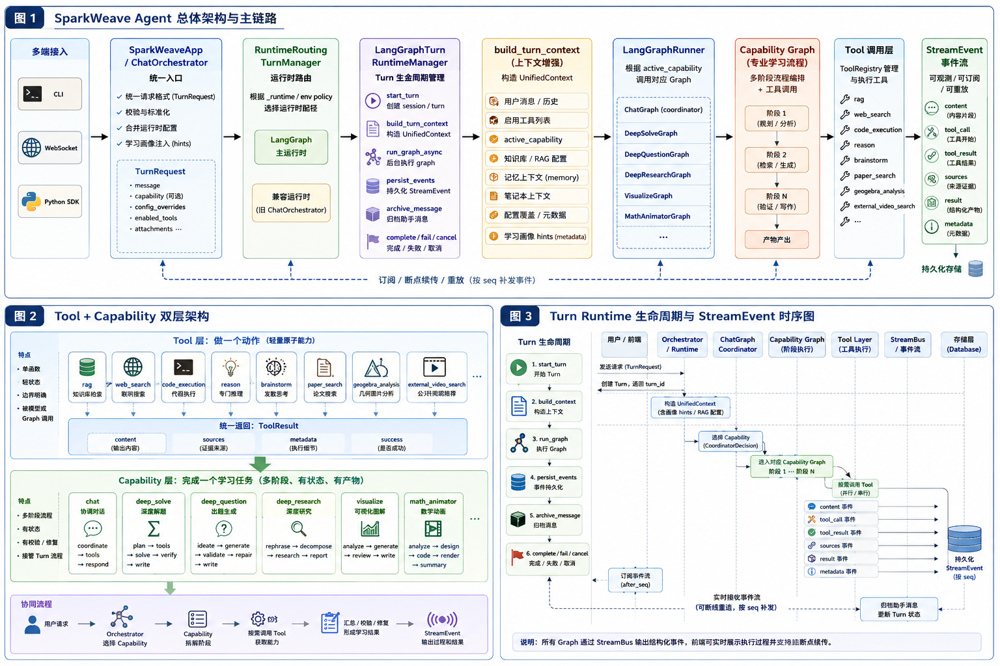
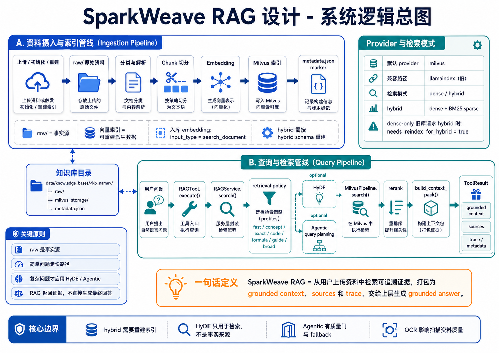
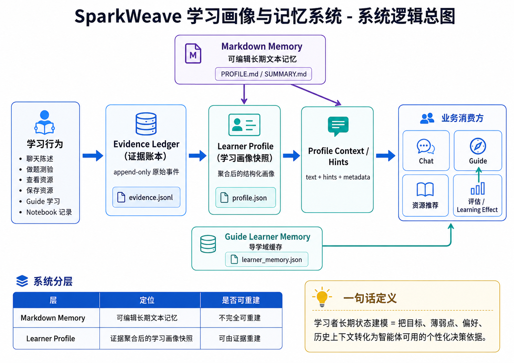
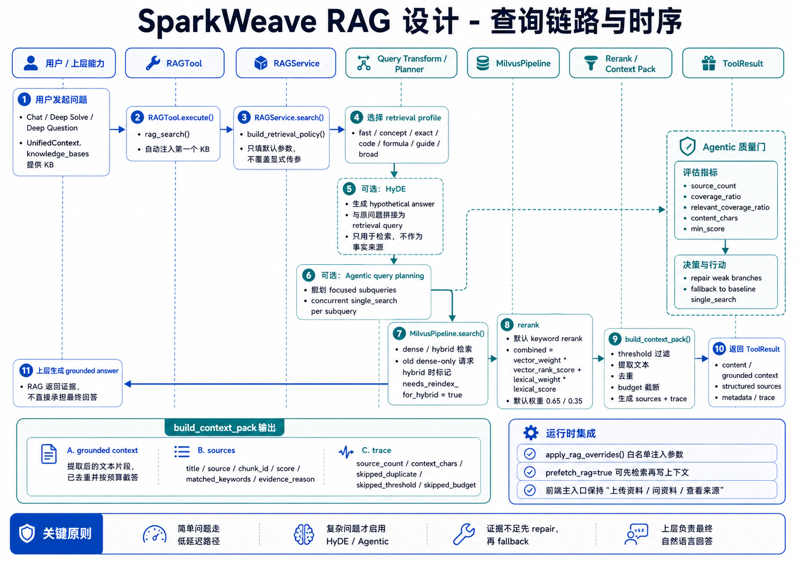
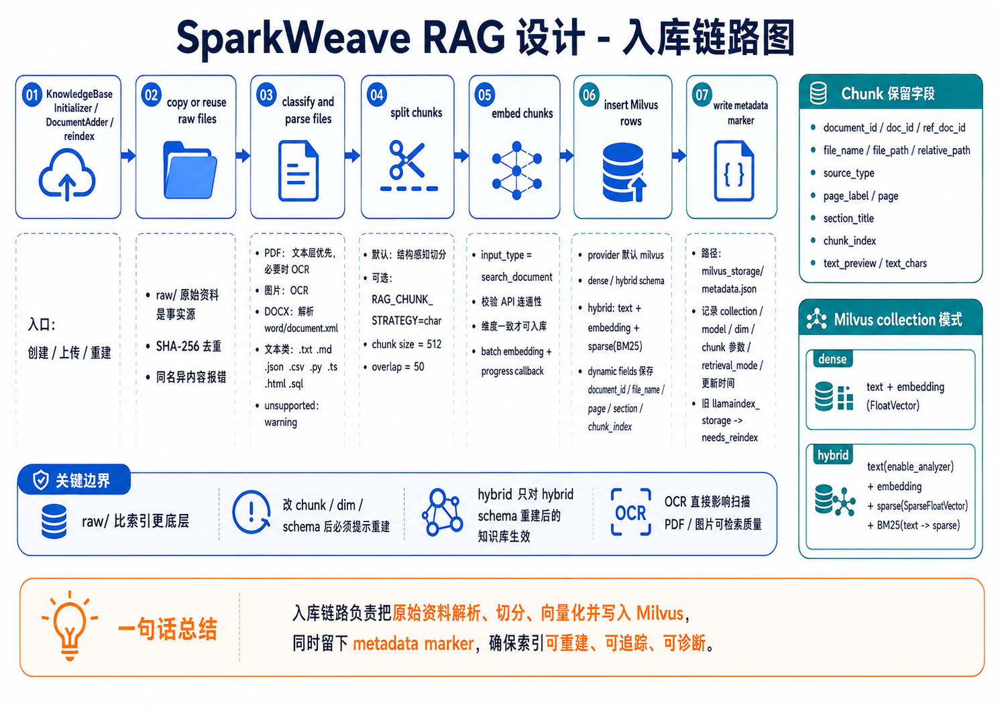
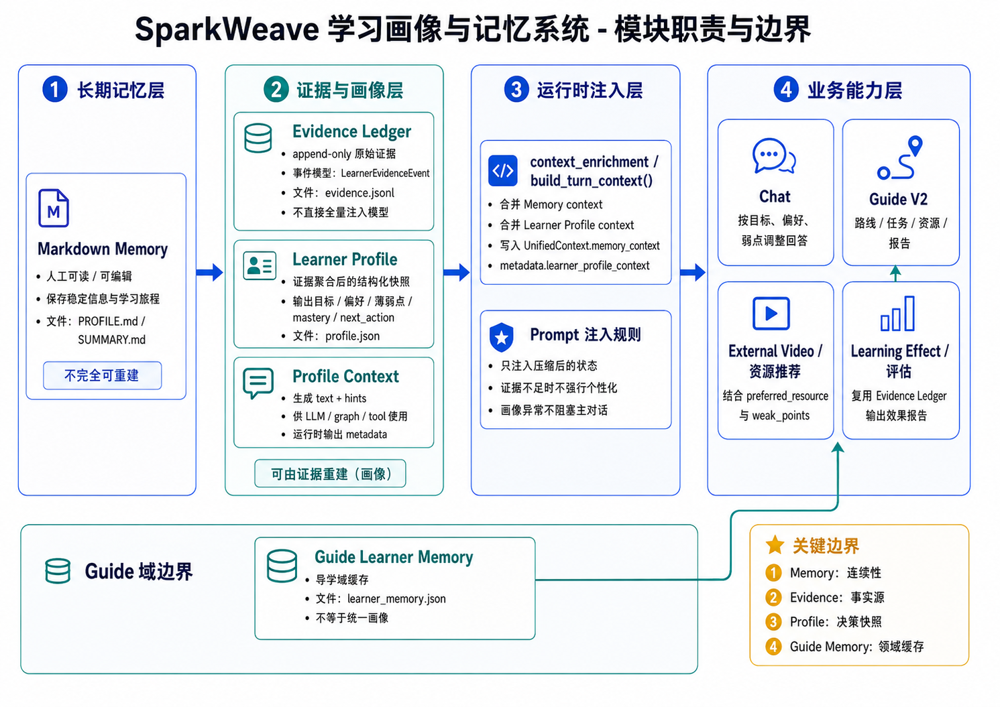
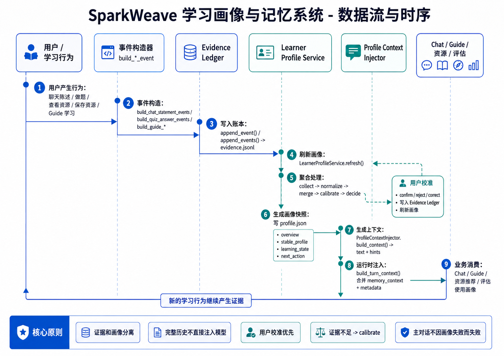

# SparkWeave 文档中心

这里保留当前仓库中稳定、可维护的核心工程文档。根目录 [README.md](../README.md) 负责项目首屏说明；本页用现有 PNG 图和开发规范把项目主线串起来。
参赛交付、7 分钟讲法、AI Coding 说明和 Docker 部署入口统一维护在根目录 README，避免 docs 目录再次堆积临时材料。

所有核心文档都按代码事实维护：关键结论必须能对应真实路径、函数、API、数据文件、脚本、测试或前端组件；未落地内容只能放在“限制与待实现”，不能写成当前能力。

## 文档地图

| 主线 | 图示 | 文档 |
| --- | --- | --- |
| Agent 编排 |  | [智能体编排设计](./agent-orchestration-design.md) |
| Agentic Evidence RAG |  | [RAG 系统设计](./rag-system-design.md) |
| 学习画像 / 记忆 |  | [学习画像 / 记忆设计](./learner-profile-memory-design.md) |
| 软件工程规范 | - | [软件工程规范](./engineering-standards.md) |
| 开发规范 | - | [开发指南](./development-guide.md) |
| 配置规范 | - | [配置指南](./configuration-guide.md) |
| API 规范 | - | [API 开发规范](./api-development-guide.md) |
| 测试规范 | - | [测试规范](./testing-guide.md) |
| 前端设计规范 | - | [前端设计规范](./frontend-design-guide.md) |
| 数据存储规范 | - | [数据存储规范](./data-storage-guide.md) |
| 软件杯交付 | - | [软件杯交付检查清单](./software-cup-delivery-checklist.md) |

## RAG 图集

| 图示 | 说明 |
| --- | --- |
|  | 从工具调用、策略选择、Milvus 检索到证据打包的完整链路 |
|  | 一次资料问答中 query transform、retrieval、rerank、context pack 的执行顺序 |
|  | 原始资料进入知识库、切分、embedding、索引和 metadata 的生成过程 |

## 学习画像图集

| 图示 | 说明 |
| --- | --- |
|  | Memory、Evidence Ledger、Learner Profile 与运行时注入的关系 |
|  | 长期记忆、证据账本、画像快照和导学记忆的职责边界 |
|  | 学习行为如何沉淀为证据，并逐步影响后续任务与提示词 |

## 评测样例

| 文件 | 内容 |
| --- | --- |
| [RAG 评测集样例](./examples/rag_eval_dataset.sample.jsonl) | 通用 RAG 评测数据格式 |
| [机器学习课程 RAG 评测集](./examples/rag_eval_dataset.ml_course.sample.jsonl) | 课程场景评测样例 |

## 维护原则

- 文档索引只链接当前仓库里实际存在的文件。
- `docs/assets/` 只保留当前文档会使用的 PNG 图，不再维护 SVG 图集。
- 新增功能文档要绑定代码路径、API 路由、数据落点和验证命令。
- 面向学习用户的入口说明放在根 README；工程细节放在 `docs/`。
- 阶段性计划完成后应合并到稳定设计文档，或明确归档位置。

## 文档检查

```powershell
python scripts/check_project_standards.py
git diff --check -- README.md docs/README.md
rg -n "\x{FFFD}" README.md docs
```
