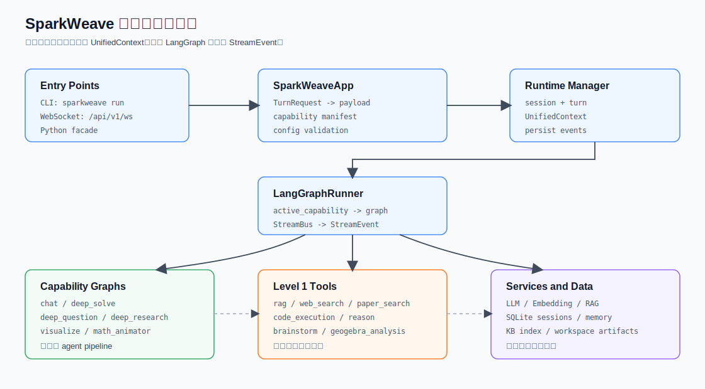

# 系统架构

SparkWeave 是面向课程学习场景的 agent-native 智能学习系统。当前代码以 NG/LangGraph runtime 为主，兼容入口保留在路由层和少量 adapter 中。核心设计是两层插件模型：

- Level 1：Tools，轻量单步工具。
- Level 2：Capabilities，多阶段智能体流水线。

系统提供三个入口：

- CLI：面向命令行使用和调试。
- WebSocket API：面向 Web 工作台和外部集成。
- Python facade：面向 Python 内部调用、CLI 和二次开发。

## 总览



```text
Entry Points: CLI | WebSocket /api/v1/ws | Python facade
                    |
                    v
              SparkWeaveApp / Runtime Manager
                    |
       +------------+-------------+
       |                          |
       v                          v
  ToolRegistry              LangGraphRunner
  Level 1 Tools             Level 2 Capabilities
```

## 入口层

| 入口 | 关键文件 | 说明 |
| --- | --- | --- |
| CLI | `sparkweave_cli/main.py` | `sparkweave run`、`sparkweave chat`、`sparkweave serve` |
| WebSocket | `sparkweave/api/routers/unified_ws.py` | `/api/v1/ws`，启动 turn、订阅事件、取消 turn |
| HTTP API | `sparkweave/api/main.py`、`sparkweave/api/routers/` | 设置、知识库、Notebook、SparkBot、Guide 等页面 API |
| Python facade | `sparkweave/app/facade.py` | `SparkWeaveApp`、`TurnRequest`、capability manifest |

`ChatOrchestrator` 仍存在于 `sparkweave/runtime/orchestrator.py`，用于兼容 capability API 和部分直接流式执行场景。主 Web/CLI turn 链路走 `SparkWeaveApp -> RuntimeRoutingTurnManager -> LangGraphTurnRuntimeManager`。

## 运行时层

运行时负责把请求转成 `UnifiedContext`、执行图、持久化事件和刷新记忆。

| 文件 | 责任 |
| --- | --- |
| `sparkweave/runtime/policy.py` | 选择 `langgraph` 或兼容运行时 |
| `sparkweave/runtime/routing.py` | turn manager 路由 |
| `sparkweave/runtime/turn_runtime.py` | LangGraph turn 生命周期 |
| `sparkweave/runtime/context_enrichment.py` | 构造上下文并注入记忆、历史、Notebook、附件 |
| `sparkweave/runtime/runner.py` | capability 到 graph 的分派 |

`LangGraphTurnRuntimeManager` 负责：

- 创建或复用 session。
- 创建 turn。
- 校验 capability config。
- 调用 `build_turn_context()`。
- 执行 `LangGraphRunner.handle()`。
- 把事件写入 SQLite `turn_events`。
- 写入 assistant message。
- 调用 memory refresh。

关键文件：

| 路径 | 说明 |
| --- | --- |
| `sparkweave/runtime/orchestrator.py` | 兼容 orchestrator |
| `sparkweave/core/contracts.py` | `StreamEvent`、`StreamBus`、`UnifiedContext` |
| `sparkweave/runtime/mode.py` | CLI / SERVER 运行模式 |

## Tools

Tools 是 LLM 可按需调用的轻量能力，通常完成一个明确动作。

| Tool | 说明 |
| --- | --- |
| `rag` | 知识库检索 |
| `web_search` | 带引用的联网搜索 |
| `code_execution` | 沙箱 Python 执行 |
| `reason` | 专用深度推理调用 |
| `brainstorm` | 广度优先创意探索 |
| `paper_search` | arXiv 论文搜索 |
| `geogebra_analysis` | 图片到 GeoGebra 命令的视觉分析 |

关键文件：

| 路径 | 说明 |
| --- | --- |
| `sparkweave/core/tool_protocol.py` | `BaseTool` 协议 |
| `sparkweave/tools/registry.py` | 工具发现和注册 |
| `sparkweave/tools/builtin.py` | 内置工具封装 |

工具协议、注册表、别名、prompt hints、内置工具包装和能力图调用细节见 [Tools 工具系统](./tools.md)。

## Capabilities

Capabilities 是多阶段智能体流程。它们会接管一次 turn，并通过 `StreamBus` 持续输出阶段、内容和结果事件。

| Capability | 阶段 | 说明 |
| --- | --- | --- |
| `chat` | coordinating -> thinking -> acting -> responding | 默认对话能力，可自动委派 specialist，可调用 tools |
| `deep_solve` | planning -> reasoning -> writing | 深度解题，包含规划、工具选择、验证和最终写作 |
| `deep_question` | ideation -> generation | 题目生成，支持 custom 和 mimic 模式 |
| `deep_research` | rephrasing -> decomposing -> researching -> reporting | 深度研究和报告生成 |
| `visualize` | analyzing -> generating -> reviewing | SVG、Chart.js、Mermaid 可视化 |
| `math_animator` | concept_analysis -> concept_design -> code_generation -> code_retry -> summary -> render_output | Manim 数学动画或分镜图片 |

每个能力的配置字段、事件阶段和 `result` payload 见 [Capabilities 详解](./capabilities.md)。

关键文件：

| 路径 | 说明 |
| --- | --- |
| `sparkweave/core/capability_protocol.py` | `BaseCapability` 协议 |
| `sparkweave/app/facade.py` | capability manifest |
| `sparkweave/runtime/registry/capability_registry.py` | 将 manifest 包装成可执行 capability |
| `sparkweave/graphs/` | LangGraph capability 实现 |

## Chat 自动委派

`chat` 不只是普通问答。`ChatGraph` 内置对话协调器，会根据用户意图委派到 specialist：

| 意图 | 目标 capability |
| --- | --- |
| 解题、证明、推导、计算 | `deep_solve` |
| 出题、练习题、quiz | `deep_question` |
| 调研、报告、学习路径 | `deep_research` |
| 图解、流程图、结构图 | `visualize` |
| 动画、视频讲解、Manim | `math_animator` |

可通过 config 控制：

```json
{
  "auto_delegate": false,
  "delegate_capability": "deep_solve"
}
```

## 插件层

扩展能力优先放到：

```text
sparkweave/plugins/<name>/
```

插件可以通过 `manifest.yaml` 或 `plugin.json` 描述元信息。当前 loader 主要负责 manifest 发现和 playground 展示；可执行能力仍以内置 LangGraph capability 为主。

关键文件：

| 路径 | 说明 |
| --- | --- |
| `sparkweave/plugins/` | 插件目录 |
| `sparkweave/plugins/loader.py` | 插件 manifest 发现 |
| `sparkweave/api/routers/plugins_api.py` | Playground 列表、工具执行、capability 流式执行 |

## 数据与状态

SparkWeave 的长期数据通常放在 `data/` 下，包括：

- `data/user/chat_history.db`：sessions、messages、turns、turn_events、题目本。
- `data/user/settings/`：UI 设置和模型 catalog。
- `data/user/workspace/`：聊天、解题、研究、动画、Notebook、Guide、Co-Writer 产物。
- `data/memory/`：`SUMMARY.md` 和 `PROFILE.md`。
- `data/knowledge_bases/`：知识库原始文件、索引和配置。

这些内容通常不应提交到 Git。

会话数据库表、turn 状态、事件 `seq` 和 WebSocket replay 机制见 [会话、Turn 与事件持久化](./sessions-and-turns.md)。

## 事件流

能力运行时通过 `StreamBus` 输出事件，前端和 CLI 可以统一消费：

- `stage_start` / `stage_end`：进入或离开某个阶段。
- `progress`、`thinking`、`observation`：中间状态。
- `tool_call` / `tool_result`：工具调用轨迹。
- `sources`：引用来源。
- `content`：用户可见正文。
- `result`：最终结构化结果。
- `error`：错误事件。
- `done`：turn 结束。

这种事件协议让 CLI、WebSocket API 和 SDK 可以共享同一套执行内核。

更完整的 turn 生命周期见 [运行时链路](./runtime-flow.md)。
