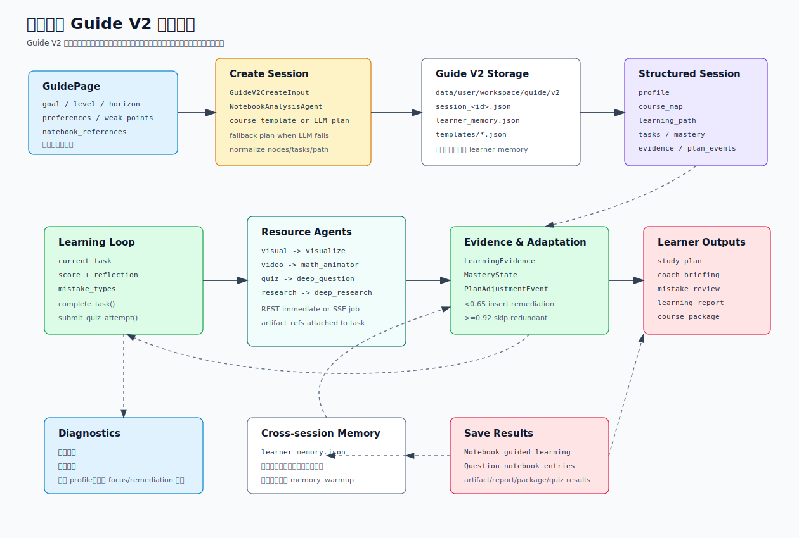

# 导学空间与 Guide V2

导学空间是 SparkWeave 中最像“学习驾驶舱”的模块。它不只是回答一个问题，而是把学习目标拆成路线、任务、资源、证据、掌握度、错因闭环和最终产出包。

当前代码里有两条导学线：

- `/api/v1/guide`：兼容旧入口的 HTML 导学页，生成知识点页面、支持聊天和页面修复。
- `/api/v1/guide/v2`：新的结构化学习路径驾驶舱，围绕 profile、course map、tasks、evidence、mastery、recommendations 持续调整路线。

## 一图看懂



关键分工：

- Guide V2 的 session 是独立 JSON 文件，不走主聊天 `turn_events`。
- Guide V2 的长期画像是 `learner_memory.json`，不同于全局两文件 Memory 的 `data/memory/SUMMARY.md` 和 `PROFILE.md`。
- 资源生成会调用已有 capability：`visualize`、`math_animator`、`deep_question`、`deep_research`。
- 资源、报告、课程产出包可以保存到主 Notebook，练习题和答题结果可以同步到题目本。
- 新版导学前端已经按“先做这一件事”收束：画像负责判断入口，导学页只突出当前任务、任务资源和提交反馈。

## 代码地图

| 领域 | 文件 | 责任 |
| --- | --- | --- |
| 旧版导学 API | `sparkweave/api/routers/guide.py` | `/api/v1/guide/*` REST 和 WebSocket |
| 旧版导学服务 | `sparkweave/services/guide_generation.py` | HTML 页面导学、知识点、聊天、页面状态 |
| Guide V2 API | `sparkweave/api/routers/guide_v2.py` | `/api/v1/guide/v2/*` REST、SSE resource job、保存入口 |
| Guide V2 服务 | `sparkweave/services/guide_v2.py` | 学习画像、路线、任务、证据、评估、资源、报告 |
| Notebook 引用分析 | `sparkweave/services/context.py` | `NotebookAnalysisAgent` 压缩引用记录 |
| Notebook 保存 | `sparkweave/services/notebook.py` | `guided_learning` 记录写入 |
| 题目本保存 | `sparkweave/services/session_store.py` | quiz artifact 和 quiz result 写入 `notebook_entries` |
| 前端页面 | `web/src/pages/GuidePage.tsx` | Guide V2 工作台 |
| 前端 API | `web/src/lib/api.ts` | Guide / Guide V2 HTTP 和 SSE 客户端 |
| 前端类型 | `web/src/lib/types.ts` | Guide V2 session、task、artifact、report 类型 |
| React Query | `web/src/hooks/useApiQueries.ts` | Guide V2 查询缓存和失效策略 |

## 数据目录

旧版导学默认目录：

```text
data/user/workspace/guide/
  session_<session_id>.json
```

Guide V2 默认目录：

```text
data/user/workspace/guide/v2/
  session_<session_id>.json
  learner_memory.json
  templates/
    <template_id>.json
```

额外课程模板目录：

```text
data/course_templates/
  <template_id>.json
```

`GuideV2Manager.list_course_templates()` 会先返回内置模板，再读取两个模板目录中的 JSON。重复 ID 会被跳过，内置模板优先。当前内置模板是 `ml_foundations`，带有课程 ID、学习结果、评估方式和项目里程碑。

前端 `/guide` 现在把课程模板分成两层入口：

- “开始稳定演示”只保留一条最稳的比赛 Demo 路线，适合录屏时一键启动。
- “也可以直接选一门完整课程”展示少量完整课程模板，例如“智能机器人与 ROS 基础”“高等数学极限与导数”。用户点选后会自动填入学习目标、时间预算和偏好，再点击“帮我安排学习”即可创建确定性路线。

这个设计刻意不做下拉列表的主入口：普通学习者先看到可理解的课程卡片，只有需要精细配置时再进入“需要更细设置”。

## 旧版导学

旧版 `/api/v1/guide` 保留了历史接口形状，但内部已经由 `sparkweave.services.guide_generation` 接管，不再依赖旧 agent 实现。

### Session 模型

`GuidedSession` 字段：

| 字段 | 说明 |
| --- | --- |
| `session_id` | 8 位短 ID |
| `notebook_name` | 显示标题，来自用户输入前 50 字符 |
| `knowledge_points` | 知识点数组 |
| `current_index` | 当前知识点索引，初始 `-1` |
| `chat_history` | 导学页面内聊天记录 |
| `status` | `initialized`、`learning`、`completed` |
| `html_pages` | 已生成页面，key 是索引字符串 |
| `page_statuses` | `pending`、`generating`、`ready`、`failed` |
| `page_errors` | 页面生成错误 |
| `summary` | 完成后的学习总结 |
| `notebook_context` | 由 Notebook 引用分析得到的上下文 |

### 创建流程

`POST /api/v1/guide/create_session` 接受：

```json
{
  "user_input": "我想学习导数",
  "notebook_id": null,
  "records": null,
  "notebook_references": []
}
```

输入优先级：

1. 直接使用 `user_input`。
2. 如果没有 `user_input` 且传了 `records`，从每条记录的 `user_query` 拼成学习请求。
3. 如果没有 `user_input` 且传了 `notebook_id`，读取该 Notebook 所有记录并拼学习请求。
4. 如果传了 `notebook_references`，先用 `NotebookAnalysisAgent` 分析记录，再把 `[Notebook Context]` 拼到用户问题前。

`GuideManager._design_knowledge_points()` 会尝试让 LLM 返回知识点 JSON；失败时走 deterministic fallback，通常生成 3 个知识点。每个页面由 `_render_page()` 渲染成 HTML。

### 旧版 API

| 方法 | 路径 | 说明 |
| --- | --- | --- |
| `POST` | `/api/v1/guide/create_session` | 创建导学 session |
| `POST` | `/api/v1/guide/start` | 跳到第一个知识点并生成页面 |
| `POST` | `/api/v1/guide/navigate` | 跳转到指定知识点 |
| `POST` | `/api/v1/guide/complete` | 完成导学并生成 summary |
| `POST` | `/api/v1/guide/chat` | 围绕当前知识点聊天 |
| `POST` | `/api/v1/guide/fix_html` | 在当前 HTML 页面追加修复说明 |
| `POST` | `/api/v1/guide/retry_page` | 清掉某页并重新生成 |
| `POST` | `/api/v1/guide/reset` | 重置 current index 和聊天历史 |
| `GET` | `/api/v1/guide/sessions` | 列表 |
| `GET` | `/api/v1/guide/session/{session_id}` | 详情 |
| `GET` | `/api/v1/guide/session/{session_id}/html` | 当前 HTML |
| `GET` | `/api/v1/guide/session/{session_id}/pages` | 页面状态和 HTML 字典 |
| `DELETE` | `/api/v1/guide/session/{session_id}` | 删除 session 文件 |
| `WS` | `/api/v1/guide/ws/{session_id}` | 旧版实时导学 |

WebSocket 消息类型：

```text
start
navigate
complete
chat
fix_html
get_session
get_pages
retry_page
reset
```

旧版导学适合保留兼容，但新开发优先面向 Guide V2。

## Guide V2 Session 模型

`GuideSessionV2` 是导学空间的核心状态，保存到 `session_<id>.json`。

| 对象 | 关键字段 | 说明 |
| --- | --- | --- |
| `LearnerProfile` | `goal`、`level`、`time_budget_minutes`、`horizon`、`preferences`、`weak_points` | 学习画像 |
| `CourseMap` | `title`、`nodes`、`edges`、`generated_by`、`metadata` | 知识地图 |
| `CourseNode` | `node_id`、`title`、`prerequisites`、`difficulty`、`mastery_target` | 知识节点 |
| `LearningPath` | `node_sequence`、`current_task_id`、`today_focus`、`next_recommendation` | 学习路线 |
| `LearningTask` | `task_id`、`node_id`、`type`、`title`、`instruction`、`artifact_refs`、`origin` | 可执行任务 |
| `LearningEvidence` | `evidence_id`、`task_id`、`type`、`score`、`reflection`、`mistake_types` | 学习证据 |
| `MasteryState` | `node_id`、`score`、`status`、`evidence_count` | 掌握度 |
| `PlanAdjustmentEvent` | `type`、`reason`、`inserted_task_ids`、`skipped_task_ids` | 路线调整记录 |

状态值：

- session `status`：`planned`、`learning`、`completed`。
- task `status`：`pending`、`completed`、`skipped`。
- task `origin`：`planned`、`learner_memory`、`profile_dialogue`、`diagnostic_remediation`、`adaptive_remediation`、`adaptive_retest`、`adaptive_transfer` 等。

## 创建 Guide V2 路线

前端 `GuidePage` 调用：

```ts
createGuideV2Session({
  goal,
  level,
  horizon,
  timeBudgetMinutes,
  courseTemplateId,
  preferences,
  weakPoints,
  notebookReferences,
  useMemory: true,
});
```

后端请求：

```json
{
  "goal": "我想用 30 分钟理解梯度下降，并做几道练习确认掌握。",
  "level": "beginner",
  "time_budget_minutes": 30,
  "horizon": "today",
  "preferences": ["visual", "practice"],
  "weak_points": ["公式推导"],
  "notebook_context": "",
  "course_template_id": "",
  "notebook_references": [
    { "notebook_id": "a1b2c3d4", "record_ids": ["r1"] }
  ],
  "use_memory": true
}
```

创建步骤：

1. Router 校验 `goal` 非空。
2. 如果传了 `notebook_references`，用主 Notebook manager 解析记录，再用 `NotebookAnalysisAgent` 合成上下文。
3. `GuideV2Manager.create_session()` 在 `use_memory=true` 时刷新并读取 `learner_memory.json`。
4. `_build_profile()` 合并显式输入、跨 session 记忆和启发式推断。
5. 若选择 `course_template_id`，优先用课程模板；否则尝试 `_build_plan_with_llm()`。
6. LLM 失败或返回不可用时，使用 fallback nodes/tasks。
7. 归一化 `CourseMap`、`LearningTask`、`LearningPath`。
8. 初始化 mastery、recommendations。
9. `_apply_memory_to_new_session()` 可能把长期薄弱点插入成 `memory_warmup` 任务。
10. 保存 session JSON，并刷新 `learner_memory.json`。

### 画像到导学的前端接力

当前前端已经把统一画像中的“下一步建议”做成可见的导学接力：

- `/memory` 中的 `next_action` 会生成可点击入口，跳转到 `/guide`。
- 跳转时通过 query 参数带入：
  - `prompt`
  - `action_title`
  - `source_label`
  - `source_type`
  - `estimated_minutes`
  - `confidence`
- Guide 页面会把这些信息转换成：
  - 新路线目标
  - 时间预算
  - 薄弱点预填
  - 来源说明卡片（`SourceActionNotice`）

这意味着导学不再是一个完全独立的表单页，而是已经能够接住画像页给出的“下一步该学什么”。

### 导学页当前任务策略

导学主学习区不再把所有能力平铺出来，而是先给出当前最该做的一件事。策略逻辑仍然会综合画像和路线状态，但前端只把结果包装成用户能直接执行的任务。

当前启发式判断会综合：

- 统一画像可信度
- 最近题目正确率
- 知识点掌握度均值
- 当前薄弱点数量
- 资源偏好（图解 / 练习 / 视频）
- 最近一次反馈分数

然后判断当前更适合优先：

- 看图解
- 做练习
- 看短视频
- 找精选公开视频

前端主任务卡只保留一个系统推荐按钮和“学完提交”入口；“换一种材料”降级为小入口，用户主动想换学习方式时再进入子页选择图解、练习、短视频或精选视频。这样保证主流程一眼可懂，同时保留个性化资源的主动选择权。

前端会把推荐资源放到当前任务的产物区，并在生成结果里显示两类轻量解释：

- 生成依据：当前资源参考了哪些画像信号、薄弱点和任务目标。
- 协作链路：画像智能体、图解/动画/出题智能体、评估智能体如何接力。

原则是让评委看见多智能体协作，但不让普通学习者看到运行日志、原始 JSON 或复杂进度流。

同样的原则也用于对话页：前端会把原始 stream 事件压缩成“协作明细”，只显示识别任务、调用工具、找到资料、形成回答等用户能理解的动作，隐藏 `stage_start`、`thinking` 这类调试字段。

### LLM 规划 contract

`_build_plan_with_llm()` 要求 LLM 返回 JSON，包含：

```text
course_map
learning_path
tasks
recommendations
```

节点最多归一化前 8 个，任务最多归一化前 24 个。节点缺失时走 fallback；任务缺失时根据节点生成 fallback tasks。

### 课程模板

外部模板示例：

```json
{
  "id": "linear_algebra",
  "title": "线性代数入门",
  "course_id": "MATH101",
  "description": "矩阵、向量空间与线性变换。",
  "level": "beginner",
  "suggested_weeks": 6,
  "default_goal": "我想系统学习线性代数。",
  "default_preferences": ["visual", "practice"],
  "default_time_budget_minutes": 45,
  "learning_outcomes": ["能解释矩阵乘法的几何含义"]
}
```

模板用于前端预填目标和偏好，也用于后端生成完整课程路线。新增模板时放在 `data/course_templates/` 或 `data/user/workspace/guide/v2/templates/`。

如果模板提供 `nodes` 和 `tasks`，后端会直接按模板生成确定性路线，不再等待 LLM 规划；如果只提供 `learning_outcomes` 或 `project_milestones`，系统会自动补一组基础节点和任务。提交前建议运行：

```powershell
python scripts/check_course_templates.py
```

当前仓库内置 `data/course_templates/robotics_ros_foundations.json`，可作为“智能机器人与 ROS 基础”完整课程样例，用于展示项目式导学、图解、练习、公开视频和课程报告闭环。

## 学习证据闭环

完成当前任务：

```http
POST /api/v1/guide/v2/sessions/{session_id}/tasks/{task_id}/complete
```

请求：

```json
{
  "score": 0.85,
  "reflection": "我能解释链式法则如何传递梯度。",
  "mistake_types": ["公式或步骤断裂"]
}
```

服务端会：

1. 将任务标记为 `completed`。
2. 创建 `LearningEvidence`，写入 score、reflection、mistake_types。
3. 计算 `evidence_quality`。
4. 更新对应知识节点的 mastery。
5. 用证据更新 profile。
6. 调用 `_adapt_learning_path()` 动态调整路线。
7. 找到下一条 pending task，更新 `current_task_id`。
8. 生成 `learning_feedback` 并写入 evidence metadata。
9. 保存 session 和 learner memory。

路线调整规则：

| 条件 | 行为 |
| --- | --- |
| `score < 0.65` 且当前任务不是补救任务 | 插入 `adaptive_remediation` 和 `adaptive_retest` |
| `score >= 0.92` | 尝试跳过同节点下重复铺垫任务 |
| `score >= 0.85` 且路线已无 pending task | 追加 `adaptive_transfer` 迁移挑战 |

这些调整都会写入 `plan_events`，前端的 “PlanEventsPanel” 和报告会展示它们。

## 前测和画像对话

Guide V2 有两种主动校准画像的方式。

### 前测 Diagnostic

```http
GET /api/v1/guide/v2/sessions/{session_id}/diagnostic
POST /api/v1/guide/v2/sessions/{session_id}/diagnostic
```

前测问题包括：

- 学习经验
- 时间是否合适
- 偏好资源
- 当前卡点
- 各知识点信心分

提交后会创建 `type="diagnostic"` 的 evidence，并调用：

- `_apply_diagnostic_profile()`
- `_apply_diagnostic_mastery()`
- `_adapt_path_from_diagnostic()`

如果诊断显示准备度不足，路线可能插入 `diagnostic_remediation` 任务。

### Profile Dialogue

```http
GET /api/v1/guide/v2/sessions/{session_id}/profile-dialogue
POST /api/v1/guide/v2/sessions/{session_id}/profile-dialogue
```

用户可以直接说：

```text
我今天只有 20 分钟，公式推导不太会，希望先看图解再做题。
```

服务会抽取 time budget、preferences、weak points、readiness score 等信号，更新 profile，并可能插入 `profile_dialogue` focus task。

## 资源生成

Guide V2 的资源不是独立存放的文档，而是附着在某个 `LearningTask.artifact_refs` 上。

支持资源类型：

| resource_type | Capability | 关键 config |
| --- | --- | --- |
| `visual` | `visualize` | `{ "render_mode": "svg" }` |
| `video` | `math_animator` | `output_mode=video`、`quality`、`max_retries=2` |
| `external_video` | `external_video_search` | 复用 `web_search` 检索公开视频，筛选 2-3 个适合当前画像和任务的链接 |
| `quiz` | `deep_question` | `mode=custom`、`num_questions=4`、`question_type=mixed` |
| `research` | `deep_research` | `mode=learning_path`、`depth=quick`、`sources=["kb","web"]` |

别名也会归一化：

```text
diagram / visualize / 图解 -> visual
animation / math_animator / 短视频 / 动画 -> video
external_video / curated_video / web_video / 精选视频 / 网络视频 / 公开视频 -> external_video
practice / question / 练习 / 题目 -> quiz
materials / reading / 资料 -> research
```

同步生成：

```http
POST /api/v1/guide/v2/sessions/{session_id}/tasks/{task_id}/resources
```

异步 job：

```http
POST /api/v1/guide/v2/sessions/{session_id}/tasks/{task_id}/resources/jobs
GET  /api/v1/guide/v2/resource-jobs/{job_id}/events
```

SSE 事件：

```text
status
trace
result
complete
failed
```

`GuideV2Manager.generate_resource()` 会构造一个 `UnifiedContext`：

- `session_id = guide-v2-<session_id>`
- `active_capability` 是映射后的 capability
- `config_overrides` 是资源类型对应配置
- `language = zh`
- `notebook_context = session.notebook_context`
- `metadata.guide_session_id`、`guide_task_id`、`guide_node_id`、`guide_resource_type`

注意：资源生成直接调用 capability runner，不走主聊天 WebSocket 的 turn/session 持久化。结果会写回 Guide V2 session 的 `artifact_refs`。

## Quiz 与题目本

生成 `quiz` 资源后，artifact 的 `result.results` 会被 `_extract_questions()` 转成题目本格式。

保存 artifact：

```http
POST /api/v1/guide/v2/sessions/{session_id}/tasks/{task_id}/artifacts/{artifact_id}/save
```

请求：

```json
{
  "notebook_ids": ["a1b2c3d4"],
  "title": "",
  "summary": "",
  "save_questions": true
}
```

行为：

- 如果有 `notebook_ids`，保存一条主 Notebook 记录，`record_type="guided_learning"`。
- 如果 artifact 是 `quiz` 且 `save_questions=true`，同步题目到题目本 session `guide_v2_<session_id>`。
- 如果既没有 Notebook 目标，也没有题目可保存，会返回 400。

提交 quiz 结果：

```http
POST /api/v1/guide/v2/sessions/{session_id}/tasks/{task_id}/artifacts/{artifact_id}/quiz-results
```

服务会：

1. 校验 artifact 是 quiz。
2. 归一化 answers。
3. 计算得分。
4. 写入 artifact 的 `quiz_attempts`。
5. 将任务标记为 completed。
6. 创建 `type="quiz"` 的 evidence。
7. 更新 mastery、profile、plan events、learning feedback。
8. 默认把答题结果同步到题目本。

## 报告、课程包和推荐

Guide V2 提供一组读取型产出：

| 方法 | 路径 | 说明 |
| --- | --- | --- |
| `GET` | `/sessions/{id}/evaluation` | 总分、进度、掌握度、资源计数、风险和下一步 |
| `GET` | `/sessions/{id}/study-plan` | 学习块、checkpoint、剩余时间、规则 |
| `GET` | `/sessions/{id}/learning-timeline` | 行为、证据、资源、调整事件时间线 |
| `GET` | `/sessions/{id}/mistake-review` | 错因 cluster、补救任务、复测计划 |
| `GET` | `/sessions/{id}/coach-briefing` | 当前优先任务、微计划、资源快捷入口 |
| `GET` | `/sessions/{id}/resource-recommendations` | 基于学习效果和资源缺口的推荐 |
| `GET` | `/sessions/{id}/report` | 学习效果报告，包含 markdown |
| `GET` | `/sessions/{id}/course-package` | 课程产出包，包含 capstone、rubric、portfolio、markdown |

保存报告：

```http
POST /api/v1/guide/v2/sessions/{session_id}/report/save
```

保存课程包：

```http
POST /api/v1/guide/v2/sessions/{session_id}/course-package/save
```

这两个接口都要求 `notebook_ids` 非空，并保存为 `record_type="guided_learning"`。

## Learner Memory

Guide V2 的 `learner_memory.json` 是跨 Guide session 的聚合画像，位置：

```text
data/user/workspace/guide/v2/learner_memory.json
```

它聚合：

- session count
- completed session count
- evidence count
- average score
- low score count
- quiz attempt count
- resource counts
- preferred time budget
- suggested level
- top preferences
- persistent weak points
- common mistakes
- strengths
- recent goals
- next guidance

每次 `_save_session()` 后都会刷新 learner memory。创建新路线时，如果 `use_memory=true`，`_build_profile()` 会继承偏好、薄弱点和建议水平；`_apply_memory_to_new_session()` 还可能插入 `memory_warmup` 任务。

这套 memory 与全局 Memory 文档互不相同：

| 系统 | 路径 | 作用 |
| --- | --- | --- |
| 全局 Memory | `data/memory/SUMMARY.md`、`PROFILE.md` | 主聊天上下文长期背景 |
| Guide V2 learner memory | `data/user/workspace/guide/v2/learner_memory.json` | 导学路线之间的学习证据聚合 |

不要把 `learner_memory.json` 当成全局 Memory，也不要从主聊天 Memory API 读取它。

## 前端工作台

`web/src/pages/GuidePage.tsx` 目前主要是 Guide V2 工作台。当前前端原则是“少平铺、多分页、先做一件事”，页面结构按用户任务收束：

| 区域 | 说明 |
| --- | --- |
| 创建路线 | 选择课程模板、目标、水平、时间、周期、偏好、薄弱点、Notebook 引用 |
| 历史路线 | 列出 Guide V2 sessions |
| 当前任务 | 展示现在要做什么、为什么先做它、完成后去哪里提交 |
| 任务资源 | 图解、短视频、精选公开视频、交互练习等围绕当前任务生成，资源卡显示生成依据和协作链路 |
| 提交反馈 | 收集掌握评分、困难点和反思，并写回画像与评估 |
| 知识地图 | 作为路线理解和可视化入口，不抢占主流程 |
| 任务队列 | 展示路线进度，避免一次性展开全部细节 |
| 学习画像 | profile、来源摘要和校准入口 |
| 报告 / 课程包 | 生成学习效果报告、学习处方、课程产出包，并可保存到 Notebook |

学习报告不再只展示指标。后端会生成 `action_brief`，把综合掌握、最近反馈、错因闭环和画像信号压缩成：

- 一个首要行动：例如先补某个卡点、做短练习、进入迁移项目，并尽量直接跳转或生成对应资源。
- 两个备选动作：用于解释如果不走首要动作，还可以如何稳住节奏，也可以直接触发相应入口。
- 几个依据标签：综合掌握、学习进度、最近反馈、优先卡点。

如果学习处方触发了图解、练习或复测生成，前端会在报告下方显示“处方产物”，用户可以直接查看、保存到 Notebook，或提交练习反馈，不需要再回到任务页找结果。刷新页面后，前端也会从 `action_brief.target_task_id` 指向的任务里恢复已有产物。

`external_video` 是面向实用学习的补充资源：系统不会把搜索结果列表直接丢给用户，而是根据当前任务标题、薄弱点、偏好和公开网页结果筛选少量视频卡片。前端展示封面、平台、推荐理由、可嵌入播放器和“打开观看”按钮；保存到 Notebook 时只保存链接与推荐理由，不下载视频内容。如果检索服务没有返回稳定的 Bilibili/YouTube 直链，系统会改为给出“搜索入口”卡片，引导学习者只打开一个平台、选择 1-2 个短讲解后回到导学提交反思。

同一套 `external_video_search` 也接入了普通对话协调智能体：学习者在对话页直接说“推荐一个梯度下降讲解视频”时，不需要先进入导学页，系统会自动走“画像提示 -> 视频检索 -> 相关性筛选 -> 视频卡片”的轻量流程。

处方产物里的练习提交后，不会把页面带回普通任务反馈流，而是在报告页内显示“处方复测”结果，继续保持报告 -> 处方 -> 复测 -> 画像回写的闭环。

学习报告同时生成 `demo_readiness`。它不是给用户增加新任务，而是为比赛演示做轻量检查：画像证据、多模态资源、练习闭环、学习处方、可展示产物是否已经成链。前端只显示一个“演示就绪”小卡片，用于提醒还差哪一个最关键证据，避免录屏前才发现闭环不完整。

课程产出包会生成 `demo_blueprint`，把 7 分钟演示拆成可执行片段：学习画像、个性化路线、多智能体资源、交互练习、学习报告、课程产出包。前端只展示前三段和一个兜底提示，完整内容会写入产出包 Markdown，方便录屏前排练和提交文档。

课程产出包还会生成 `demo_fallback_kit`。它面向录屏稳定性，包含固定学习者画像、可展示素材、录屏前检查项和兜底话术。前端只展示最关键的画像、两项素材和第一条检查项，完整兜底包写入 Markdown，避免页面变复杂。

内置“机器学习基础”课程模板提供 `demo_seed`，课程产出包会汇总为 `demo_seed_pack`。它包含稳定演示画像、T1/T4/T6 可复现任务链、资源提示词、示例反思和排练备注，用于提前准备固定 Demo 数据，减少现场临时发挥。

前端 `/guide` 在没有活跃路线时会显示“开始稳定演示”按钮。它会直接套用机器学习课程模板和 `demo_seed`，创建一条适合录屏的路线，减少比赛现场手动填目标、选模板和配置偏好的步骤。

创建稳定演示路线后，当前任务如果命中 `demo_seed.task_chain`，前端会把对应的稳定资源提示词直接显示在任务页，并在提交页提供“示例反馈”快捷填入。录屏时可以按 T1/T4/T6 顺序生成素材、提交反馈、打开报告，不需要临时编写提示词或反思。

稳定 Demo 提交反馈后，反馈区会出现“演示收尾”小卡片，只展示就绪度摘要、一个最小补齐建议，以及“看路线 / 看产出包”两个入口。这样录屏可以从任务反馈自然过渡到学习报告和课程产出包，不需要用户在复杂面板里寻找下一步。

这条路径已经有 Playwright 黑盒测试覆盖：`web/tests/e2e/guide-v2-demo.spec.ts` 会模拟稳定 Demo，从创建路线、生成资源、带入示例反馈，一直走到“演示收尾”和课程产出包页面。以后调整导学 UI 时，优先保证这条路径仍然能通过。

稳定 Demo 主流程还会显示一个很小的“录屏下一步”提示器。它不会展开完整脚本，只告诉演示者现在应该点击什么、该讲哪一句，例如“生成稳定素材”或“看产出包”。这能降低录屏时的认知负担，也避免把导学页重新变成复杂控制台。

课程产出包页面会把 `demo_blueprint`、`demo_fallback_kit` 和 `demo_seed_pack` 合并成一个“录屏检查”卡片。它只保留就绪状态、前三个演示片段、固定学习者和一条兜底动作，避免把排练材料、兜底素材和任务链分散成多张卡片。

React Query 缓存失效在 `useGuideV2Mutations()` 中集中处理。完成任务、生成资源、保存 artifact、提交 quiz、前测、画像对话、刷新推荐都会失效 session、evaluation、study plan、timeline、coach briefing、mistake review、report、course package、resource recommendations 和 learner memory。

## API 总览

基础端点：

| 方法 | 路径 | 说明 |
| --- | --- | --- |
| `GET` | `/api/v1/guide/v2/health` | 健康检查 |
| `GET` | `/api/v1/guide/v2/templates` | 课程模板 |
| `GET` | `/api/v1/guide/v2/sessions` | session 列表 |
| `POST` | `/api/v1/guide/v2/sessions` | 创建路线 |
| `GET` | `/api/v1/guide/v2/sessions/{session_id}` | session 详情 |
| `DELETE` | `/api/v1/guide/v2/sessions/{session_id}` | 删除 session |
| `GET` | `/api/v1/guide/v2/learner-memory` | Guide V2 跨 session 画像 |

学习闭环端点：

| 方法 | 路径 | 说明 |
| --- | --- | --- |
| `POST` | `/sessions/{id}/tasks/{task_id}/complete` | 完成任务并写学习证据 |
| `GET` | `/sessions/{id}/diagnostic` | 前测 |
| `POST` | `/sessions/{id}/diagnostic` | 提交前测并调整路线 |
| `GET` | `/sessions/{id}/profile-dialogue` | 画像对话提示 |
| `POST` | `/sessions/{id}/profile-dialogue` | 提交画像对话 |
| `POST` | `/sessions/{id}/recommendations/refresh` | 刷新建议 |

资源与保存端点：

| 方法 | 路径 | 说明 |
| --- | --- | --- |
| `POST` | `/sessions/{id}/tasks/{task_id}/resources` | 同步生成资源 |
| `POST` | `/sessions/{id}/tasks/{task_id}/resources/jobs` | 启动资源生成 job |
| `GET` | `/resource-jobs/{job_id}/events` | SSE 监听 job |
| `POST` | `/sessions/{id}/tasks/{task_id}/artifacts/{artifact_id}/save` | 保存 artifact 到 Notebook/题目本 |
| `POST` | `/sessions/{id}/tasks/{task_id}/artifacts/{artifact_id}/quiz-results` | 提交 quiz 结果 |
| `POST` | `/sessions/{id}/report/save` | 保存学习报告到 Notebook |
| `POST` | `/sessions/{id}/course-package/save` | 保存课程产出包到 Notebook |

## 开发清单

新增 Guide V2 字段时，同步检查：

- `sparkweave/services/guide_v2.py` dataclass。
- `GuideSessionV2.from_dict()` 的兼容默认值。
- `web/src/lib/types.ts` 对应 interface。
- `web/src/pages/GuidePage.tsx` 展示和空状态。
- `tests/services/test_guide_v2.py`。

新增资源类型时，同步检查：

- `_normalize_resource_type()` alias。
- `_resource_capability()` capability 映射和 config。
- `_resource_title()`、`_resource_prompt()`。
- `web/src/pages/GuidePage.tsx` 的 `resourceOptions`。
- `web/src/lib/types.ts` 的 `GuideV2ResourceType`。
- 保存到 Notebook 的 markdown 展示。

调整学习证据或路线适配时，同步检查：

- `complete_task()` 和 `submit_quiz_attempt()` 是否保持一致。
- `_update_mastery()`、`_update_profile_from_evidence()`。
- `_adapt_learning_path()` 的 plan event。
- `_learning_feedback()`。
- `build_learning_timeline()`、`build_mistake_review()`、`build_coach_briefing()`。

调整保存行为时，同步检查：

- 主 Notebook `record_type="guided_learning"`。
- 题目本 session ID `guide_v2_<session_id>`。
- `web/src/hooks/useApiQueries.ts` 是否失效 `notebooks`、`notebook-stats`、`question-entries`。
- [Notebook、Memory 与上下文引用](./notebook-memory-context.md) 中的边界说明。

## 常见排查

| 现象 | 排查方向 |
| --- | --- |
| 创建路线失败 | `goal` 是否为空；LLM 失败时应走 fallback；检查 `session_*.json` 是否写入 |
| Notebook 引用没有进入路线 | 检查 `notebook_references`、`NotebookAnalysisAgent` 输出和 `notebook_context` |
| 资源生成没有出现在任务里 | 检查 resource job SSE 是否有 `result`/`complete`，以及 task 的 `artifact_refs` |
| quiz 结果没有进题目本 | 确认 artifact 类型是 `quiz`、`save_questions=true`，检查 `guide_v2_<session_id>` |
| 低分后没有补救任务 | 确认 score 小于 `0.65`，且当前任务不是 `adaptive_remediation` |
| 新路线没有继承长期画像 | 确认 `use_memory=true`，`learner_memory.json` 中 `evidence_count > 0` |
| 保存报告失败 | `/report/save` 和 `/course-package/save` 必须传有效 `notebook_ids` |
| 前端状态旧 | 检查 `useGuideV2Mutations()` 是否失效了对应 query key |

## 测试索引

| 覆盖点 | 测试 |
| --- | --- |
| 旧版 guide router 使用 NG 服务 | `tests/api/test_guide_router.py` |
| 旧版 GuideManager 生命周期 | `tests/ng/test_guide_generation_service.py` |
| Guide V2 fallback 创建、LLM 规划、模板、删除 | `tests/services/test_guide_v2.py` |
| Guide V2 learner memory 继承 | `tests/services/test_guide_v2.py` |
| 任务完成、掌握度、路线调整 | `tests/services/test_guide_v2.py` |
| 前测和画像对话 | `tests/services/test_guide_v2.py` |
| 资源生成和 artifact 附着 | `tests/services/test_guide_v2.py` |
| quiz attempt、learning feedback、报告、课程包、资源推荐 | `tests/services/test_guide_v2.py` |
| Guide V2 API 全流程 | `tests/api/test_guide_v2_router.py` |
