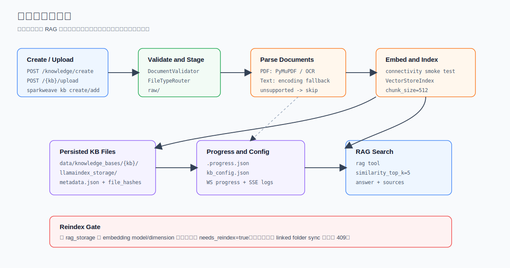

# 知识库详解

SparkWeave 的知识库用于 RAG 检索。当前主实现是 LlamaIndex pipeline，索引文件保存在项目级 `data/knowledge_bases/` 下，运行时通过 `rag` 工具或知识库 HTTP API 访问。



## 目录结构

单个知识库目录：

```text
data/knowledge_bases/<kb_name>/
  raw/
  llamaindex_storage/
  metadata.json
  .progress.json
```

全局配置：

```text
data/knowledge_bases/kb_config.json
```

重要文件：

| 文件 | 说明 |
| --- | --- |
| `raw/` | 上传或同步进来的原始文档 |
| `llamaindex_storage/` | LlamaIndex 持久化索引 |
| `metadata.json` | 单库 metadata、文件 hash、linked folders |
| `.progress.json` | 最近一次创建、上传或同步任务进度 |
| `kb_config.json` | 知识库注册表、默认库、状态、embedding 指纹 |

## 核心类

| 类 | 文件 | 责任 |
| --- | --- | --- |
| `KnowledgeBaseManager` | `sparkweave/knowledge/manager.py` | 列表、默认库、状态、metadata、linked folder、旧索引迁移标记 |
| `KnowledgeBaseInitializer` | `sparkweave/knowledge/initializer.py` | 创建目录、写 metadata、初始化 LlamaIndex 索引 |
| `DocumentAdder` | `sparkweave/knowledge/add_documents.py` | 增量添加文档、去重、更新 hash |
| `ProgressTracker` | `sparkweave/knowledge/progress_tracker.py` | 写 `.progress.json` 和 `kb_config.json`，广播进度 |
| `RAGService` | `sparkweave/services/rag_support/service.py` | 初始化、检索、删除的统一 facade |
| `LlamaIndexPipeline` | `sparkweave/services/rag_support/pipelines/llamaindex.py` | 文档解析、embedding、向量索引、检索 |
| `FileTypeRouter` | `sparkweave/services/rag_support/file_routing.py` | 文件类型分类和可上传扩展名 |

## 支持文件类型

API 上传和 CLI 收集文件时使用 `FileTypeRouter.get_supported_extensions()`，当前包含：

| 类型 | 扩展名 |
| --- | --- |
| PDF | `.pdf` |
| 文本和源码 | `.txt`、`.md`、`.json`、`.csv`、`.yaml`、`.py`、`.js`、`.ts`、`.html`、`.css`、`.sql` 等文本类扩展 |

`FileTypeRouter` 里也能识别 docx 和图片类型，但 `get_supported_extensions()` 当前只返回 PDF 和文本类扩展。因此知识库上传入口默认不会接受 docx、图片 OCR 入库。

PDF 文本提取策略：

| 策略 | 行为 |
| --- | --- |
| 默认 `auto` | 先用 PyMuPDF 读文本层；如果文本过短且讯飞 OCR 已配置，再尝试 OCR |
| `SPARKWEAVE_PDF_OCR_STRATEGY=iflytek_first` | 先用讯飞 OCR，失败或空结果再回退 PyMuPDF |

相关环境变量：

```text
SPARKWEAVE_PDF_OCR_STRATEGY
SPARKWEAVE_OCR_MIN_TEXT_CHARS
IFLYTEK_OCR_APP_ID
IFLYTEK_OCR_API_KEY
IFLYTEK_OCR_API_SECRET
```

## 创建知识库

HTTP API：

```http
POST /api/v1/knowledge/create
Content-Type: multipart/form-data
```

表单字段：

| 字段 | 类型 | 说明 |
| --- | --- | --- |
| `name` | string | 知识库名称 |
| `files` | file[] | 至少一个支持的文档 |
| `rag_provider` | string | 兼容字段，当前会规范为默认 `llamaindex` |

返回：

```json
{
  "message": "Knowledge base 'math' created. Processing 2 files in background.",
  "name": "math",
  "files": ["book.pdf"],
  "task_id": "kb_init_..."
}
```

后台任务流程：

1. `KnowledgeBaseManager.update_kb_status()` 先把库注册为 `initializing`。
2. `KnowledgeBaseInitializer.create_directory_structure()` 创建目录并写 `metadata.json`。
3. 上传文件保存到 `raw/`。
4. `run_initialization_task()` 后台执行。
5. `RAGService.initialize()` 调用 LlamaIndex pipeline。
6. pipeline 先做 embedding connectivity smoke test。
7. PDF 解析或文本读取后构建 `VectorStoreIndex`。
8. 索引持久化到 `llamaindex_storage/`。
9. `ProgressTracker` 写入完成状态。

CLI：

```bash
sparkweave kb create math --doc textbook.pdf
sparkweave kb create math --docs-dir ./materials
```

## 增量上传

HTTP API：

```http
POST /api/v1/knowledge/{kb_name}/upload
Content-Type: multipart/form-data
```

表单字段：

| 字段 | 类型 | 说明 |
| --- | --- | --- |
| `files` | file[] | 要追加的文档 |
| `rag_provider` | string | 兼容字段；如果传入，必须和 KB provider 一致 |

返回：

```json
{
  "message": "Uploaded 1 files. Processing in background.",
  "files": ["notes.md"],
  "task_id": "kb_upload_..."
}
```

增量上传规则：

- 只允许写入已存在且已初始化的 LlamaIndex 知识库。
- 如果 `kb_config.json` 标记了 `needs_reindex=true`，接口返回 409。
- `DocumentAdder` 根据 `metadata.json.file_hashes` 去重。
- 同名但内容不同的文件默认跳过，避免覆盖已索引内容。
- 每个新文件会调用 `LlamaIndexPipeline.add_documents()` 插入现有索引。

CLI：

```bash
sparkweave kb add math --doc new-notes.md
sparkweave kb add math --docs-dir ./new-materials
```

## 查询知识库

主路径是工具 `rag`，能力图里会通过 `LangChainToolRegistry` 调用。

服务层入口：

```python
from sparkweave.services.rag import rag_search

result = await rag_search(query="矩阵特征值", kb_name="math")
```

CLI：

```bash
sparkweave kb search math "矩阵特征值" --format json
```

返回结构：

```json
{
  "query": "矩阵特征值",
  "answer": "检索到的上下文文本",
  "content": "检索到的上下文文本",
  "sources": [
    {
      "title": "linear-algebra.md",
      "content": "chunk preview",
      "source": "data/knowledge_bases/math/raw/linear-algebra.md",
      "page": "",
      "chunk_id": "...",
      "score": 0.8123
    }
  ],
  "provider": "llamaindex"
}
```

检索实现要点：

- `LlamaIndexPipeline.search()` 使用 persisted storage 加载 index。
- 检索器使用 `similarity_top_k`，默认 `top_k=5`。
- 返回的是上下文片段，不强制再走 LLM 总结。
- 如果索引不存在，会返回 `No documents indexed. Please upload documents first.`。
- 如果 embedding 指纹不匹配，会在结果里附加 `warning`。

## 状态与进度

查询当前进度：

```http
GET /api/v1/knowledge/{kb_name}/progress
```

清理进度文件：

```http
POST /api/v1/knowledge/{kb_name}/progress/clear
```

实时进度 WebSocket：

```text
ws://<host>/api/v1/knowledge/{kb_name}/progress/ws?task_id=<task_id>
```

消息形状：

```json
{
  "type": "progress",
  "data": {
    "kb_name": "math",
    "task_id": "kb_upload_...",
    "stage": "processing_file",
    "message": "Indexing (LlamaIndex) notes.md",
    "current": 1,
    "total": 3,
    "file_name": "",
    "progress_percent": 33,
    "timestamp": "2026-04-29T10:00:00"
  }
}
```

阶段枚举：

| 阶段 | 说明 |
| --- | --- |
| `initializing` | 创建目录和注册配置 |
| `processing_documents` | 批量处理文档 |
| `processing_file` | 增量索引单个文件 |
| `extracting_items` | 兼容旧功能，目前是 no-op |
| `completed` | 完成 |
| `error` | 失败 |

任务日志 SSE：

```http
GET /api/v1/knowledge/tasks/{task_id}/stream
```

用于读取创建、上传、同步任务的日志流。

## 列表、详情、默认库

| 方法 | 路径 | 说明 |
| --- | --- | --- |
| `GET` | `/api/v1/knowledge/health` | 知识库服务健康检查 |
| `GET` | `/api/v1/knowledge/rag-providers` | 当前可用 RAG provider |
| `GET` | `/api/v1/knowledge/list` | 列出知识库 |
| `GET` | `/api/v1/knowledge/{kb_name}` | 获取详情 |
| `DELETE` | `/api/v1/knowledge/{kb_name}` | 删除知识库目录和配置 |
| `GET` | `/api/v1/knowledge/default` | 获取默认库 |
| `PUT` | `/api/v1/knowledge/default/{kb_name}` | 设置默认库 |
| `GET` | `/api/v1/knowledge/configs` | 获取所有 KB 配置 |
| `GET` | `/api/v1/knowledge/{kb_name}/config` | 获取单库配置 |
| `PUT` | `/api/v1/knowledge/{kb_name}/config` | 更新单库配置 |
| `POST` | `/api/v1/knowledge/configs/sync` | 从 metadata 同步配置 |

`GET /list` 返回的每项：

```json
{
  "name": "math",
  "is_default": true,
  "statistics": {
    "raw_documents": 2,
    "images": 0,
    "content_lists": 0,
    "rag_initialized": true,
    "rag_provider": "llamaindex",
    "needs_reindex": false,
    "status": "ready",
    "progress": {}
  },
  "status": "ready",
  "progress": {}
}
```

## Linked Folder

Linked folder 用于把本地目录和知识库关联。适合 OneDrive、SharePoint、Google Drive、OneLake 等同步目录。

创建链接：

```http
POST /api/v1/knowledge/{kb_name}/link-folder
Content-Type: application/json

{
  "folder_path": "~/Documents/course-materials"
}
```

返回：

```json
{
  "id": "a1b2c3d4",
  "path": "C:/Users/name/Documents/course-materials",
  "added_at": "2026-04-29T10:00:00",
  "file_count": 12
}
```

其他接口：

| 方法 | 路径 | 说明 |
| --- | --- | --- |
| `GET` | `/api/v1/knowledge/{kb_name}/linked-folders` | 查看已链接目录 |
| `DELETE` | `/api/v1/knowledge/{kb_name}/linked-folders/{folder_id}` | 解除链接 |
| `POST` | `/api/v1/knowledge/{kb_name}/sync-folder/{folder_id}` | 同步新文件和修改过的文件 |

同步逻辑：

1. `KnowledgeBaseManager.detect_folder_changes()` 扫描支持扩展名。
2. 根据 metadata 中的 `synced_files` 比较新增和修改。
3. 只把变化文件交给 `run_upload_processing_task()`。
4. 索引成功后才调用 `update_folder_sync_state()`。

这种顺序避免了“处理失败但已标记为 synced”的竞态。

## Embedding 指纹与重建

知识库 ready 时会把当前 embedding 配置写进 `kb_config.json`：

```json
{
  "embedding_model": "text-embedding-3-small",
  "embedding_dim": 1536
}
```

之后 `KnowledgeBaseManager._load_config()` 会比较当前 embedding 模型和维度：

- 模型或维度变化时，标记 `embedding_mismatch=true`。
- 同时设置 `needs_reindex=true`。
- 用户切回原模型后，会自动清除 `embedding_mismatch`。

影响：

- 搜索仍会尝试执行，但返回 warning。
- 增量上传和 linked folder 同步会被 409 拦截。
- 旧的 `rag_storage/` 格式也会被标记为 `needs_reindex`。

当前 HTTP API 没有单独的 reindex 端点。通常处理方式是重新创建知识库，或通过 CLI/脚本清理旧索引后重新初始化。

## 常见故障

| 现象 | 可能原因 | 处理 |
| --- | --- | --- |
| 创建后一直 processing | 后台任务仍在跑，或 `.progress.json` 是旧任务 | 查看 `tasks/{task_id}/stream`，必要时清理 progress |
| 上传返回 409 | `needs_reindex=true` | 重新索引或重建知识库 |
| 上传文件被跳过 | hash 已存在，或同名文件冲突 | 改名后重新上传，或确认内容是否已入库 |
| PDF 没有内容 | 扫描版 PDF 且 OCR 未配置 | 配置讯飞 OCR 或改用可复制文本的 PDF |
| 搜索返回空 | 索引目录不存在或没有有效文档 | 重新创建或上传支持格式文档 |
| embedding API 连接失败 | embedding provider、host、key 或模型配置错误 | 先在设置页修正 embedding 配置，再重新建库 |

更多服务层背景见 [服务层与数据流](./services.md)。
