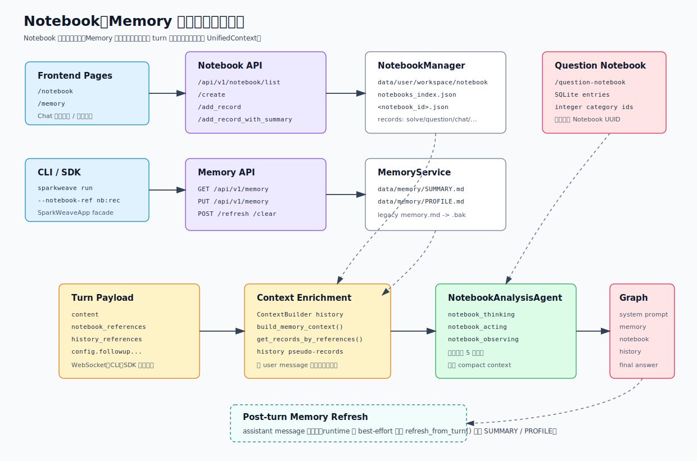

# Notebook、Memory 与上下文引用

Notebook、Memory 和历史引用共同承担 SparkWeave 的“可复用上下文”层：

- Notebook 保存用户显式沉淀的产出，如解题记录、题目包、协作写作草稿、视觉题解析、导学产出。
- Memory 保存长期学习画像和学习旅程摘要，由用户手动编辑，也会在 turn 完成后自动刷新。
- Context References 让一次新提问临时引用 Notebook 记录或历史会话，并在主 capability 运行前压缩成提示词上下文。

## 一图看懂



最重要的边界：

- `/api/v1/notebook` 是主 Notebook，落盘为 JSON 文件，ID 是 8 位 UUID 字符串。
- `/api/v1/question-notebook` 是题目本，落在 SQLite，分类 ID 是整数，不能当成主 Notebook ID 使用。
- Memory 当前实际存储在 `data/memory/`，旧的 `data/user/workspace/memory/` 只做 Markdown 文件迁移兼容。
- Notebook 和历史会话引用是“本轮临时上下文”；Memory 是“长期背景上下文”。

## 代码地图

| 领域 | 文件 | 责任 |
| --- | --- | --- |
| Notebook 存储 | `sparkweave/services/notebook.py` | Notebook JSON、记录 CRUD、引用解析、统计 |
| Notebook 摘要 | `sparkweave/services/notebook_summary.py` | 保存记录时自动生成短摘要，支持 SSE 流式返回 |
| Memory 存储 | `sparkweave/services/memory.py` | `SUMMARY.md` / `PROFILE.md` 读写、迁移、上下文构造和自动刷新 |
| 上下文构造 | `sparkweave/runtime/context_enrichment.py` | 将 payload 转成 `UnifiedContext`，注入历史、Memory、Notebook、附件 |
| 历史压缩 | `sparkweave/services/context.py` | `ContextBuilder` 压缩会话历史，`NotebookAnalysisAgent` 分析引用素材 |
| Prompt 组装 | `sparkweave/core/state.py` | `context_to_state()` 把 `UnifiedContext` 转成 LangChain messages |
| Notebook API | `sparkweave/api/routers/notebook.py` | `/api/v1/notebook/*` |
| Memory API | `sparkweave/api/routers/memory.py` | `/api/v1/memory`、`/refresh`、`/clear` |
| 前端入口 | `web/src/pages/NotebookPage.tsx`、`web/src/pages/MemoryPage.tsx` | Notebook 与 Memory 管理页面 |
| 引用面板 | `web/src/components/chat/ContextReferencesPanel.tsx` | 选择历史会话和 Notebook 记录作为本轮上下文 |
| CLI | `sparkweave_cli/chat.py`、`sparkweave_cli/notebook.py`、`sparkweave_cli/memory.py` | 单轮/REPL 引用、Notebook 导入、Memory 查看清空 |

## 存储模型

### 主 Notebook

默认目录：

```text
data/user/workspace/notebook/
  notebooks_index.json
  <notebook_id>.json
```

`notebooks_index.json` 保存列表页所需元信息，每个 `<notebook_id>.json` 保存完整记录。`NotebookManager.list_notebooks()` 会重新读取各 notebook 文件，按 `updated_at` 降序返回。

Notebook 数据结构：

```json
{
  "id": "a1b2c3d4",
  "name": "线性代数错题",
  "description": "矩阵、特征值和空间直觉",
  "created_at": 1760000000.0,
  "updated_at": 1760000300.0,
  "color": "#3B82F6",
  "icon": "book",
  "records": []
}
```

记录结构：

```json
{
  "id": "r9x8y7z6",
  "type": "solve",
  "title": "特征值题解",
  "summary": "用户保存的一道特征值题，重点在对角化条件。",
  "user_query": "解这道题",
  "output": "完整解题过程...",
  "metadata": {
    "source": "chat",
    "session_id": "..."
  },
  "created_at": 1760000300.0,
  "kb_name": "linear-algebra"
}
```

支持的 `type`：

```text
solve
question
research
co_writer
chat
guided_learning
```

实现注意：

- `create_notebook()` 使用 `uuid4()[:8]` 生成短 ID。
- `add_record()` 会创建一条记录，并把同一个 record payload 写入所有有效 `notebook_ids`。
- 无效 notebook ID 会被静默跳过，返回的 `added_to_notebooks` 才是真正写入成功的列表。
- 如果一条记录被写入多个 Notebook，后续 `update_record()` 和 `remove_record()` 是按单个 notebook 操作，不会自动同步到其他 notebook 副本。
- `update_record()` 合并 `metadata`，不会整体覆盖旧 metadata。
- `get_records_by_references()` 中 `record_ids` 为空时表示读取该 notebook 的全部记录。

### 题目本不是主 Notebook

题目本接口：

```text
/api/v1/question-notebook
```

题目本落在 `data/user/chat_history.db` 的 SQLite 表中：

```text
notebook_entries
notebook_categories
notebook_entry_categories
```

这里的 category ID 是整数。主 Notebook ID 是短 UUID 字符串。测试 `tests/api/test_main_notebook_router.py` 明确覆盖了一个回归：如果把题目本分类 ID `1`、`42` 传给 `/api/v1/notebook/add_record`，主 Notebook 不应该匹配到任何记录。

前端或插件保存到主 Notebook 时，必须从 `/api/v1/notebook/list` 取 notebook ID；保存题目收藏或分类时，才使用 `/api/v1/question-notebook/*` 的 entry/category ID。

### Memory

当前目录：

```text
data/memory/
  SUMMARY.md
  PROFILE.md
```

两个文件的分工：

| 文件 | 用途 |
| --- | --- |
| `PROFILE.md` | 稳定身份、学习偏好、知识水平、长期约束 |
| `SUMMARY.md` | 学习旅程、当前关注点、已完成内容、开放问题 |

`PathService.get_memory_dir()` 会返回 `data/memory/`。如果旧目录 `data/user/workspace/memory/` 存在且新目录不存在，会把旧目录中的 Markdown 文件复制到 `data/memory/`。`MemoryService` 还会迁移旧的 `memory.md`，拆成 `PROFILE.md` 和 `SUMMARY.md` 后把旧文件改名为 `memory.md.bak`。

写入规则：

- `read_snapshot()` 返回两份内容和各自 `updated_at`。
- `write_file("summary" | "profile", content)` 写单个文件。
- 空内容表示删除对应文件。
- `write_memory()` 是兼容入口，实际写入 `PROFILE.md`。
- `clear_memory()` 删除两个文件。

## Notebook API

路由在 `sparkweave/api/main.py` 中挂载为：

```python
app.include_router(notebook.router, prefix="/api/v1/notebook", tags=["notebook"])
```

主要端点：

| 方法 | 路径 | 说明 |
| --- | --- | --- |
| `GET` | `/api/v1/notebook/list` | Notebook 列表 |
| `GET` | `/api/v1/notebook/statistics` | 总数、类型统计、最近 Notebook |
| `POST` | `/api/v1/notebook/create` | 创建 Notebook |
| `GET` | `/api/v1/notebook/{notebook_id}` | 读取详情和记录 |
| `PUT` | `/api/v1/notebook/{notebook_id}` | 更新名称、描述、颜色、图标 |
| `DELETE` | `/api/v1/notebook/{notebook_id}` | 删除 Notebook 文件并移除 index |
| `POST` | `/api/v1/notebook/add_record` | 保存记录，必要时先生成摘要 |
| `POST` | `/api/v1/notebook/add_record_with_summary` | SSE 流式生成摘要并保存记录 |
| `PUT` | `/api/v1/notebook/{notebook_id}/records/{record_id}` | 更新记录 |
| `DELETE` | `/api/v1/notebook/{notebook_id}/records/{record_id}` | 删除记录 |

创建 Notebook：

```json
{
  "name": "Fourier Notes",
  "description": "信号处理学习",
  "color": "#0F766E",
  "icon": "book"
}
```

保存记录：

```json
{
  "notebook_ids": ["a1b2c3d4"],
  "record_type": "chat",
  "title": "傅里叶变换解释",
  "summary": "",
  "user_query": "解释傅里叶变换",
  "output": "完整回答内容...",
  "metadata": {
    "source": "chat",
    "session_id": "session-1",
    "ui_language": "zh"
  },
  "kb_name": "signals"
}
```

如果 `summary` 为空，`_build_record_summary()` 会调用 `NotebookSummarizeAgent`。摘要 LLM 使用当前 `get_llm_config()`，并会透传 `extra_headers`；`tests/ng/test_notebook_summary.py` 覆盖了这个行为。

SSE 保存接口事件：

```text
data: {"type":"summary_chunk","content":"..."}

data: {"type":"result","success":true,"summary":"...","record":{...},"added_to_notebooks":["a1b2c3d4"]}
```

实现注意：`/health` 端点定义在动态路由 `/{notebook_id}` 之后。若健康检查出现 404，需要先确认路由匹配顺序，或用 `/list`、`/statistics` 辅助判断服务是否可用。

## Memory API

路由挂载：

```python
app.include_router(memory.router, prefix="/api/v1/memory", tags=["memory"])
```

端点：

| 方法 | 路径 | 请求 | 说明 |
| --- | --- | --- | --- |
| `GET` | `/api/v1/memory` | 无 | 读取 `summary`、`profile` 和更新时间 |
| `PUT` | `/api/v1/memory` | `{ "file": "summary", "content": "..." }` | 写单个文件 |
| `POST` | `/api/v1/memory/refresh` | `{ "session_id": "...", "language": "zh" }` | 从指定或最近会话刷新两份记忆 |
| `POST` | `/api/v1/memory/clear` | `{ "file": "profile" }` 或 `{ "file": null }` | 清空单个文件或全部 |

`refresh_from_session()` 如果不传 `session_id`，会取最近一条会话。传入 session 但不存在时，API 返回 404。

## Turn 上下文构造

每次 WebSocket、CLI 或 SDK 启动 turn，都会进入：

```text
LangGraphTurnRuntimeManager._run_prepared_turn()
  -> build_turn_context()
  -> LangGraphRunner.handle(context)
```

`build_turn_context()` 的主要输入：

```json
{
  "content": "结合我之前保存的记录，解释这道题",
  "capability": "chat",
  "tools": ["rag"],
  "knowledge_bases": ["math"],
  "notebook_references": [
    { "notebook_id": "a1b2c3d4", "record_ids": ["r9x8y7z6"] }
  ],
  "history_references": ["session-old"],
  "attachments": [],
  "language": "zh",
  "config": {}
}
```

构造步骤：

1. 复制 `config`，移除 runtime 内部字段，如 `followup_question_context` 和 `_persist_user_message`。
2. 如果存在 `followup_question_context` 且当前会话没有消息，写入一条 system message 作为题目追问背景。
3. 调用 `ContextBuilder.build()` 读取当前会话历史，必要时压缩成 `compressed_summary`。
4. 调用 `MemoryService.build_memory_context()` 读取长期记忆。
5. 按 `notebook_references` 从 Notebook 文件解析记录，并用 `NotebookAnalysisAgent` 压缩成 `notebook_context`。
6. 按 `history_references` 把历史会话转成伪 record，同样交给 `NotebookAnalysisAgent` 压缩成 `history_context`。
7. 将 Notebook 和 History 上下文拼到本轮 `UnifiedContext.user_message` 前面。
8. 如果 `_persist_user_message` 不是 false，把原始用户输入写入 `messages`。
9. 返回 `UnifiedContext`，并把引用和上下文摘要写入 `metadata`。

Notebook/History 增强后的 user message 形态：

```text
[Notebook Context]
...

[History Context]
...

[User Question]
原始用户问题
```

注意：持久化到 `messages` 的仍然是原始 `content`，不是增强后的 prompt。这样历史页面不会被 Notebook/History 上下文污染。

## Prompt 注入方式

`UnifiedContext` 中与上下文相关的字段：

| 字段 | 来源 | 用途 |
| --- | --- | --- |
| `conversation_history` | 当前 session 历史和压缩摘要 | `build_langchain_messages()` 转成历史 messages |
| `memory_context` | `MemoryService.build_memory_context()` | 追加到 system prompt |
| `notebook_context` | Notebook 引用分析结果 | 写入 system prompt，也会拼进增强 user message |
| `history_context` | 历史会话引用分析结果 | 写入 system prompt，也会拼进增强 user message |
| `metadata.conversation_summary` | `ContextBuilder` | 调试和追踪 |
| `metadata.notebook_references` | 原始 payload | 前后端调试 |
| `metadata.history_references` | 原始 payload | 前后端调试 |
| `metadata.memory_context` | Memory 文本 | 调试和回放 |

`context_to_state()` 会通过 `_system_prompt_with_context()` 把 Memory、Notebook、History 追加到 system prompt。对多数 LangGraph capability 来说，Notebook/History 会同时出现在 system prompt 和增强 user message 中。调试 prompt 长度时，要把这部分重复注入成本算进去。

Memory 不会拼进 `user_message`，只作为长期背景进入 system prompt。它的内容会带有“只在直接相关时使用”的提示，避免模型把长期记忆过度套用到每一轮。

## NotebookAnalysisAgent

`NotebookAnalysisAgent` 负责把用户选中的 Notebook 记录或历史会话压缩成“主能力可直接使用的上下文说明”。它不是一个可选工具，而是 context enrichment 的预处理 agent。

阶段：

| 阶段 | 事件 stage | 作用 |
| --- | --- | --- |
| thinking | `notebook_thinking` | 根据用户问题和记录摘要推理哪些素材相关 |
| acting | `notebook_acting` | 产出 `selected_record_ids`，最多 5 条 |
| observing | `notebook_observing` | 读取详细记录，合成紧凑上下文 |

运行时事件：

- `stage_start` / `stage_end`
- `thinking`
- `tool_call`，工具名为 `notebook_lookup`
- `tool_result`
- `observation`
- `result`，metadata 包含 `observation` 和 `selected_record_ids`

裁剪策略：

- 摘要目录中 title 限制约 80 字符，summary 限制约 240 字符。
- 详细记录 `output` 每条限制约 2500 字符。
- 工具结果展示的 `output` 每条限制约 400 字符。
- 如果 acting 没选出有效 ID，则退回到前 5 条记录。

历史会话引用也复用这个 agent。区别是 runtime 会把历史 session 转成伪 record：`notebook_id="__history__"`、`notebook_name="History"`、`output` 是该 session 的 transcript。

## 历史压缩

`ContextBuilder` 只读取当前会话的 `user`、`assistant`、`system` 消息。预算来自当前 LLM 配置：

```text
history_budget = max(256, max_tokens * 0.35)
summary_budget = max(96, history_budget * 0.40)
recent_budget = max(128, history_budget - summary_budget)
```

如果当前历史没超预算，直接返回原 messages。如果超预算，会把较旧消息总结到 `sessions.compressed_summary`，保留近期消息进入 `conversation_history`。

上下文压缩本身也可以写 `progress` 事件，所以你可能在主 graph 事件之前看到 context builder 或 notebook analysis 的事件。

## Turn 后 Memory 刷新

主 capability 完成后，`LangGraphTurnRuntimeManager` 会汇总 assistant message，然后调用：

```text
MemoryService.refresh_from_turn(
  user_message=原始用户输入,
  assistant_message=汇总后的 assistant 文本,
  session_id=...,
  capability=...,
  language=...
)
```

刷新规则：

- 用户消息或 assistant 消息为空时不刷新。
- 分别重写 `PROFILE.md` 和 `SUMMARY.md`。
- LLM 返回 `NO_CHANGE` 时不写文件。
- 自动刷新异常会被 runtime 捕获，不会让本次 turn 失败。
- 手动刷新走 `/api/v1/memory/refresh` 或 MemoryPage。

这意味着 Memory 是 best-effort 的长期沉淀层，不应该被业务流程当成强一致状态。

## 前端入口

### NotebookPage

`web/src/pages/NotebookPage.tsx` 同时展示主 Notebook 与题目本：

- 主 Notebook：创建、删除、编辑元信息、查看记录、编辑记录、手动新增记录、流式生成摘要。
- 题目本：查看答题记录、分类、收藏和追问入口。
- 手动新增记录可以使用普通保存，也可以使用 `add_record_with_summary` 先生成摘要。

与 API 的映射在 `web/src/lib/api.ts`：

```text
listNotebooks()
getNotebook()
createNotebook()
addNotebookRecord()
addNotebookRecordWithSummary()
updateNotebookRecord()
deleteNotebookRecord()
```

### MemoryPage

`web/src/pages/MemoryPage.tsx` 使用 `useMemory()` 和 `useMemoryMutations()`：

- 切换编辑 `SUMMARY.md` / `PROFILE.md`。
- 保存当前文件。
- 选择 session 后刷新 Memory。
- 清空当前文件或全部文件。

### Chat 引用面板

`web/src/components/chat/ContextReferencesPanel.tsx` 负责选本轮引用素材：

- 历史会话最多展示最近 8 条，排除当前 session。
- Notebook 下拉选择一个 notebook，并展示前 10 条记录。
- 点击记录后构造 `{ notebook_id, record_ids }`。
- `useChatRuntime.ts` 在 WebSocket `start_turn` payload 中发送 `notebook_references` 和 `history_references`。

前端 `NotebookReference` 类型：

```ts
export interface NotebookReference {
  notebook_id: string;
  record_ids: string[];
}
```

### 其他保存入口

多个页面会把能力产出保存为 Notebook 记录：

| 页面 | 保存内容 |
| --- | --- |
| `QuestionLabPage` | 本次题目生成结果 |
| `VisionPage` | 图像题、导师讲解和 GeoGebra 指令 |
| `GuidePage` | 导学报告、练习、产出包 |
| `CoWriterPage` | 协作写作草稿或最终稿 |
| `MessageBubble` | 可识别的 artifact 输出 |

新增保存入口时，metadata 至少建议带上 `source`、`session_id`、`turn_id` 或业务对象 ID，方便后续追踪。

## CLI 与 Python facade

单轮命令引用 Notebook 和历史会话：

```powershell
sparkweave run chat "结合这条笔记讲解" --notebook-ref a1b2c3d4:r9x8y7z6 --history-ref session-old
```

`--notebook-ref` 格式：

```text
<notebook_id>
<notebook_id>:<record_id>
<notebook_id>:<record_id_1>,<record_id_2>
```

不写 record ID 时，后端会读取该 notebook 的全部记录，再由 `NotebookAnalysisAgent` 选择最多 5 条详细展开。

交互式 REPL：

```text
/history add <session_id>
/history clear
/notebook add <notebook_id>:<record_id>
/notebook clear
/refs
```

Notebook CLI：

```powershell
sparkweave notebook list
sparkweave notebook create "写作素材" --description "课程论文草稿"
sparkweave notebook show a1b2c3d4
sparkweave notebook add-md a1b2c3d4 .\draft.md
sparkweave notebook replace-md a1b2c3d4 r9x8y7z6 .\draft.md
sparkweave notebook remove-record a1b2c3d4 r9x8y7z6
```

Memory CLI：

```powershell
sparkweave memory show
sparkweave memory show summary
sparkweave memory show profile
sparkweave memory clear profile --force
sparkweave memory clear all --force
```

Python facade 可直接操作 Notebook：

```python
from sparkweave.app import SparkWeaveApp

app = SparkWeaveApp()
notebook = app.create_notebook("研究记录", description="RAG 论文阅读")
app.add_record(
    notebook_ids=[notebook["id"]],
    record_type="research",
    title="检索增强生成综述",
    summary="RAG 系统的索引、检索和生成阶段笔记。",
    user_query="总结 RAG",
    output="完整笔记...",
    metadata={"source": "script"},
)
```

## 开发清单

新增 Notebook 记录类型时，同时检查：

- `sparkweave/services/notebook.py` 的 `RecordType`。
- `sparkweave/api/routers/notebook.py` 的 `AddRecordRequest.record_type` literal。
- `sparkweave/services/notebook.py` 的 `get_statistics()` 类型计数。
- `web/src/lib/types.ts` 的 `NotebookRecord` union。
- `NotebookPage` 和保存入口的展示文案。
- 对应 API 或服务测试。

新增可引用上下文来源时，同时检查：

- payload 字段是否进入 `TurnRequest.to_payload()`。
- `sparkweave/runtime/context_enrichment.py` 是否解析、裁剪、写 metadata。
- `UnifiedContext` 是否需要新增字段。
- `sparkweave/core/state.py` 是否需要进入 system prompt。
- WebSocket 事件是否可回放。
- `tests/ng/test_turn_runtime.py` 和 `tests/ng/test_turn_runtime_parity.py`。

调整 Memory 行为时，同时检查：

- `MemoryService.build_memory_context()` 的 prompt 体积。
- `refresh_from_turn()` 的异常是否仍保持 best-effort。
- `refresh_from_session()` 对空会话和不存在 session 的行为。
- `tests/services/memory/test_memory_service.py`。
- `tests/api/test_memory_router.py`。

调整 Notebook 摘要时，同时检查：

- `NotebookSummarizeAgent.stream_summary()` 的 token 限制和语言提示。
- `add_record()` 与 `add_record_with_summary()` 是否一致。
- SSE 客户端解析逻辑 `web/src/lib/api.ts`。
- `tests/ng/test_notebook_summary.py`。

## 常见排查

| 现象 | 排查方向 |
| --- | --- |
| 保存记录后 Notebook 没变化 | 检查 `added_to_notebooks`，确认传的是主 Notebook UUID，不是题目本分类 ID |
| 引用 Notebook 后回答没利用记录 | 检查 payload 中 `notebook_references` 是否有 record ID，查看 turn events 中 `notebook_analysis` 阶段 |
| 引用历史会话后没有上下文 | 确认 `history_references` 中的 session 存在，且该 session 有 user/assistant 消息 |
| Memory 不更新 | 用户或 assistant 文本为空、LLM 返回 `NO_CHANGE`、或自动刷新异常被 best-effort 捕获 |
| Prompt 过长 | 检查 Notebook/History 是否同时进入 system prompt 和增强 user message，必要时减少引用记录 |
| 手动清空 Memory 后文件不见了 | 这是预期行为，空内容会删除对应 Markdown 文件 |

## 测试索引

| 覆盖点 | 测试 |
| --- | --- |
| 主 Notebook API、分类 ID 回归 | `tests/api/test_main_notebook_router.py` |
| Notebook 服务枚举兼容 | `tests/services/test_notebook_service.py` |
| Notebook 摘要 LLM 调用 | `tests/ng/test_notebook_summary.py` |
| Memory API | `tests/api/test_memory_router.py` |
| Memory 自动重写和 `NO_CHANGE` | `tests/services/memory/test_memory_service.py` |
| `UnifiedContext` 上下文字段 | `tests/core/test_context.py` |
| ContextBuilder 历史压缩 | `tests/services/session/test_context_builder.py` |
| turn runtime、follow-up、Memory、Notebook/History 引用 | `tests/ng/test_turn_runtime.py` |
| NG runtime parity | `tests/ng/test_turn_runtime_parity.py` |
| WebSocket 集成上下文 | `tests/api/test_unified_ws_langgraph_e2e.py` |
| CLI 引用参数 | `tests/cli/test_chat_cli.py` |
