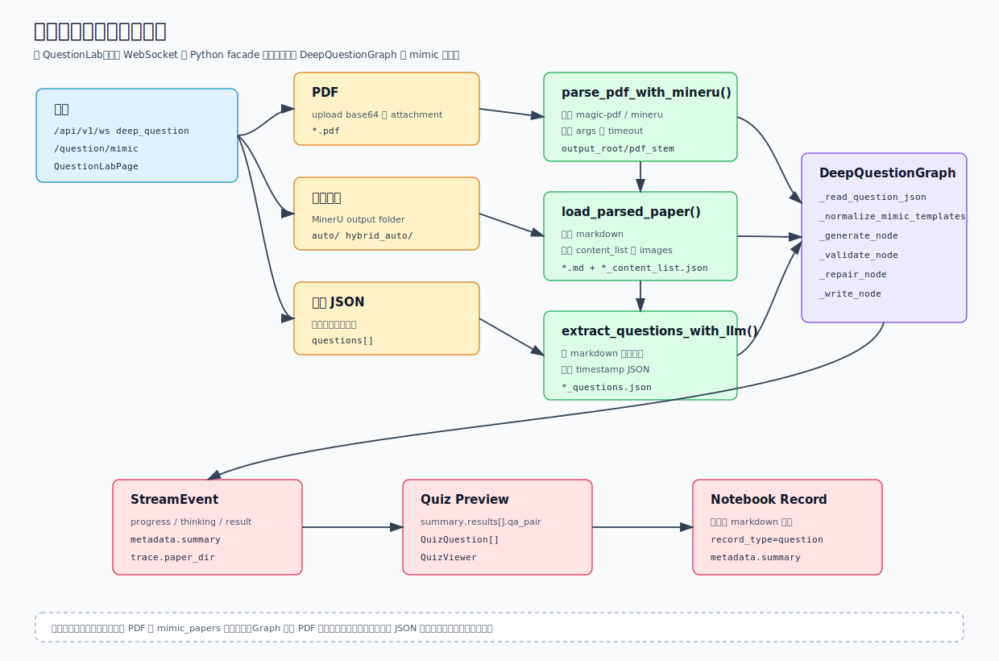

# 试卷解析与仿题素材链路

这篇文档专门解释 `deep_question` 的 mimic 模式如何把一份试卷变成可生成仿题的结构化素材。它补充 [题目工作流](./question-workflows.md)：后者讲能力入口和题目本 API，这里讲 PDF、MinerU 解析目录、题目 JSON、模板归一化和前端 QuestionLab 的完整数据链路。



## 代码地图

| 文件 | 责任 |
| --- | --- |
| `sparkweave/api/routers/question.py` | 旧 `/api/v1/question/mimic` WebSocket，处理 PDF base64 上传、文件安全校验、批次目录和旧事件协议 |
| `sparkweave/services/question_generation.py` | `AgentCoordinator` 兼容 facade，把旧接口请求转换成 `UnifiedContext(active_capability="deep_question")` |
| `sparkweave/graphs/deep_question.py` | mimic 模式主流程：加载参考题、归一化模板、生成、校验、修复、写出 summary |
| `sparkweave/services/question.py` | MinerU 命令探测、PDF 解析、MinerU 产物读取、LLM 题目抽取、题目 JSON 保存 |
| `web/src/pages/QuestionLabPage.tsx` | 前端题目工作台：知识点出题、试卷仿题、事件流、预览和保存到 Notebook |
| `web/src/lib/quiz.ts` | 从 `result.metadata.summary.results` 提取可渲染的 `QuizQuestion[]` |
| `tests/ng/test_question_services.py` | MinerU 命令、参数、超时和题目抽取服务测试 |
| `tests/ng/test_deep_question_graph.py` | mimic JSON、上传 PDF、缺少试卷、修复无效题目 payload 的图层测试 |
| `tests/api/test_question_router.py` | 旧 WebSocket 入口和 NG facade 绑定测试 |

## 三个入口

推荐的新入口是统一运行时：

```json
{
  "type": "start_turn",
  "content": "仿照这份试卷生成 5 道题",
  "capability": "deep_question",
  "config": {
    "mode": "mimic",
    "paper_path": "data/reference_papers/exam/questions.json",
    "max_questions": 5
  }
}
```

统一运行时也可以传 PDF attachment。`DeepQuestionGraph._load_mimic_questions()` 会从 `UnifiedContext.attachments` 中寻找 PDF，临时写入本地文件，再走同一套 PDF 解析逻辑。

旧兼容入口仍然存在：

```text
ws://<host>/api/v1/question/mimic
```

上传 PDF：

```json
{
  "mode": "upload",
  "pdf_data": "base64_encoded_pdf_content",
  "pdf_name": "exam.pdf",
  "kb_name": "linear-algebra",
  "max_questions": 5
}
```

使用已解析目录：

```json
{
  "mode": "parsed",
  "paper_path": "data/reference_papers/exam",
  "kb_name": "linear-algebra",
  "max_questions": 5
}
```

前端 `QuestionLabPage` 在“试卷仿题”模式下会二选一发送：

- 选择 PDF 文件时，浏览器用 `FileReader.readAsDataURL()` 读取并取 base64 主体，发送 `mode=upload`。
- 填写解析目录时，发送 `mode=parsed` 和 `paper_path`。

## 素材格式

`DeepQuestionGraph` 最终只需要一组参考题。最稳定的输入是题目 JSON 文件：

```json
{
  "paper_name": "exam",
  "total_questions": 2,
  "questions": [
    {
      "question_number": "1",
      "question_text": "Explain why matrix multiplication is not commutative.",
      "question_type": "written",
      "answer": "AB and BA can differ.",
      "images": []
    }
  ]
}
```

也接受顶层数组：

```json
[
  {
    "question": "Find the derivative of x^2.",
    "type": "written",
    "answer": "2x"
  }
]
```

解析目录通常来自 MinerU，常见结构如下：

```text
exam/
  auto/
    exam.md
    exam_content_list.json
    images/
      figure_1.png
```

`load_parsed_paper()` 会优先寻找 `auto/` 和 `hybrid_auto/`，然后扫描子目录和嵌套的 `*.md`、`*_content_list.json`。如果目录里已经有 `*_questions.json` 或 `questions.json`，图会直接读取，不再调用抽取 LLM。

## PDF 到题目 JSON

`sparkweave.services.question.parse_pdf_with_mineru()` 做 PDF 解析：

1. `check_mineru_installed()` 查找命令，顺序是 `SPARKWEAVE_MINERU_COMMAND`、`magic-pdf`、`mineru`、当前 Python 环境的 `Scripts/` 或 `bin/`。
2. 对候选命令先试 `--version`，失败再试 `--help`。
3. 校验输入必须存在且后缀是 `.pdf`。
4. 创建 `temp_mineru_output`，执行 `mineru_cmd -p <pdf> -o <temp_output> ...extra_args`。
5. `SPARKWEAVE_MINERU_ARGS` 会用 `shlex.split()` 追加到命令末尾。
6. `SPARKWEAVE_MINERU_TIMEOUT` 如果是正数，会作为 subprocess 超时。
7. 解析成功后优先选取与 PDF stem 同名的输出目录，否则选第一个生成目录，移动到 `<output_root>/<pdf_stem>/`。

`extract_questions_from_paper()` 再把 MinerU 产物变成题目 JSON：

1. `load_parsed_paper()` 读取 markdown、可选 content list 和 `images/` 文件名。
2. `extract_questions_with_llm()` 用当前 LLM 配置抽取题目，提示词要求返回顶层 `questions` 数组。
3. markdown 最多传前 15000 字符，content list 最多传前 6000 字符，图片目前以文件名列表进入提示词。
4. 如果 provider 支持，会请求 JSON object response format；Anthropic/Claude 和 `o1`、`o3` 系列不强制该格式。
5. `save_questions_json()` 写出 `<paper_name>_<timestamp>_questions.json`。

## Graph 中的加载顺序

`DeepQuestionGraph._load_mimic_questions_from_path()` 按输入类型分支：

| 输入 | 行为 |
| --- | --- |
| JSON 文件 | `_read_question_json()` 读取 `{ "questions": [] }` 或顶层数组 |
| 目录 | `_find_or_extract_question_json()` 查找 `*_questions.json`、`questions.json`，找不到时调用 `extract_questions_from_paper()` |
| PDF 文件 | 使用临时目录调用 `parse_pdf_with_mineru()`，再在解析目录中查找或抽取题目 JSON |

这里有一个当前实现细节：旧 `/question/mimic` 会创建 `mimic_papers/mimic_<timestamp>_<name>/` 并保存上传 PDF，但 `DeepQuestionGraph` 对 PDF 的 MinerU 解析产物使用临时目录。`AgentCoordinator` 传入的 `output_dir` 和 `metadata.question_output_dir` 目前主要是兼容上下文，图层尚未用它持久化生成题或解析中间产物。

## 参考题到模板

`_normalize_mimic_templates()` 会把参考题变成生成模板：

| 参考题字段 | 模板字段 |
| --- | --- |
| `question_text`、`question`、`stem` | `reference_question`，并截断前 240 字符放入 `concentration` |
| `answer` | `reference_answer` |
| `question_type`、`type` | 规范化后的 `question_type` |
| `question_number` | `metadata.question_number` |
| `images` | `metadata.images` |

题型归一化规则：

| 原始描述包含 | 输出 |
| --- | --- |
| `choice`、`multiple`、`mcq`、`select` | `choice` |
| `true`、`false`、`judge` | `true_false` |
| `blank`、`fill`、`cloze` | `fill_blank` |
| `code`、`program` | `coding` |
| 其他或缺省 | `written` |

生成时的系统提示要求模型“模仿参考题风格、难度和技能焦点，但不要复制原题”，并且必须返回 JSON。之后 `_validate_node()` 会按题型检查结构：

- `choice` 必须有 A-D 四个选项，`correct_answer` 必须是选项 key。
- `true_false` 答案必须归一化为 `True` 或 `False`。
- `fill_blank` 题干必须包含可见空格，例如 `____`。
- 非选择题如果看起来像选择题，会被标记为需要修复。

有结构问题的题目进入 `_repair_node()`，只重生成失败的单题，最后由 `_write_node()` 输出 markdown 和 `result.metadata.summary`。

## WebSocket 事件和前端消费

旧 `/api/v1/question/mimic` 会发送兼容消息：

```json
{ "type": "status", "stage": "init", "content": "Initializing..." }
{ "type": "status", "stage": "upload", "content": "Saving PDF: exam.pdf" }
{ "type": "status", "stage": "parsing", "content": "Parsing PDF exam paper (MinerU)..." }
{ "type": "status", "stage": "processing", "content": "Executing question generation workflow..." }
{ "type": "progress", "stage": "ideation", "content": "Loading exam paper templates..." }
{ "type": "result", "stage": "generation", "metadata": { "summary": {} } }
{ "type": "complete" }
```

`AgentCoordinator._event_to_update()` 会把 `StreamEvent` 的 `type`、`stage`、`source`、`content`、`metadata` 平铺给旧前端。`QuestionLabPage.extractSummary()` 会从 `event.summary`、`event.metadata.summary` 或 `type=result` 的 metadata 中提取 summary，再把 `summary.results[].qa_pair` 转成 `QuizQuestion[]`。

保存到 Notebook 时，前端把生成题转成 markdown，并调用 notebook mutation 写入一条 `record_type="question"` 的记录，metadata 中保留 `source="question_lab"`、`mode` 和完整 summary。

## 配置和排错

| 变量 | 用途 |
| --- | --- |
| `SPARKWEAVE_MINERU_COMMAND` | 指定 MinerU CLI 路径，适合 Windows 虚拟环境或手动安装路径 |
| `SPARKWEAVE_MINERU_ARGS` | 追加 MinerU 参数，例如 `-m txt -b pipeline` 或 `-m ocr -b pipeline -l en` |
| `SPARKWEAVE_MINERU_TIMEOUT` | PDF 解析 subprocess 超时秒数，空值表示不限制 |
| `SPARKWEAVE_NG_MINERU_LIVE` | 仅用于 live 测试，设为 `1` 后运行真实 MinerU PDF smoke test |

常见失败点：

| 现象 | 可能原因 | 检查位置 |
| --- | --- | --- |
| `Failed to parse exam paper with MinerU.` | MinerU 命令不可用、参数错误、PDF 无法解析或超时 | `check_mineru_installed()`、`SPARKWEAVE_MINERU_ARGS`、服务日志 |
| `Failed to extract questions from parsed exam.` | 解析目录没有 markdown，或抽取 LLM 没返回有效 `questions` | `load_parsed_paper()`、LLM provider 配置 |
| `Question extraction output not found.` | 抽取成功标志异常，或题目 JSON 没写到解析目录 | `extract_questions_from_paper()`、输出目录权限 |
| `Mimic mode requires either an uploaded PDF or a parsed exam directory.` | `paper_path` 为空且没有 PDF attachment | 请求 payload |
| 前端显示完成但没有题目 | summary 存在但 `results[].qa_pair.question` 为空 | `result.metadata.summary.results` |

## 测试建议

改这条链路时优先跑：

```bash
pytest tests/ng/test_question_services.py tests/ng/test_deep_question_graph.py tests/api/test_question_router.py
```

如果本机安装了 MinerU、Pillow 和 reportlab，可以跑 live smoke：

```bash
set SPARKWEAVE_NG_MINERU_LIVE=1
pytest tests/ng/test_question_mineru_live.py -m live
```

Windows PowerShell 下用：

```powershell
$env:SPARKWEAVE_NG_MINERU_LIVE = "1"
pytest tests/ng/test_question_mineru_live.py -m live
```

## 开发检查清单

- 新增 PDF 解析参数时，同步更新 `SPARKWEAVE_MINERU_ARGS` 文档和服务测试。
- 改题目 JSON 字段时，同步更新 `_normalize_mimic_templates()`、`web/src/lib/quiz.ts` 和题目本保存逻辑。
- 希望保留解析中间产物时，需要让 `DeepQuestionGraph` 使用 `config.output_dir` 或 `metadata.question_output_dir`，并补充清理策略。
- 如果要让模型真正看图，不只看图片文件名，需要在 `extract_questions_with_llm()` 或后续生成 prompt 中接入多模态内容。
- 旧 `/api/v1/question/mimic` 只作为兼容层扩展；新的能力行为应优先落在 `DeepQuestionGraph` 或 `sparkweave.services.question`。
