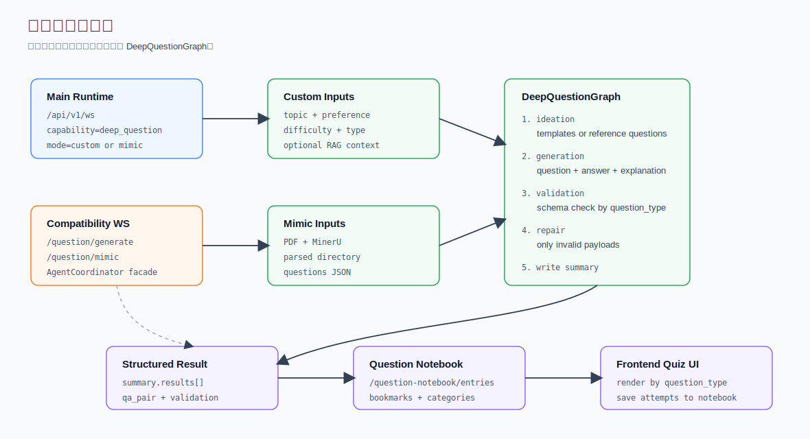

# 题目工作流

SparkWeave 的题目能力有两条入口线：

- 主运行时：`deep_question` capability，走 `/api/v1/ws`、CLI、Python facade。
- 兼容路由：`/api/v1/question/generate` 和 `/api/v1/question/mimic`，保留旧前端 WebSocket 协议，但内部已经委托给 `DeepQuestionGraph`。

题目保存、收藏和分类由 `/api/v1/question-notebook` 提供。



PDF、MinerU 解析目录和题目 JSON 如何进入仿题模板，见 [试卷解析与仿题素材链路](./question-parsing-and-mimic.md)。

## 代码地图

| 文件 | 说明 |
| --- | --- |
| `sparkweave/graphs/deep_question.py` | LangGraph 题目生成主实现 |
| `sparkweave/services/question_generation.py` | 兼容 facade，暴露 `AgentCoordinator` 和 `mimic_exam_questions()` |
| `sparkweave/api/routers/question.py` | 旧题目生成 WebSocket 路由 |
| `sparkweave/api/routers/question_notebook.py` | 题目本 CRUD 和分类 API |
| `sparkweave/services/question.py` | MinerU 试卷解析兼容函数 |
| `tests/ng/test_deep_question_graph.py` | 图层行为测试 |
| `tests/api/test_question_router.py` | 兼容 WebSocket 路由测试 |

## 主运行时生成题目

推荐新功能优先走 `/api/v1/ws` 的 `deep_question`。

示例：

```json
{
  "type": "start_turn",
  "content": "线性代数特征值",
  "capability": "deep_question",
  "tools": ["rag"],
  "knowledge_bases": ["linear-algebra"],
  "config": {
    "mode": "custom",
    "topic": "线性代数特征值",
    "num_questions": 5,
    "difficulty": "medium",
    "question_type": "mixed",
    "preference": "覆盖概念理解和计算"
  }
}
```

配置字段：

| 字段 | 类型 | 默认 | 说明 |
| --- | --- | --- | --- |
| `mode` | `custom`、`mimic` | `custom` | 题目模式 |
| `topic` | string | 用户输入 | 自定义出题主题 |
| `num_questions` | int | `1` | 自定义模式题数，1 到 50 |
| `difficulty` | string | 空 | 难度偏好 |
| `question_type` | string | 空 | `choice`、`true_false`、`fill_blank`、`written`、`coding` 或自动 |
| `preference` | string | 空 | 风格、范围、题目要求 |
| `paper_path` | string | 空 | mimic 模式试卷路径 |
| `max_questions` | int | `10` | mimic 参考题数，1 到 100 |

事件阶段：

| 阶段 | 内容 |
| --- | --- |
| `ideation` | 检索知识库、生成题目模板，或读取 mimic 参考题 |
| `generation` | 生成题目、校验结构、修复无效 payload、输出结果 |

如果启用了 `rag` 且绑定知识库，图只使用第一个知识库做 ideation 检索。

## 自定义出题

自定义模式的完整链路：

```text
UnifiedContext
  -> DeepQuestionGraph._ideate_node()
  -> optional rag retrieval
  -> template generation
  -> _generate_node()
  -> _validate_node()
  -> optional _repair_node()
  -> _write_node()
```

题目类型规范化：

| 请求值 | 输出题型 |
| --- | --- |
| `choice` | 选择题，`options` 为选项字典 |
| `true_false` | 判断题，答案规范成 true/false 类值 |
| `fill_blank` | 填空题 |
| `written` | 简答题 |
| `coding` | 编程题 |
| 空、`auto`、`mixed` | 由模板或 fallback 决定 |

生成结果会先做结构校验。比如选择题缺少选项、判断题答案不合法时，会进入 repair 节点再生成一次。

最终 `result.metadata.summary` 形状：

```json
{
  "success": true,
  "source": "custom",
  "requested": 5,
  "template_count": 5,
  "completed": 5,
  "failed": 0,
  "templates": [],
  "results": [],
  "errors": [],
  "mode": "custom",
  "runtime": "langgraph"
}
```

每道题的结构：

```json
{
  "template": {
    "question_id": "q_1",
    "concentration": "特征值的几何意义",
    "question_type": "choice",
    "difficulty": "medium",
    "source": "custom",
    "metadata": {
      "rationale": "...",
      "knowledge_context": "..."
    }
  },
  "qa_pair": {
    "question_id": "q_1",
    "question_type": "choice",
    "question": "...",
    "options": {
      "A": "...",
      "B": "..."
    },
    "correct_answer": "A",
    "explanation": "...",
    "concentration": "特征值的几何意义",
    "difficulty": "medium",
    "validation": {
      "requested_question_type": "choice",
      "schema_ok": true,
      "repaired": false,
      "issues": []
    }
  },
  "success": true
}
```

## 仿题模式

mimic 模式会先从试卷中读取参考题，再让模型生成同类型、同考点风格的新题。

主运行时示例：

```json
{
  "type": "start_turn",
  "content": "仿照这套试卷生成题目",
  "capability": "deep_question",
  "config": {
    "mode": "mimic",
    "paper_path": "data/user/workspace/chat/deep_question/paper/questions.json",
    "max_questions": 10
  }
}
```

支持的 `paper_path`：

| 路径类型 | 行为 |
| --- | --- |
| JSON 文件 | 读取根数组或 `{ "questions": [] }` |
| 解析目录 | 查找 `*_questions.json` 或 `questions.json` |
| PDF 文件 | 调用 MinerU 解析，再抽取题目 JSON |

如果直接通过 `/api/v1/ws` 传 PDF attachment，图会从 attachment base64 临时写入 PDF 后走同一逻辑。

参考题会被转成模板：

| 参考字段 | 模板字段 |
| --- | --- |
| `question_text`、`question`、`stem` | `concentration` 和 `reference_question` |
| `answer` | `reference_answer` |
| `question_type`、`type` | 规范化后的 `question_type` |
| `question_number` | `metadata.question_number` |
| `images` | `metadata.images` |

题型推断规则：

| 原始描述包含 | 输出题型 |
| --- | --- |
| `choice`、`multiple`、`mcq`、`select` | `choice` |
| `true`、`false`、`judge` | `true_false` |
| `blank`、`fill`、`cloze` | `fill_blank` |
| `code`、`program` | `coding` |
| 其他 | `written` |

## 兼容 WebSocket: 生成题目

路由：

```text
ws://<host>/api/v1/question/generate
```

第一条消息：

```json
{
  "requirement": {
    "knowledge_point": "矩阵特征值",
    "difficulty": "medium",
    "question_type": "choice",
    "preference": "带解析"
  },
  "kb_name": "linear-algebra",
  "count": 3
}
```

服务端行为：

1. 生成 `task_id` 并先发送给前端。
2. 创建 `AgentCoordinator`。
3. `AgentCoordinator.generate_from_topic()` 构造 `UnifiedContext(active_capability="deep_question")`。
4. 如果传入 `kb_name`，启用 `rag` 并绑定该知识库。
5. 把 `StreamEvent` 转成旧 WebSocket update。
6. 发送 `batch_summary` 和 `complete`。

典型消息：

```json
{ "type": "task_id", "task_id": "question_gen_..." }
{ "type": "status", "content": "started" }
{ "type": "progress", "stage": "ideation", "content": "Generating question templates..." }
{ "type": "result", "stage": "generation", "summary": {} }
{ "type": "batch_summary", "requested": 3, "completed": 3, "failed": 0 }
{ "type": "complete" }
```

错误：

```json
{ "type": "error", "content": "Requirement is required" }
```

## 兼容 WebSocket: 仿题

路由：

```text
ws://<host>/api/v1/question/mimic
```

上传 PDF 模式：

```json
{
  "mode": "upload",
  "pdf_data": "base64_encoded_pdf_content",
  "pdf_name": "exam.pdf",
  "kb_name": "linear-algebra",
  "max_questions": 5
}
```

已解析目录模式：

```json
{
  "mode": "parsed",
  "paper_path": "parsed_exam_dir",
  "kb_name": "linear-algebra",
  "max_questions": 5
}
```

服务端行为：

1. 上传模式先校验文件名和大小，只允许 PDF。
2. 文件保存到 `get_path_service().get_question_dir()/mimic_papers/` 下的批次目录。
3. 解析模式也创建批次输出目录。
4. 调用 `mimic_exam_questions()`。
5. `mimic_exam_questions()` 内部创建 `AgentCoordinator` 并调用 `generate_from_exam()`。
6. 成功时发送 `complete`，失败时发送 `error`。

典型状态消息：

```json
{ "type": "status", "stage": "init", "content": "Initializing..." }
{ "type": "status", "stage": "upload", "content": "Saving PDF: exam.pdf" }
{ "type": "status", "stage": "parsing", "content": "Parsing PDF exam paper (MinerU)..." }
{ "type": "status", "stage": "processing", "content": "Executing question generation workflow..." }
{ "type": "complete" }
```

兼容路由还会捕获 stdout 和 coordinator 日志，以 `type=log` 推给前端。

## AgentCoordinator

`AgentCoordinator` 是旧代码期望的 coordinator facade，但真正执行的是 `DeepQuestionGraph`。

核心方法：

| 方法 | 说明 |
| --- | --- |
| `generate_from_topic()` | 自定义题目，设置 `mode=custom` |
| `generate_from_exam()` | 仿题，设置 `mode=mimic` |
| `set_ws_callback()` | 接收旧 WebSocket update |
| `set_trace_callback()` | 接收 trace bridge payload |

`_run_graph()` 构造的上下文：

```python
UnifiedContext(
    session_id="question_generation",
    active_capability="deep_question",
    knowledge_bases=[kb_name],
    enabled_tools=["rag"],
    config_overrides={...},
    metadata={
        "question_output_dir": output_dir
    }
)
```

`_summary_from_events()` 会从最后一个 `StreamEventType.RESULT` 中取 `metadata.summary`，作为旧接口返回。

## 题目本 API

题目本路由前缀：

```text
/api/v1/question-notebook
```

它使用 `get_sqlite_session_store()`，数据存在 `data/user/chat_history.db`。

### Entry

| 方法 | 路径 | 说明 |
| --- | --- | --- |
| `POST` | `/entries/upsert` | 保存或更新一道题 |
| `GET` | `/entries` | 分页查询题目 |
| `GET` | `/entries/lookup/by-question` | 按 `session_id` 和 `question_id` 查找 |
| `GET` | `/entries/{entry_id}` | 获取单条记录 |
| `PATCH` | `/entries/{entry_id}` | 更新收藏或 followup session |
| `DELETE` | `/entries/{entry_id}` | 删除记录 |

保存题目：

```json
{
  "session_id": "session-1",
  "question_id": "q_1",
  "question": "矩阵 A 的特征值是什么？",
  "question_type": "choice",
  "options": {
    "A": "1",
    "B": "2"
  },
  "correct_answer": "A",
  "explanation": "...",
  "difficulty": "medium",
  "user_answer": "A",
  "is_correct": true
}
```

列表筛选：

| Query | 类型 | 说明 |
| --- | --- | --- |
| `category_id` | int | 只看某分类 |
| `bookmarked` | bool | 只看收藏或非收藏 |
| `is_correct` | bool | 按答题正确性筛选 |
| `limit` | int | 1 到 200，默认 50 |
| `offset` | int | 默认 0 |

### Category

| 方法 | 路径 | 说明 |
| --- | --- | --- |
| `GET` | `/categories` | 分类列表 |
| `POST` | `/categories` | 创建分类 |
| `PATCH` | `/categories/{category_id}` | 重命名 |
| `DELETE` | `/categories/{category_id}` | 删除 |
| `POST` | `/entries/{entry_id}/categories` | 把题目加入分类 |
| `DELETE` | `/entries/{entry_id}/categories/{category_id}` | 移出分类 |

创建分类：

```json
{
  "name": "线性代数错题"
}
```

加入分类：

```json
{
  "category_id": 1
}
```

## 新开发建议

- 新 UI 和新集成优先使用 `/api/v1/ws` + `deep_question`，不要再扩展旧 `/api/v1/question/*` 协议。
- 旧 WebSocket 路由只作为兼容层维护，必要时把改动下沉到 `DeepQuestionGraph`。
- 题目结构变更时，同步更新 `question_notebook` API、SQLite store 和前端渲染类型。
- 需要知识库上下文时，确保请求同时包含 `tools=["rag"]` 和 `knowledge_bases=[...]`。

能力配置细节见 [Capabilities 详解](./capabilities.md)，知识库流程见 [知识库详解](./knowledge-base.md)。
试卷解析、MinerU 和仿题素材格式见 [试卷解析与仿题素材链路](./question-parsing-and-mimic.md)。
