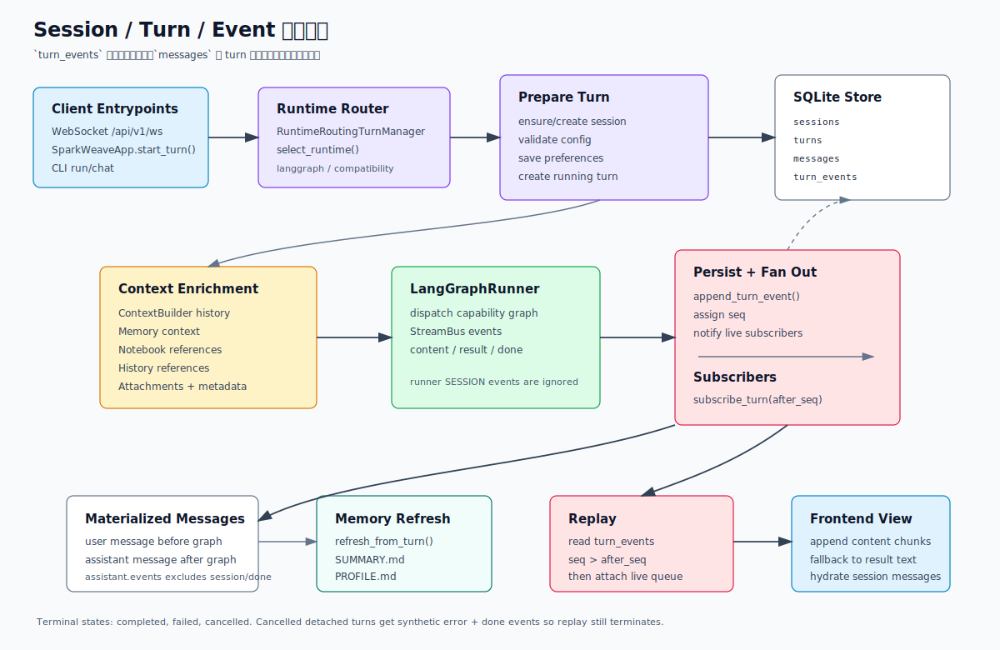

# 会话、Turn 与事件持久化

SparkWeave 的主运行链路是 turn-based：每次用户请求都会创建一个 `turn`，运行期间持续产出事件，结束后把事件汇总成一条 assistant message。理解这层以后，WebSocket 续流、历史会话、题目追问、Notebook 引用和记忆刷新都会更容易调试。

本文聚焦新的 NG/LangGraph 运行时：

```text
SparkWeaveApp / /api/v1/ws
  -> RuntimeRoutingTurnManager
  -> LangGraphTurnRuntimeManager
  -> SQLiteSessionStore
```

## 一图看懂



最重要的分工：

- `turn_events` 是事实流：每个运行事件都会按 `seq` 持久化，可回放、可续流。
- `messages` 是会话视图：用户消息在上下文构造时写入，assistant 消息在 turn 结束后由事件汇总写入。
- `sessions` 保存会话标题、偏好、压缩摘要和当前活跃 turn 信息。
- `turns` 保存单次请求的状态：`running`、`completed`、`failed`、`cancelled`。

## 代码地图

| 文件 | 责任 |
| --- | --- |
| `sparkweave/core/contracts.py` | `UnifiedContext`、`StreamEvent`、`StreamBus` 事件协议 |
| `sparkweave/services/session_store.py` | SQLite 表、session/message/turn/event CRUD |
| `sparkweave/services/session.py` | runtime manager 和 store 的进程级 facade |
| `sparkweave/runtime/policy.py` | 选择 `langgraph` 或 compatibility runtime |
| `sparkweave/runtime/routing.py` | turn 操作路由到具体 runtime |
| `sparkweave/runtime/turn_runtime.py` | LangGraph turn 生命周期、事件持久化、实时 fan-out |
| `sparkweave/runtime/context_enrichment.py` | 构造 `UnifiedContext`，注入历史、记忆、Notebook、附件 |
| `sparkweave/runtime/runner.py` | 根据 capability 分派到对应 graph |
| `sparkweave/api/routers/unified_ws.py` | `/api/v1/ws` 启动、订阅、续流、取消 |
| `sparkweave/api/routers/sessions.py` | 会话列表、详情、重命名、删除、quiz result 记录 |
| `sparkweave/api/session_bridge.py` | 兼容旧路由的 session 合并和事件写入 helper |
| `web/src/hooks/useChatRuntime.ts` | 前端 WebSocket 发送、事件合并、会话 hydrate |
| `web/src/lib/chatMessages.ts` | 从 result 事件兜底提取展示文本和能力来源 |

## SQLite 数据模型

默认数据库：

```text
data/user/chat_history.db
```

首次初始化时，如果存在旧路径 `data/chat_history.db`，会尝试迁移到 `data/user/chat_history.db`。

主要表：

| 表 | 关键字段 | 说明 |
| --- | --- | --- |
| `sessions` | `id`、`title`、`compressed_summary`、`summary_up_to_msg_id`、`preferences_json` | 会话元信息、偏好、压缩摘要 |
| `messages` | `session_id`、`role`、`content`、`capability`、`events_json`、`attachments_json` | 历史消息视图 |
| `turns` | `id`、`session_id`、`capability`、`status`、`error`、`finished_at` | 单次请求状态 |
| `turn_events` | `turn_id`、`seq`、`type`、`source`、`stage`、`content`、`metadata_json` | 可回放事件流 |
| `notebook_entries` | `session_id`、`question_id`、`user_answer`、`is_correct`、`bookmarked` | 题目结果和题目本入口 |
| `notebook_categories` | `id`、`name` | 题目本分类 |
| `notebook_entry_categories` | `entry_id`、`category_id` | 题目与分类关系 |

所有写操作通过 `SQLiteSessionStore._run()` 串到同一个 `asyncio.Lock` 下，再用 `asyncio.to_thread()` 执行同步 SQLite 操作。这样 API 层可以保持 async 接口，同时避免同进程内并发写 SQLite 时互相踩踏。

## Turn 生命周期

### 1. 入口启动 turn

WebSocket 发送：

```json
{
  "type": "start_turn",
  "content": "解释傅里叶变换",
  "capability": "chat",
  "session_id": null,
  "tools": ["rag", "web_search"],
  "knowledge_bases": ["math"],
  "language": "zh",
  "config": {}
}
```

Python facade：

```python
from sparkweave.app import SparkWeaveApp, TurnRequest

app = SparkWeaveApp()
session, turn = await app.start_turn(
    TurnRequest(
        content="解释傅里叶变换",
        capability="chat",
        tools=["rag"],
        knowledge_bases=["math"],
        language="zh",
    )
)
```

两条入口最后都会调用 runtime manager 的 `start_turn()`。

### 2. Runtime 路由

`RuntimeRoutingTurnManager.start_turn()` 会读取请求里的 runtime：

| 来源 | 字段 |
| --- | --- |
| facade | `TurnRequest.runtime` 会被写入 `config._runtime` |
| Web/API | `payload.runtime` 或 `payload.config._runtime` |
| 环境变量 | `SPARKWEAVE_RUNTIME` |
| 默认策略 | 已迁移 capabilities 默认走 LangGraph |

`runtime/policy.py` 中已迁移能力：

```text
chat
deep_question
deep_research
deep_solve
math_animator
visualize
```

支持的 runtime 值：

| 值 | 结果 |
| --- | --- |
| `langgraph`、`ng` | 强制 LangGraph |
| `compat`、`compatibility`、`legacy`、`off`、`false`、`0` | 请求 compatibility |
| `auto`、`rollout` | 根据 `SPARKWEAVE_NG_DEFAULT_CAPABILITIES` allowlist |
| 空值 | 已迁移能力走 LangGraph，其他能力走 compatibility |

当前默认 compatibility runtime 是不可用占位。如果请求 compatibility 但不可用，router 会回退到 LangGraph。

### 3. 准备 session 和 turn

`LangGraphTurnRuntimeManager._prepare_turn()` 做四件事：

1. `_resolve_session()`：复用 `session_id`；如果不存在，就用这个 ID 创建新 session；如果没传，就生成 `unified_<timestamp>_<uuid>`。
2. `_validated_payload()`：用 `validate_capability_config()` 校验公开 config，并保留 runtime-only 字段。
3. `update_session_preferences()`：写入最近使用的 capability、tools、knowledge_bases、language。
4. `create_turn()`：创建 `running` turn。

同一 session 同时只能有一个 running turn。`SQLiteSessionStore._create_turn_sync()` 会检查活跃 turn，发现已有 running turn 就抛出：

```text
Session already has an active turn: <turn_id>
```

### 4. 写入 session 事件

真正执行前，runtime 会先持久化一个标准 session 事件：

```json
{
  "type": "session",
  "source": "langgraph",
  "metadata": {
    "session_id": "...",
    "turn_id": "...",
    "runtime": "langgraph"
  }
}
```

这个事件通常是客户端拿到 `session_id` 和 `turn_id` 的第一手来源。

### 5. 构造 UnifiedContext

`build_turn_context()` 把原始 payload 变成图可用的 `UnifiedContext`。

它会读取并注入：

| 输入/来源 | 写入位置 |
| --- | --- |
| 原始 `content` | `UnifiedContext.user_message` 或增强后的 user message |
| `tools` | `enabled_tools` |
| `knowledge_bases` | `knowledge_bases` |
| `attachments` | `attachments` |
| `config` | `config_overrides` |
| 历史压缩结果 | `conversation_history`、`metadata.conversation_summary` |
| 记忆 | `memory_context`、`metadata.memory_context` |
| Notebook 引用 | `notebook_context`、增强 user message |
| 历史会话引用 | `history_context`、增强 user message |
| `turn_id` | `metadata.turn_id` |

运行时内部 config 字段：

| 字段 | 说明 |
| --- | --- |
| `_runtime` | runtime 选择，保留给 context |
| `_persist_user_message` | 是否把当前用户输入写入 `messages`，默认 `true` |
| `followup_question_context` | 题目追问上下文，会转成一条 system message |
| `answer_now_context` | 中断后“现在回答”的上下文 |

`followup_question_context` 会从 config 中移除并写入 metadata，同时在空会话里补一条 system message。`answer_now_context` 会保留在 `config_overrides`，由各 capability 自己处理。

### 6. 写入用户消息

如果 `_persist_user_message` 不是 false，context 构造阶段会写入：

```text
messages.role = "user"
messages.content = 原始 content
messages.capability = capability
messages.attachments_json = attachments
```

注意：Notebook/History 上下文会注入到 `UnifiedContext.user_message`，但不会污染用户原始消息。历史里看到的仍然是用户实际输入。

### 7. 执行图并持久化事件

`LangGraphRunner.handle(context)` 会把请求分派到具体 graph。runtime 对每个 graph 事件执行：

1. 如果 graph 又发了 `session` 事件，忽略它，避免重复。
2. 设置 `event.session_id` 和 `event.turn_id`。
3. `append_turn_event()` 写入 SQLite。
4. 如果是实时 `start_turn()`，把持久化后的事件推给 live subscribers。
5. 收集 assistant events 和 assistant content。

事件 `seq` 由 `append_turn_event()` 分配：

```text
seq = max(existing seq for turn_id) + 1
```

如果事件自己带了正整数 `seq`，store 会保留它，并用 `INSERT OR REPLACE` 写入。这主要用于兼容场景；普通 graph 不需要自己管理 seq。

### 8. 汇总 assistant message

运行结束后，runtime 会把事件汇总成 assistant message：

| 情况 | 规则 |
| --- | --- |
| 有 `content` 事件 | 拼接可捕获的 `content` 文本 |
| 没有 `content` 但有 `result` | 从 result metadata 中按 key 提取文本 |
| 事件里有 specialist source | assistant message 的 `capability` 可能从 `chat` 改成 specialist |
| 有 result 但没有正文 | 仍会写 assistant message，便于前端展示 artifact |
| 只有 error | 不写 assistant message，只保留 user message 和 turn error |

可从 result 中提取文本的 key：

```text
response
final_answer
answer
output
result
text
content
```

assistant message 的 `events_json` 不包含 `session` 和 `done`，但会保留 `content`、`result`、`tool_call`、`tool_result`、`progress` 等过程事件。

### 9. 完成状态和记忆刷新

最后 runtime 会：

1. 将 turn 标记为 `completed` 或 `failed`。
2. 如果有 error，保存 `turn.error`。
3. 如果有用户消息和 assistant 消息，调用 `MemoryService.refresh_from_turn()`。

取消时是特殊路径，见下文。

## 事件协议

事件对象来自 `StreamEvent.to_dict()`：

```json
{
  "type": "content",
  "source": "chat",
  "stage": "responding",
  "content": "回答片段",
  "metadata": {},
  "session_id": "session-id",
  "turn_id": "turn-id",
  "seq": 2,
  "timestamp": 1710000000.0
}
```

事件类型：

| 类型 | 说明 |
| --- | --- |
| `session` | turn 建立，含 session/turn/runtime 元信息 |
| `stage_start` / `stage_end` | 能力阶段开始和结束 |
| `thinking` | 计划、草稿、模型中间输出 |
| `observation` | 校验、评审或观察结果 |
| `progress` | 运行状态、上下文构造、warning、工具内部进度 |
| `tool_call` | 工具调用开始 |
| `tool_result` | 工具调用结束 |
| `sources` | 引用来源 |
| `content` | 面向用户的正文片段 |
| `result` | 结构化最终结果 |
| `error` | 错误 |
| `done` | turn 终止 |

`done` 事件如果没有 `metadata.status`，runtime 会自动补：

```json
{"status": "completed"}
```

## WebSocket 协议

主入口：

```text
GET /api/v1/ws
```

### 启动 turn

```json
{
  "type": "start_turn",
  "content": "解释傅里叶变换",
  "capability": "chat",
  "tools": ["rag"],
  "knowledge_bases": ["math"],
  "language": "zh",
  "session_id": null,
  "config": {}
}
```

兼容类型 `message` 也会当成 `start_turn` 处理。

如果 config 校验失败，WebSocket 会直接返回：

```json
{
  "type": "error",
  "source": "unified_ws",
  "content": "Invalid ...",
  "metadata": {
    "turn_terminal": true,
    "status": "rejected"
  },
  "seq": 0
}
```

### 订阅 turn

```json
{
  "type": "subscribe_turn",
  "turn_id": "turn_...",
  "after_seq": 12
}
```

服务端先从 SQLite 读取 `seq > after_seq` 的历史事件，再接入当前进程内的 live queue。

### 订阅 session

```json
{
  "type": "subscribe_session",
  "session_id": "session-id",
  "after_seq": 0
}
```

服务端会优先订阅 session 的 active turn；如果没有 running turn，就订阅最新 completed/failed/cancelled turn。

### 断线续流

```json
{
  "type": "resume_from",
  "turn_id": "turn_...",
  "seq": 12
}
```

`resume_from.seq` 等价于 `subscribe_turn.after_seq`。

### 取消 turn

```json
{
  "type": "cancel_turn",
  "turn_id": "turn_..."
}
```

如果 turn 属于当前进程内的活跃 task，runtime 会 cancel task，并写入：

```text
error: "Turn cancelled"
done: {"status": "cancelled"}
```

如果 turn 在数据库里仍是 `running`，但当前进程没有对应 task，runtime 会走 detached cancel：直接把 turn 标记为 `cancelled`，并补写同样的 terminal events。这样重连 replay 仍然能自然结束。

### 取消订阅

```json
{
  "type": "unsubscribe",
  "turn_id": "turn_..."
}
```

或：

```json
{
  "type": "unsubscribe",
  "session_id": "session-id"
}
```

## HTTP Session API

路由前缀：

```text
/api/v1/sessions
```

| 方法 | 路径 | 说明 |
| --- | --- | --- |
| `GET` | `/api/v1/sessions` | 分页列出会话 |
| `GET` | `/api/v1/sessions/{session_id}` | 获取会话详情，包含 messages 和 active_turns |
| `PATCH` | `/api/v1/sessions/{session_id}` | 重命名会话 |
| `DELETE` | `/api/v1/sessions/{session_id}` | 删除会话，级联删除 messages、turns、turn_events、notebook_entries |
| `POST` | `/api/v1/sessions/{session_id}/quiz-results` | 记录题目作答结果，并 upsert 到题目本表 |

会话列表摘要包含：

```json
{
  "id": "...",
  "session_id": "...",
  "title": "...",
  "message_count": 2,
  "status": "completed",
  "active_turn_id": "",
  "capability": "chat",
  "last_message": "...",
  "preferences": {
    "capability": "chat",
    "tools": ["rag"],
    "knowledge_bases": ["math"],
    "language": "zh"
  }
}
```

会话详情会把 `messages.events_json` 解析为 `messages[].events`。

## 前端消费方式

`web/src/hooks/useChatRuntime.ts` 是主工作台的消费入口。

发送时它会：

1. 先在本地追加 user message。
2. 再追加一个空的 streaming assistant message。
3. 打开 `/api/v1/ws`。
4. `onopen` 后发送 `start_turn`。
5. 每收到一个事件，追加到当前 assistant message 的 `events`。
6. `content` 事件直接拼接到 assistant content。
7. `result` 事件在 content 为空时用作文本兜底。
8. `error`、`done`、`result` 或 responding 阶段结束会把 assistant 标为 done/error。

`web/src/lib/chatMessages.ts` 负责两个兜底：

- 从 `result.metadata` 的 `response`、`final_answer`、`answer` 等字段里取展示文本。
- 从事件 `source` 或 metadata 的 `target_capability` / `capability` 推断实际能力。

因此用户在前端选择 `chat`，如果后端自动委派到 `math_animator`，assistant message 最终也能显示成 specialist 能力。

加载历史会话时，前端不会回放 WebSocket，而是调用 session detail API 并 hydrate：

```text
SessionDetail.messages -> ChatMessage[]
```

这就是为什么 assistant message 里必须保留 `events_json`：历史视图要能显示工具轨迹、artifact viewer 和 result 快照。

## 上下文构造细节

### 历史压缩

`ContextBuilder` 会读取 `store.get_messages_for_context(session_id)`，只取 `user`、`assistant`、`system` 三类消息。它返回：

| 字段 | 进入 context 的位置 |
| --- | --- |
| `conversation_history` | `UnifiedContext.conversation_history` |
| `conversation_summary` | `metadata.conversation_summary` |
| `context_text` | `metadata.conversation_context_text` |
| `token_count` | `metadata.history_token_count` |
| `budget` | `metadata.history_budget` |

上下文构造本身也可以通过 `emit` 写 `progress` 事件，这些事件会先于 graph 输出进入 `turn_events`。

### Notebook 引用

如果 payload 带 `notebook_references`：

1. runtime 从 Notebook manager 查记录。
2. `NotebookAnalysisAgent` 分析记录与当前问题的相关性。
3. 结果写入 `UnifiedContext.notebook_context`。
4. `user_message` 被扩展为：

```text
[Notebook Context]
...

[User Question]
原始用户问题
```

### 历史会话引用

如果 payload 带 `history_references`：

1. 按 session id 读取历史会话。
2. 将历史 messages 组织成 record。
3. 同样走 `NotebookAnalysisAgent`。
4. 结果写入 `UnifiedContext.history_context`。

如果分析结果为空，会退回到 `_history_fallback()`，最多拼接约 8000 字符。

### 题目追问

题目本或题目结果追问会使用 `followup_question_context`。当会话还没有消息时，runtime 会写入一条 system message，内容包含：

- parent quiz session
- question id
- question type
- options
- user answer
- correct answer
- explanation
- knowledge context

这样后续用户只问“为什么我错了”，图也能拿到原题上下文。

### Answer Now

`answer_now_context` 是中断后快速收束的内部字段。它不会被 context builder 消耗，而是保留在 `UnifiedContext.config_overrides`，由 `chat`、`deep_solve`、`deep_question`、`deep_research`、`visualize`、`math_animator` 各自处理。

如果请求中同时带 `_persist_user_message=false`，当前“answer now”指令不会写入 messages，只会写最终 assistant。

## 取消、失败与恢复

| 场景 | turn 状态 | 事件 |
| --- | --- | --- |
| 正常完成 | `completed` | 最后有 `done.status=completed` |
| graph 发 error | `failed` | 保留 error 内容，通常不写 assistant message |
| runtime 异常 | `failed` | runtime 补写 `error` 和 `done.status=failed` |
| 当前进程取消 | `cancelled` | 补写 `error: Turn cancelled` 和 `done.status=cancelled` |
| detached running turn 取消 | `cancelled` | 直接补 terminal events，保证 replay 可结束 |
| config 校验失败 | 不创建 turn 或返回 rejected error | WebSocket 返回 `seq=0` error |

恢复机制依赖两件事：

1. `turn_events` 中每个事件都有单调递增 `seq`。
2. `subscribe_turn()` 会先 replay SQLite，再监听 live queue，并过滤重复 seq。

客户端只要记录最后收到的 `seq`，重连后发：

```json
{"type": "resume_from", "turn_id": "...", "seq": 12}
```

就能继续接收 `seq > 12` 的事件。

## 开发注意事项

- 新事件类型要同步更新 `StreamEventType`、`web/src/lib/types.ts` 和前端展示组件。
- 图节点应通过 `StreamBus` 输出事件，不要直接写 `turn_events`。
- 运行期内部 config 字段需要加入 `LangGraphTurnRuntimeManager._validated_payload()` 的 allowlist。
- 如果新增 capability 会自动委派，确认 `_infer_assistant_capability()` 能从 `source` 或 metadata 推断出真实能力。
- 会话列表依赖 `sessions.updated_at`、latest turn、last non-empty message；写 message 或 event 时要确认更新时间符合预期。
- 会影响历史上下文的消息必须写入 `messages`，只写 `turn_events` 不会进入下一轮 `conversation_history`。
- 如果某个能力主要返回 artifact 而不是正文，必须发 `result` 且 metadata 中包含 `response` 或等价文本字段。
- 删除 session 会因外键级联删除 turn、turn_events、messages 和 notebook_entries，调试前先确认不是生产数据。

## 推荐测试

| 改动 | 测试 |
| --- | --- |
| SQLite store 表结构、CRUD、级联 | `tests/services/session/test_sqlite_store.py` |
| turn runtime 事件、消息、记忆 | `tests/ng/test_turn_runtime.py` |
| runtime parity / 上下文 envelope | `tests/ng/test_turn_runtime_parity.py` |
| runtime 路由策略 | `tests/ng/test_runtime_routing.py`、`tests/ng/test_runtime_policy.py` |
| WebSocket 启动、续流、取消 | `tests/api/test_unified_ws_turn_runtime.py`、`tests/api/test_unified_ws_langgraph_e2e.py` |
| 旧路由 session bridge | `tests/api/test_session_bridge.py`、`tests/api/test_legacy_session_routes_bridge.py` |
| 前端契约 | `python scripts/check_web_api_contract.py` |
