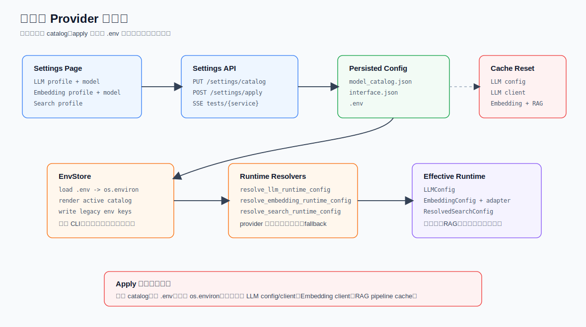

# 设置与 Provider 配置

SparkWeave 的模型配置不是单纯读取 `.env`。当前主路径是：设置页维护 `model_catalog.json`，保存应用时把 active selection 渲染回 `.env`，运行时 resolver 再综合 catalog、`.env`、环境变量和 provider spec 得到最终配置。



系统健康检查、设置页流式测试和 Embedding adapter 细节见 [系统诊断与 Provider 健康检查](./system-diagnostics.md)。

## 代码地图

| 文件 | 说明 |
| --- | --- |
| `sparkweave/services/config.py` | provider 元数据、catalog 服务、`.env` 读写、LLM/Embedding/Search resolver |
| `sparkweave/api/routers/settings.py` | 设置页 API、catalog apply、UI 偏好、流式配置测试 |
| `sparkweave/api/routers/system.py` | 系统状态和简短连接测试 |
| `sparkweave/services/config_test_runner.py` | 设置页 SSE 配置测试 runner |
| `sparkweave/services/embedding_support/client.py` | Embedding adapter 分派和批处理 |
| `sparkweave/services/search_support/` | 搜索 provider 注册、fallback、结果整合 |
| `web/src/pages/SettingsPage.tsx` | 设置页表单和 catalog 组装 |
| `web/src/lib/api.ts` | 设置页前端 API client |

## 配置文件

| 路径 | 说明 |
| --- | --- |
| `.env` | 兼容层和启动时注入层，包含 legacy env keys |
| `data/user/settings/model_catalog.json` | 设置页主配置，包含 LLM、Embedding、Search profiles |
| `data/user/settings/interface.json` | UI 偏好，如主题、语言、侧栏说明、导航顺序 |
| `data/user/settings/.tour_cache.json` | setup tour 状态 |
| `data/user/settings/main.yaml` | runtime YAML，部分工具配置仍从这里读取 |

`.env.example` 是模板；运行时实际优先通过 `EnvStore` 读取 `.env`，并把缺失值回落到当前进程环境变量。

## Catalog 数据结构

`ModelCatalog` 基本结构：

```json
{
  "version": 1,
  "services": {
    "llm": {
      "active_profile_id": "llm-profile-default",
      "active_model_id": "llm-model-default",
      "profiles": []
    },
    "embedding": {
      "active_profile_id": "embedding-profile-default",
      "active_model_id": "embedding-model-default",
      "profiles": []
    },
    "search": {
      "active_profile_id": "search-profile-default",
      "profiles": []
    }
  }
}
```

LLM / Embedding profile：

```json
{
  "id": "llm-profile-default",
  "name": "Default LLM Endpoint",
  "binding": "openai",
  "base_url": "https://api.openai.com/v1",
  "api_key": "sk-...",
  "api_version": "",
  "extra_headers": {},
  "models": [
    {
      "id": "llm-model-default",
      "name": "gpt-5.2",
      "model": "gpt-5.2"
    }
  ]
}
```

Embedding model 额外有 `dimension`：

```json
{
  "id": "embedding-model-default",
  "name": "text-embedding-3-large",
  "model": "text-embedding-3-large",
  "dimension": "3072"
}
```

Search profile：

```json
{
  "id": "search-profile-default",
  "name": "Default Search Provider",
  "provider": "brave",
  "base_url": "https://api.search.brave.com/res/v1/web/search",
  "api_key": "",
  "proxy": "",
  "models": []
}
```

## Settings API

路由前缀：

```text
/api/v1/settings
```

| 方法 | 路径 | 说明 |
| --- | --- | --- |
| `GET` | `` | 获取 UI 设置、catalog、provider 下拉选项 |
| `GET` | `/catalog` | 获取 catalog |
| `PUT` | `/catalog` | 保存 catalog，并清 runtime cache |
| `POST` | `/apply` | 保存 catalog、写 `.env`、清 runtime cache |
| `PUT` | `/ui` | 更新 UI 设置 |
| `PUT` | `/theme` | 更新主题 |
| `PUT` | `/language` | 更新语言 |
| `POST` | `/reset` | 重置 UI 设置 |
| `GET` | `/themes` | 获取主题列表 |
| `GET` | `/sidebar` | 获取侧栏设置 |
| `PUT` | `/sidebar/description` | 更新侧栏描述 |
| `PUT` | `/sidebar/nav-order` | 更新导航顺序 |
| `POST` | `/tests/{service}/start` | 启动配置测试，`service=llm|embedding|search` |
| `GET` | `/tests/{service}/{run_id}/events` | SSE 读取测试事件 |
| `POST` | `/tests/{service}/{run_id}/cancel` | 取消测试 |
| `GET` | `/tour/status` | setup tour 状态 |
| `POST` | `/tour/complete` | 保存配置并标记 tour 完成 |
| `POST` | `/tour/reopen` | 返回重新打开 tour 的命令 |

`GET /api/v1/settings` 返回：

```json
{
  "ui": {},
  "catalog": {},
  "providers": {
    "llm": [],
    "embedding": [],
    "search": []
  }
}
```

## Save 与 Apply 的区别

`PUT /settings/catalog`：

1. `ModelCatalogService.save()` 规范化并写入 `model_catalog.json`。
2. `_invalidate_runtime_caches()` 清缓存。
3. 不写 `.env`。

`POST /settings/apply`：

1. `ModelCatalogService.apply()` 先保存 catalog。
2. `EnvStore.render_from_catalog()` 把 active selection 渲染成 legacy env keys。
3. `EnvStore.write()` 原子写 `.env`，并同步更新 `os.environ`。
4. `_invalidate_runtime_caches()` 清缓存。

清理的缓存：

```text
clear_llm_config_cache()
reset_llm_client()
reset_embedding_client()
reset_pipeline_cache()
```

这意味着设置页点击“保存并应用”后，后续 LLM、Embedding、RAG pipeline 都会重新读取配置。

## EnvStore

`EnvStore` 是 `.env` 的统一入口：

| 方法 | 说明 |
| --- | --- |
| `load()` | 读取 `.env`，并用 `os.environ.setdefault()` 注入进程环境 |
| `get()` | 先查 `.env`，再查当前环境变量 |
| `as_summary()` | 把端口、LLM、Embedding、Search 聚合成摘要 |
| `render_from_catalog()` | 把 active catalog 转成 `.env` key/value |
| `write()` | 按 `ENV_KEY_ORDER` 原子写 `.env`，并更新 `os.environ` |

Apply 渲染出的关键 `.env` 字段：

```text
BACKEND_PORT
FRONTEND_PORT
LLM_BINDING
LLM_MODEL
LLM_API_KEY
LLM_HOST
LLM_API_VERSION
EMBEDDING_BINDING
EMBEDDING_MODEL
EMBEDDING_API_KEY
EMBEDDING_HOST
EMBEDDING_DIMENSION
EMBEDDING_API_VERSION
SEARCH_PROVIDER
SEARCH_API_KEY
SEARCH_BASE_URL
SEARCH_PROXY
```

`SEARCH_BASE_URL` 为空时不会写入 `.env`。

## Catalog 加载与迁移

`ModelCatalogService.load()` 会：

1. 从 `_default_catalog()` 起步。
2. 如果 `model_catalog.json` 存在，合并已有内容。
3. `_hydrate_missing_services_from_env()`：如果 catalog 没有 profile，但 `.env` 已有模型配置，则自动生成默认 profile。
4. `_sync_active_services_from_env()`：如果 `.env` 显式存在相关 key，同步到 active profile/model。
5. `_normalize()`：补齐 id、name、base_url、api_key、models 等字段。
6. 如果发生迁移或文件不存在，自动保存规范化后的 catalog。

这让旧 `.env` 用户可以迁移到设置页，而不会丢失已有配置。

## LLM 解析

入口：

```python
resolve_llm_runtime_config()
get_llm_config()
```

输出：

```python
ResolvedLLMConfig(
    model="gpt-5.2",
    provider_name="openai",
    provider_mode="standard",
    binding="openai",
    api_key="...",
    base_url="https://api.openai.com/v1",
    effective_url="https://api.openai.com/v1",
    api_version=None,
    extra_headers={},
    reasoning_effort=None,
)
```

解析顺序：

1. 读取 active LLM profile 和 active model。
2. 如果没有 active model，回退 `.env` 的 `LLM_MODEL`。
3. 如果仍为空，使用 `gpt-4o-mini` 作为最后兜底。
4. 读取 `binding`、`api_key`、`base_url`、`api_version`、`extra_headers`。
5. 通过 `_choose_resolved_provider()` 推断 provider。
6. 应用 provider 默认地址、本地模型 dummy key、讯飞星火 X2/X1.5 HTTP 兼容特例。

Provider 推断优先级：

| 优先级 | 规则 |
| --- | --- |
| 1 | 显式 `binding` |
| 2 | API key 前缀或 base URL 识别出的 gateway |
| 3 | model 名称关键词 |
| 4 | localhost base URL，按端口推断 `ollama`、`vllm` 等 |
| 5 | catalog 中已配置的 provider pool |
| 6 | `openai` |

本地 provider：

- `vllm`、`ollama`、`lm_studio`、`llama_cpp` 等 `is_local=true`。
- 如果没有 API key，会自动使用 `sk-no-key-required`。

讯飞星火 X：

- 统一 provider 名是 `iflytek_spark_ws`。
- alias 如 `iflytek`、`xfyun`、`spark_x2` 会规范化到它。
- 仅保留 X2 与 X1.5 两个能力入口，模型名统一为 `spark-x`。
- X2 base URL 为 `https://spark-api-open.xf-yun.com/x2/`，X1.5 base URL 为 `https://spark-api-open.xf-yun.com/v2/`。
- 旧的 `4.0Ultra`、`generalv3.5`、`spark-x2`、`spark-x1.5` 或旧 WebSocket URL 会迁移为兼容 HTTP 配置。

`get_llm_config()` 会缓存 `LLMConfig`。如果 resolver 出错，会 fallback 到 `_get_llm_config_from_env()`。

Token 参数：

```python
get_token_limit_kwargs(model, max_tokens=200)
```

对 `o*`、`gpt-4o`、`gpt-5+` 等模型返回 `max_completion_tokens`，其他模型返回 `max_tokens`。

## Embedding 解析

入口：

```python
resolve_embedding_runtime_config()
get_embedding_config()
get_embedding_client()
```

Embedding 和 LLM 的一个重要差异：没有 active embedding model 时会直接抛错，不做模型名兜底。

Provider 解析规则：

| 优先级 | 规则 |
| --- | --- |
| 1 | 显式 `binding` |
| 2 | model 前缀匹配 provider 名 |
| 3 | provider keywords 命中 model 名 |
| 4 | localhost base URL，`11434` 推断 `ollama`，否则 `vllm` |
| 5 | catalog 中已配置的 embedding provider pool |
| 6 | `openai` |

支持 provider：

| Provider | Adapter | 默认模型 | 默认维度 |
| --- | --- | --- | --- |
| `openai` | `openai_compat` | `text-embedding-3-large` | 3072 |
| `azure_openai` | `openai_compat` | 空 | 0 |
| `cohere` | `cohere` | `embed-v4.0` | 1024 |
| `jina` | `jina` | `jina-embeddings-v3` | 1024 |
| `iflytek_spark` | `iflytek_spark` | `llm-embedding` | 2560 |
| `ollama` | `ollama` | `nomic-embed-text` | 768 |
| `vllm` | `openai_compat` | 空 | 0 |
| `custom` | `openai_compat` | 空 | 0 |

`EmbeddingClient.embed()` 行为：

- 按 `batch_size` 分批，当前 resolver 默认 `10`。
- 每批会构造 `EmbeddingRequest`，包含 `texts`、`model`、`dimensions`、`input_type`。
- 支持 `progress_callback(batch_num, total_batches)`。
- `input_type` 会传给支持任务类型的 provider，例如 Cohere、Jina、讯飞。
- `get_embedding_client()` 是单例，设置变更后必须 `reset_embedding_client()`。

知识库索引会记录 embedding 模型和维度。模型或维度变更会触发 `embedding_mismatch` 和 `needs_reindex`，详见 [知识库详解](./knowledge-base.md)。

## Search 解析

入口：

```python
resolve_search_runtime_config()
web_search()
```

支持 provider：

```text
brave
tavily
jina
searxng
duckduckgo
perplexity
serper
iflytek_spark
```

deprecated / unsupported：

```text
exa
baidu
openrouter
```

解析规则：

1. 从 active search profile 读取 `provider`、`api_key`、`base_url`、`proxy`。
2. 如果缺失，回退 `.env` 的 `SEARCH_*`。
3. provider 为空时默认 `brave`。
4. `max_results` 优先来自 search profile，再回退 `main.yaml` 的工具配置，范围限制为 1 到 10。
5. `brave`、`tavily`、`jina` 缺 API key 时 fallback 到 `duckduckgo`。
6. `searxng` 缺 base URL 时 fallback 到 `duckduckgo`。
7. `perplexity`、`serper`、`iflytek_spark` 缺 API key 时标记 `missing_credentials`，不自动 fallback。

Provider-specific env fallback：

| Provider | Env |
| --- | --- |
| `brave` | `BRAVE_API_KEY` |
| `tavily` | `TAVILY_API_KEY` |
| `jina` | `JINA_API_KEY` |
| `perplexity` | `PERPLEXITY_API_KEY` |
| `serper` | `SERPER_API_KEY` |
| `iflytek_spark` | `IFLYTEK_SEARCH_API_PASSWORD` |
| `searxng` | `SEARXNG_BASE_URL` |

`web_search()` 会再次做运行期保护：

- 搜索工具可被 `main.yaml` 中 `tools.web_search.enabled=false` 关闭。
- raw SERP provider 会用 `AnswerConsolidator` 生成统一 answer。
- 传入 `output_dir` 时会保存 `search_{provider}_{timestamp}.json`。

## 系统状态与连接测试

系统状态：

```http
GET /api/v1/system/status
```

返回 backend、LLM、Embedding、Search 状态：

```json
{
  "backend": { "status": "online" },
  "llm": { "status": "configured", "model": "gpt-5.2", "testable": true },
  "embeddings": { "status": "configured", "model": "text-embedding-3-large", "testable": true },
  "search": { "status": "fallback", "provider": "duckduckgo", "testable": true }
}
```

简短测试：

| 方法 | 路径 | 行为 |
| --- | --- | --- |
| `POST` | `/api/v1/system/test/llm` | 调用一次短 completion |
| `POST` | `/api/v1/system/test/embeddings` | 对 `["test"]` 做 embedding |
| `POST` | `/api/v1/system/test/search` | 搜索 `SparkWeave health check` |

设置页流式测试：

1. 前端调用 `POST /api/v1/settings/tests/{service}/start`。
2. 后端 `ConfigTestRunner` 创建后台线程。
3. runner 用 `EnvStore.render_from_catalog()` 临时 overlay `os.environ`。
4. 按服务执行测试。
5. 前端用 `EventSource` 读取 `/events`。

事件类型：

| 类型 | 说明 |
| --- | --- |
| `info` | 当前解析或请求步骤 |
| `config` | 使用的 profile 摘要，API key 会脱敏 |
| `response` | 连接成功后的响应摘要 |
| `warning` | fallback 等非致命问题 |
| `completed` | 成功结束 |
| `failed` | 失败，错误经过 `explain_provider_error()` |

更完整的探针、SSE runner、缓存失效和讯飞 Embedding 签名协议说明见 [系统诊断与 Provider 健康检查](./system-diagnostics.md)。

## 前端设置页行为

`SettingsPage.tsx` 的模型配置表单分三列：

| 区块 | 表单字段 | 写入 catalog |
| --- | --- | --- |
| 问答模型 | provider、base URL、model、API key、讯飞 APPID/APISecret | `services.llm` |
| 向量模型 | provider、base URL、model、dimension、API key、讯飞 APPID/APISecret/domain | `services.embedding` |
| 联网搜索 | provider、base URL、API key | `services.search` |

保存时：

1. `structuredClone(settings.catalog)`。
2. `applyLlmForm()`、`applyEmbeddingForm()`、`applySearchForm()` 写入 active profile。
3. `saveCatalog` 调用 `PUT /settings/catalog`。
4. `applyCatalog` 调用 `POST /settings/apply`。
5. `updateUi` 保存语言和主题。

安全细节：

- 表单初始化时不会把已有 API key 填回输入框。
- API key 输入留空表示保留原值。
- 讯飞 `api_secret` 也采用留空保留。

## 新增 Provider 的步骤

新增 LLM provider：

1. 在 `PROVIDERS` 中增加 `ProviderSpec`。
2. 如需 alias，更新 `PROVIDER_ALIASES`。
3. 如非 OpenAI-compatible，需要在 LLM factory/provider 层增加 backend。
4. 确认 `_provider_choices()` 能展示默认 base URL 和模型选项。
5. 补测试或至少用 `/settings/tests/llm` 验证。
6. 更新本文档和 [环境变量配置](./configuration.md)。

新增 Embedding provider：

1. 在 `EMBEDDING_PROVIDERS` 中增加 `EmbeddingProviderSpec`。
2. 在 `embedding_support/adapters/` 实现 adapter。
3. 在 `_ADAPTER_MAP` 注册 adapter。
4. 如有 alias，更新 `EMBEDDING_PROVIDER_ALIASES`。
5. 确认 dimension 行为和 `input_type` 语义。
6. 补 embedding adapter 测试。

新增 Search provider：

1. 在 `search_support/providers/` 添加 provider，并用 `@register_provider` 注册。
2. 更新 `SUPPORTED_SEARCH_PROVIDERS`。
3. 如需 key fallback，更新 `SEARCH_ENV_FALLBACK` 和 `_PROVIDER_KEY_ENV`。
4. 若返回 raw SERP，确认 `supports_answer=false` 并补 consolidation 行为。
5. 更新设置页 provider choices。

## 常见问题

| 现象 | 原因 | 处理 |
| --- | --- | --- |
| 设置页保存后仍用旧模型 | runtime cache 未清或运行中的请求未结束 | 用 `/settings/apply`，新 turn 会使用新配置 |
| 本地模型缺 API key | local provider 自动填 `sk-no-key-required` | 通常无需填写 |
| Embedding 测试维度不一致 | catalog 中 dimension 与模型实际返回不一致 | 修改 dimension，并重建知识库 |
| Brave/Tavily/Jina 没 key 却能搜索 | 自动 fallback 到 `duckduckgo` | 查看 system status 的 `fallback` 和 error |
| Perplexity/Serper/讯飞搜索缺 key 失败 | 这些 provider 不自动 fallback | 填 API key/APIPassword 或切换 provider |
| `.env` 手改后设置页变化 | `load()` 会把显式 `.env` key 同步到 catalog | 这是兼容旧配置的迁移行为 |
