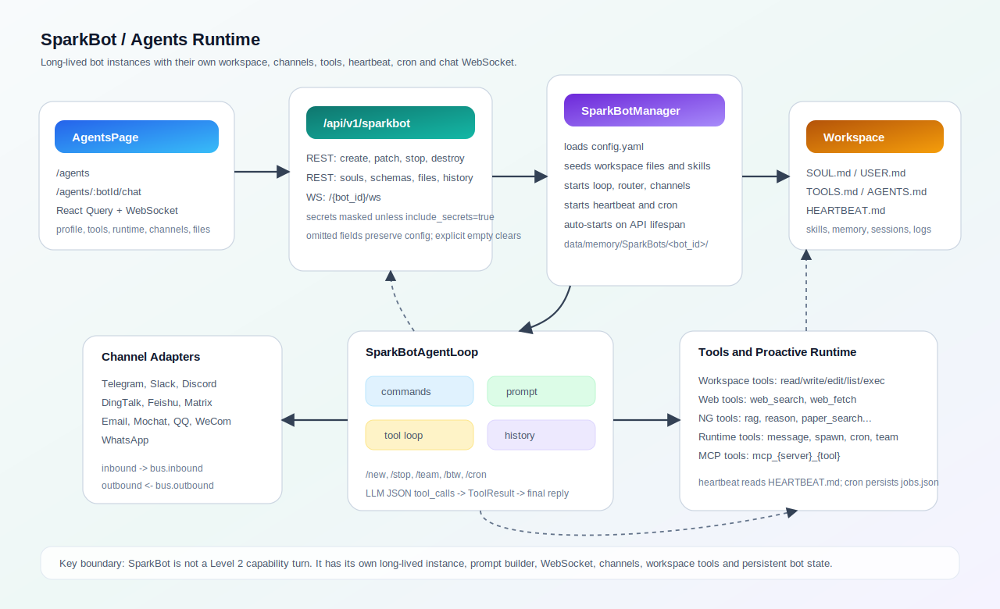

# SparkBot 与 Agents 工作台

SparkBot 是 SparkWeave 里的长期智能体系统。它和 `/api/v1/ws` 的一次性 capability turn 不同：每个 SparkBot 都有独立配置、工作区文件、技能、会话历史、渠道监听、后台任务、定时任务和前端聊天 WebSocket。前端的 `AgentsPage` 是这个系统的管理台。



## 代码地图

| 区域 | 文件 | 责任 |
| --- | --- | --- |
| API 路由 | `sparkweave/api/routers/sparkbot.py` | Bot 增删改查、Soul 模板、渠道 schema、工作区文件、历史、聊天 WebSocket |
| 渠道 schema | `sparkweave/api/routers/_sparkbot_channel_schema.py` | 把渠道 Pydantic 配置转成前端可渲染的 JSON Schema，并标记敏感字段 |
| 生命周期服务 | `sparkweave/services/sparkbot.py` | `SparkBotManager`、`SparkBotInstance`、渠道、Agent loop、heartbeat、cron、team、side task |
| SparkBot 工具 | `sparkweave/sparkbot/tools.py` | 工作区文件工具、受限 shell、Web fetch/search、NG 工具适配 |
| MCP 支持 | `sparkweave/sparkbot/mcp.py` | 连接 stdio/SSE/streamable HTTP MCP server 并注册远程工具 |
| 多模态输入 | `sparkweave/sparkbot/media.py` | 把本地/远程图片转成 OpenAI 兼容 `image_url` block |
| 音频转写 | `sparkweave/sparkbot/transcription.py` | 渠道音频文件经 Groq Whisper 接口转写 |
| 内置技能 | `sparkweave/sparkbot/skills/` | `SKILL.md` 技能库，启动 Bot 时复制到工作区 |
| 前端页面 | `web/src/pages/AgentsPage.tsx` | 助教列表、创建表单、聊天、Soul 模板、渠道配置、工作区文件、历史 |
| API 客户端 | `web/src/lib/api.ts`、`web/src/hooks/useApiQueries.ts` | SparkBot REST/WS 封装和 React Query 缓存失效 |
| 能力矩阵 | `sparkweave/api/routers/agent_config.py` | `AgentsPage` 上方的能力入口元数据，不是 SparkBot 实例配置 |
| 测试 | `tests/api/test_sparkbot_router.py`、`tests/api/test_sparkbot_channel_schema.py`、`tests/ng/test_sparkbot_service.py` | 路由合约、schema、工具、渠道、heartbeat、cron、team、启动停止 |

## 运行模型

一次普通 SparkBot Web 聊天的链路是：

1. 前端进入 `/agents` 或 `/agents/$botId/chat`。
2. `AgentsPage` 调用 `/api/v1/sparkbot` 拉取 Bot 列表，调用 `/{bot_id}?include_secrets=true` 拉取编辑详情。
3. 若 Bot 未运行，前端用 `POST /api/v1/sparkbot` 启动；后端会合并磁盘配置并创建 `SparkBotInstance`。
4. 前端聊天区连接 `ws://.../api/v1/sparkbot/{bot_id}/ws`。
5. WebSocket 收到用户消息后调用 `SparkBotManager.send_message()`。
6. `SparkBotAgentLoop.process_direct()` 先处理 `/new`、`/team`、`/btw`、`/cron` 等命令；若不是命令，就构造 SparkBot 专用 prompt。
7. 模型若返回 `{"tool_calls":[...]}`，Agent loop 执行工作区工具、NG 工具、runtime 工具或 MCP 工具，再把工具结果送回模型。
8. 最终回复写入 `history.jsonl` 和 `workspace/sessions/<chat_id>.jsonl`，再通过 WebSocket 返回前端。
9. 如果外部渠道已经和该 Bot 绑定了 chat id，Web 侧回复也会转发到对应渠道。

API 进程启动时，`sparkweave/api/main.py` 的 lifespan 会调用 `get_sparkbot_manager().auto_start_bots()`；关闭时会调用 `stop_all()` 清理 Bot、渠道、heartbeat、cron 和后台任务。

## 持久化布局

SparkBot 的主目录来自 `get_path_service().get_memory_dir() / "SparkBots"`，默认可理解为：

```text
data/memory/SparkBots/<bot_id>/
  config.yaml
  history.jsonl
  cron/
    jobs.json
  media/
  logs/
  workspace/
    SOUL.md
    USER.md
    TOOLS.md
    AGENTS.md
    HEARTBEAT.md
    skills/
      <skill-name>/SKILL.md
    memory/
      MEMORY.md
      HISTORY.md
    sessions/
      <chat_id>.jsonl
    logs/
      agent_tools.jsonl
```

几个边界要特别记住：

- `config.yaml` 是 Bot 的结构化配置，包含 `name`、`description`、`persona`、`channels`、`model`、`auto_start`、`tools`、`agent`、`heartbeat`。
- `SOUL.md` 是 prompt 的人格文件；保存 `SOUL.md` 时会同步更新 `config.persona`。
- 工作区文件 API 当前只允许 `SOUL.md`、`USER.md`、`TOOLS.md`、`AGENTS.md`、`HEARTBEAT.md` 五个文件。若要让前端真正创建 `NOTES.md`，需要同步放开 `_EDITABLE_WORKSPACE_FILES`。
- `workspace/memory/MEMORY.md` 和 `workspace/memory/HISTORY.md` 是 Bot 私有记忆；全局 `data/memory/PROFILE.md`、`SUMMARY.md` 也会被 SparkBot prompt 读取。
- `/new` 会把当前 session 归档；在 Manager 传入 shared memory dir 的默认路径下，归档写入全局 `data/memory/SUMMARY.md`。
- 旧布局会自动迁移：`data/sparkbot`、`data/SparkBot`、`data/SparkBot/bots` 下的配置和工作区会迁到新的 `data/memory/SparkBots/<bot_id>/`。

## 配置合并规则

`POST /api/v1/sparkbot` 既是创建也是启动入口。路由只把客户端实际发送的字段传给 `merge_bot_config()`：

| 情况 | 结果 |
| --- | --- |
| 字段未发送 | 保留磁盘配置 |
| 字段为 `null` | 视为未提供，保留磁盘配置 |
| 字段为空字符串或空 dict | 显式清空 |
| `channels` 显式传入 | 覆盖原渠道配置 |

这个规则修复了“从前端启动 Bot 时把已配置渠道清空”的历史问题。相关回归测试在 `tests/api/test_sparkbot_router.py`。

`PATCH /api/v1/sparkbot/{bot_id}` 更新运行中 Bot 时，如果 payload 包含 `channels`，会先用 `ChannelsConfig` 做边界校验，再保存配置并热重载渠道监听。若重载失败，配置已经落盘，接口返回 500 并提示停止再启动。

Secret 字段默认被遮蔽：`token`、`password`、`secret`、`api_key`、`apikey`、`encrypt_key` 等名字会被 `mask_channel_secrets()` 变成 `***`。只有 `GET /{bot_id}?include_secrets=true` 会返回原始值，前端编辑表单使用这个模式。

## Prompt 构建

SparkBot 不走 `UnifiedContext`，而是由 `SparkBotWorkspaceContext` 构建专用 prompt：

```text
SparkBot identity
  + AGENTS.md / SOUL.md / USER.md / TOOLS.md
  + 全局 PROFILE.md / SUMMARY.md
  + Bot 私有 MEMORY.md / HISTORY.md
  + always skills 内容
  + skills summary
  + runtime metadata: time, channel, chat_id
  + media / attachments
  + recent session history
  + user message
```

Recent history 来自 `workspace/sessions/<chat_id>.jsonl`，默认最多取 24 条；如果 `agent.context_window_tokens` 小于 `65536`，会按窗口粗略收缩；旧配置里的 `memoryWindow` 字段会被读取后排除，不再持久化。

图片附件会经过 `sparkweave/sparkbot/media.py` 内联为 `image_url` block：支持本地路径、`file://`、HTTP(S) URL 和 `data:image/*`，本地图片最大 10MB。

## 工具系统

SparkBot 有自己的工具注册表，由 `build_sparkbot_agent_tool_registry()` 创建。它不是直接复用主聊天图的 LangChain 工具绑定，而是让模型以严格 JSON 返回工具调用：

```json
{"tool_calls":[{"name":"read_file","arguments":{"path":"USER.md"}}]}
```

工具分四类：

| 类别 | 工具 | 说明 |
| --- | --- | --- |
| 工作区工具 | `read_file`、`write_file`、`edit_file`、`list_dir`、`exec` | 都被限制在 SparkBot workspace 内；`exec` 还会阻止危险命令和工作区外绝对路径 |
| Web 工具 | `web_search`、`web_fetch` | 使用 Bot 级 `tools.web` 配置，`web_fetch` 优先尝试 Jina reader |
| NG 工具适配 | `brainstorm`、`rag`、`web_search`、`code_execution`、`reason`、`paper_search` | 从全局 `ToolRegistry` 取出并包一层，`code_execution` 默认写入 `.tool_runs/code_execution` |
| Runtime 工具 | `SparkBotMessageTool`、`SparkBotSpawnTool`、`SparkBotCronTool`、`SparkBotTeamTool` | 支持主动发消息、后台 side task、定时任务和 nano-team |
| MCP 工具 | `mcp_<server>_<tool>` | 从 `tools.mcp_servers` 配置连接远程 MCP server 后注册 |

Agent loop 受 `agent.max_tool_iterations` 和 `agent.tool_call_limit` 限制。每次工具调用会写入 `workspace/logs/agent_tools.jsonl`，便于排查模型为什么做了某个动作。

## 命令与后台能力

SparkBot 命令由 `SparkBotAgentLoop._handle_command()` 处理：

| 命令 | 行为 |
| --- | --- |
| `/help` | 输出命令列表 |
| `/new` | 归档当前 session 并清空该 chat id 的会话 JSONL |
| `/stop` | 取消当前 session 的运行任务、side task 和 team task |
| `/restart` | 返回提示，实际重启由停止/启动 Bot 完成 |
| `/btw <instruction>` | 运行后台 side task，完成后通过 bus 发回消息 |
| `/btw status` | 查看 side task 状态 |
| `/team <goal>` | 启动或继续 nano-team 模式 |
| `/team status/log/approve/reject/manual/stop` | 查看、审批、修改或停止 team run |
| `/cron add every <seconds> <message>` | 周期提醒或后台 turn |
| `/cron add at <iso-datetime> <message>` | 单次定时任务，执行后删除 |
| `/cron add cron "<expr>" [tz=<iana>] <message>` | cron 表达式任务 |
| `/cron list/remove/run` | 管理或强制运行任务 |

`SparkBotHeartbeatService` 会周期读取 `HEARTBEAT.md`。模型先判断是否需要运行，如果运行结果值得通知用户，再进入 `notify_queue`。Cron 任务保存在 `cron/jobs.json`，执行时会走同一个 `process_direct()`，因此可以使用工具、记忆和工作区上下文。

## 渠道系统

当前内置渠道包括：

```text
telegram, slack, discord, dingtalk, email, feishu,
matrix, mochat, qq, wecom, whatsapp
```

每个渠道的配置模型都在 `sparkweave/services/sparkbot.py` 中，例如 `TelegramConfig`、`SlackConfig`、`EmailConfig`。`GET /api/v1/sparkbot/channels/schema` 会返回：

```json
{
  "channels": {
    "telegram": {
      "name": "telegram",
      "display_name": "Telegram",
      "default_config": {},
      "secret_fields": ["token"],
      "json_schema": {}
    }
  },
  "global": {
    "json_schema": {},
    "secret_fields": ["transcription_api_key"]
  }
}
```

前端的 `ChannelEditor` 根据 schema 动态生成表单，不需要为每个渠道写专门 UI。全局字段包括 `send_progress`、`send_tool_hints`、`transcription_api_key`。`send_tool_hints` 默认关闭，所以工具进度默认不会推到外部聊天渠道。

安全边界：

- 渠道启用时，如果 `allow_from` 是空数组，会被拒绝；要么填 `["*"]`，要么填明确 sender id。
- 群聊渠道通常有 `group_policy` 或 mention 规则，避免 Bot 在群里无差别回复。
- Email 渠道需要 `consent_granted=true` 才会启动。
- 音频转写使用 `channels.transcription_api_key` 或 `GROQ_API_KEY`。

## 前端工作台

`AgentsPage` 把 SparkBot 管理拆成几个区块：

| 区块 | 后端入口 | 说明 |
| --- | --- | --- |
| 状态条和最近活跃 | `GET /sparkbot`、`GET /sparkbot/recent` | 展示总数、运行数、最近历史 |
| 助教能力 | `GET /agent-config/agents` | 展示 `solve/question/research/co_writer/guide` 的入口卡片 |
| 助教列表 | `GET /sparkbot`、`POST /sparkbot`、`DELETE /sparkbot/{id}` | 选择、启动、停止、彻底删除 |
| 创建助教 | `POST /sparkbot`、`GET /sparkbot/souls` | 创建并启动，支持套用 Soul 模板 |
| Profile/Tools/Runtime 编辑 | `PATCH /sparkbot/{id}` | 更新 Bot 基本信息、工具 JSON、agent/heartbeat JSON |
| 聊天 | `WS /sparkbot/{id}/ws` | 接收 `thinking`、`content`、`proactive`、`done`、`error` |
| Soul 模板库 | `/sparkbot/souls/*` | 管理可复用人格模板 |
| 渠道配置 | `/sparkbot/channels/schema`、`PATCH /sparkbot/{id}` | schema-driven 表单和高级 JSON 模式 |
| 工作区文件 | `/sparkbot/{id}/files/*` | 编辑五个启动文件 |
| 最近历史 | `/sparkbot/{id}/history` | 展示合并后的 `history.jsonl` 和 session JSONL |

`useSparkBotMutations()` 会在 create/update/stop/destroy/writeFile 后失效 `sparkbots`、`sparkbot-recent`、`sparkbot`、`sparkbot-files`、`sparkbot-history` 查询。添加新 SparkBot API 时，记得同步 `web/src/lib/types.ts` 和查询失效范围。

WebSocket 事件约定：

| `type` | 含义 |
| --- | --- |
| `thinking` | 模型思考或工具使用进度 |
| `content` | 最终回复文本 |
| `proactive` | heartbeat、cron、外部渠道或后台任务产生的主动消息 |
| `done` | 本轮完成 |
| `error` | 错误文本 |

## 扩展检查清单

新增渠道时：

1. 增加 `<Name>Config`，继承 `ChannelConfigModel`。
2. 增加 `<Name>Channel`，继承 `SparkBotChannel`，实现 `start()`、`stop()`、`send()` 和入站消息转换。
3. 把渠道加入 `discover_builtin_channels()`。
4. 确认 `GET /channels/schema` 能解析配置模型、默认值和 secret 字段。
5. 增加 `tests/api/test_sparkbot_channel_schema.py` 和 `tests/ng/test_sparkbot_service.py` 覆盖。

新增 Bot 工具时：

1. 在 `sparkweave/sparkbot/tools.py` 实现 `BaseTool`，或在全局 `ToolRegistry` 中注册后通过适配层暴露。
2. 明确工具是否受 workspace 限制、是否会访问网络、是否会产生文件。
3. 把失败路径返回 `ToolResult(success=False)`，不要让工具异常直接打断 Agent loop。
4. 增加工具调用和日志测试。

调整前端工作台时：

1. 更新 `web/src/lib/types.ts`。
2. 更新 `web/src/lib/api.ts` 和 `useApiQueries.ts`。
3. 确认 React Query mutation 后失效了相关缓存。
4. 若新增可编辑文件，先修改后端 `_EDITABLE_WORKSPACE_FILES`，再开放前端输入。

## 排查路径

| 现象 | 优先检查 |
| --- | --- |
| Bot 列表没有显示 | `data/memory/SparkBots/<bot_id>/config.yaml` 是否存在，`list_bots()` 是否迁移了旧目录 |
| 启动后马上停止或无响应 | 后端日志、`last_reload_error`、渠道配置校验 |
| 渠道收不到回复 | `channels.<name>.enabled`、`allow_from`、群聊 mention 策略、`send_progress`/`send_tool_hints` |
| WebSocket 连接被关闭 | Bot 是否 running；未运行时 WS 会用 code `4004` 关闭 |
| 模型反复调工具 | `agent.max_tool_iterations`、`workspace/logs/agent_tools.jsonl` |
| `/new` 后记忆变化异常 | 检查全局 `data/memory/SUMMARY.md` 和 session JSONL 是否被归档 |
| 工作区文件保存失败 | 文件名是否属于五个 allowlist 文件 |
| MCP 工具没有出现 | 是否安装 `mcp` SDK，`tools.mcp_servers` transport/url/command 是否正确 |

建议的定向测试：

```powershell
pytest tests/api/test_sparkbot_router.py
pytest tests/api/test_sparkbot_channel_schema.py
pytest tests/ng/test_sparkbot_service.py
```
