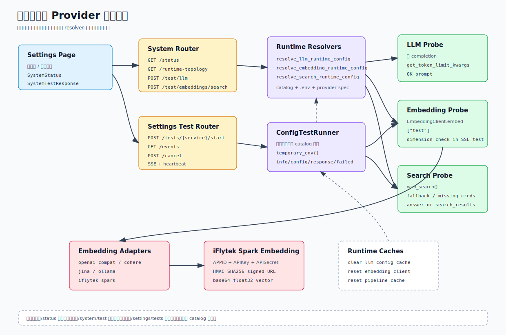

# 系统诊断与 Provider 健康检查

这篇文档解释 SparkWeave 如何判断后端、LLM、Embedding 和搜索服务是否可用。它和 [设置与 Provider 配置](./settings-and-providers.md) 是一组：后者讲 catalog 如何保存和解析，这里讲解析后的配置如何被探针、流式测试、Embedding adapter 和前端设置页消费。



## 代码地图

| 文件 | 责任 |
| --- | --- |
| `sparkweave/api/routers/system.py` | `/api/v1/system/*`：运行拓扑、系统状态、LLM/Embedding/Search 快速连接测试 |
| `sparkweave/api/routers/settings.py` | `/api/v1/settings/tests/*`：设置页流式配置测试入口 |
| `sparkweave/services/config.py` | LLM、Embedding、Search runtime resolver 与 provider spec |
| `sparkweave/services/config_test_runner.py` | 后台测试线程、SSE 事件、临时环境变量 overlay |
| `sparkweave/services/diagnostics.py` | 把常见 provider 错误翻译成面向操作者的提示 |
| `sparkweave/services/embedding_support/client.py` | Embedding adapter 分派、批处理、进度回调 |
| `sparkweave/services/embedding_support/adapters/` | OpenAI-compatible、Cohere、Jina、Ollama、iFlytek Spark adapter |
| `web/src/pages/SettingsPage.tsx` | 设置页状态条、运行拓扑面板、快速探针按钮 |
| `web/src/lib/api.ts` | `getSystemStatus()`、`getRuntimeTopology()`、`testService()`、配置测试 SSE client |
| `tests/api/test_system_router.py` | 系统状态和搜索探针测试 |
| `tests/api/test_settings_router.py` | catalog save/apply 后缓存失效测试 |
| `tests/services/config/test_embedding_runtime.py` | Embedding resolver 测试 |
| `tests/services/embedding/test_client_runtime.py` | EmbeddingClient adapter 分派和批处理测试 |
| `tests/services/embedding/test_iflytek_spark_adapter.py` | 讯飞 Embedding 签名凭证、domain 和向量解码测试 |

## 两类诊断入口

系统诊断分为两层。

| 入口 | 目标 | 是否发起真实请求 | 适合场景 |
| --- | --- | --- | --- |
| `/api/v1/system/status` | 快速读取当前 runtime 配置状态 | 否 | 页面顶部状态、启动后粗略判断 |
| `/api/v1/system/test/{service}` | 用当前已生效配置做一次短探针 | 是 | 保存配置后快速确认 |
| `/api/v1/settings/tests/{service}/start` | 用 catalog 快照做流式测试 | 是 | 设置页测试尚未应用的草稿配置 |

`/system/status` 不应该被理解成“服务一定可连通”。它只说明 resolver 能否得到可用的模型、endpoint 和凭证形态。真正连通性要看 `/system/test/*` 或设置页的流式测试。

## 运行拓扑

```http
GET /api/v1/system/runtime-topology
```

返回当前推荐入口和兼容边界：

```json
{
  "primary_runtime": {
    "transport": "/api/v1/ws",
    "manager": "LangGraphTurnRuntimeManager",
    "orchestrator": "LangGraphRunner",
    "session_store": "SQLiteSessionStore",
    "capability_entry": "CapabilityRegistry",
    "tool_entry": "ToolRegistry"
  },
  "compatibility_routes": [
    { "router": "chat", "mode": "ng_router" },
    { "router": "solve", "mode": "ng_router" },
    { "router": "question", "mode": "ng_router" },
    { "router": "research", "mode": "ng_router" }
  ],
  "isolated_subsystems": [
    { "router": "guide", "mode": "independent_subsystem" },
    { "router": "co_writer", "mode": "independent_subsystem" },
    { "router": "plugins_api", "mode": "playground_transport" }
  ]
}
```

前端通过 `useRuntimeTopology()` 在设置页展示这份拓扑。它的维护价值是让操作者知道：新的交互应优先走 `/api/v1/ws`，旧路由只是兼容或独立子系统。

## 系统状态

```http
GET /api/v1/system/status
```

状态字段：

| 字段 | 来源 | 状态含义 |
| --- | --- | --- |
| `backend` | 当前 endpoint 本身 | 能返回就视为 `online` |
| `llm` | `get_llm_config()` | `configured`、`not_configured`、`error` |
| `embeddings` | `get_embedding_config()` | `configured`、`not_configured`、`error` |
| `search` | `resolve_search_runtime_config()` | `optional`、`configured`、`fallback`、`deprecated`、`unsupported`、`not_configured`、`error` |

典型返回：

```json
{
  "backend": { "status": "online", "timestamp": "2026-04-29T10:00:00" },
  "llm": { "status": "configured", "model": "gpt-5.2", "testable": true },
  "embeddings": {
    "status": "configured",
    "model": "text-embedding-3-large",
    "testable": true
  },
  "search": {
    "status": "fallback",
    "provider": "duckduckgo",
    "testable": true,
    "error": "brave requires api_key, falling back to duckduckgo"
  }
}
```

Search resolver 的特殊规则：

- `brave`、`tavily`、`jina` 缺 API key 时自动 fallback 到 `duckduckgo`。
- `searxng` 缺 `base_url` 时 fallback 到 `duckduckgo`。
- `perplexity`、`serper`、`iflytek_spark` 缺 API key 时标记 `missing_credentials`，不自动 fallback。
- `exa`、`baidu`、`openrouter` 被标记为 deprecated。
- 不在支持列表中的 provider 会标记 unsupported。

## 快速连接测试

快速测试使用已经生效的 runtime 配置：

| 方法 | 路径 | 行为 |
| --- | --- | --- |
| `POST` | `/api/v1/system/test/llm` | 清 LLM 配置缓存，发送一次短 completion |
| `POST` | `/api/v1/system/test/embeddings` | 重置 Embedding client 和 RAG pipeline cache，对 `["test"]` 生成向量 |
| `POST` | `/api/v1/system/test/search` | 解析 Search 配置，搜索 `SparkWeave health check` |

统一返回：

```json
{
  "success": true,
  "message": "Embeddings connection successful (openai provider)",
  "model": "text-embedding-3-large",
  "response_time_ms": 392.5,
  "error": null
}
```

LLM 探针细节：

1. `clear_llm_config_cache()` 确保读取最新配置。
2. `get_llm_config()` 解析模型、binding、base URL 和 API key。
3. 如果 base URL 误填了 `/chat/completions` 或 `/completions` 后缀，会在探针前去掉。
4. 本地模型如果没有 API key，会使用 `sk-no-key-required`。
5. `get_token_limit_kwargs()` 根据模型选择 `max_tokens` 或兼容参数。
6. 发送短提示：要求模型只回答 OK。

Embedding 探针细节：

1. `reset_embedding_client()` 和 `reset_pipeline_cache()` 让新配置立即生效。
2. `get_embedding_config()` 调用 Embedding runtime resolver。
3. `EmbeddingClient` 根据 binding 选择 adapter。
4. 对 `["test"]` 发起请求；只要返回非空向量就视为成功。

Search 探针细节：

1. `resolve_search_runtime_config()` 先判断 unsupported、deprecated、missing credentials 和 fallback。
2. 只有可执行 provider 才调用 `web_search()`。
3. 返回中必须包含 `answer` 或 `search_results`。

## 设置页流式测试

设置页的流式测试入口：

```http
POST /api/v1/settings/tests/{service}/start
GET  /api/v1/settings/tests/{service}/{run_id}/events
POST /api/v1/settings/tests/{service}/{run_id}/cancel
```

`service` 是 `llm`、`embedding` 或 `search`。`start` 可以携带 catalog 草稿：

```json
{
  "catalog": {
    "version": 1,
    "services": {}
  }
}
```

执行链路：

1. `ConfigTestRunner.start()` 创建 `TestRun`，生成 `run_id`。
2. 后台线程调用 `_run_sync()`。
3. `EnvStore.render_from_catalog()` 把 catalog 快照渲染成 legacy env keys。
4. `temporary_env()` 只在本次测试线程内 overlay `os.environ`。
5. runner 分别调用 `_test_llm()`、`_test_embedding()` 或 `_test_search()`。
6. `/events` 用 SSE 输出增量事件；没有新事件时发送 heartbeat。

事件类型：

| 类型 | 说明 |
| --- | --- |
| `info` | 正在解析配置或发起请求 |
| `config` | active profile 摘要，API key 会脱敏 |
| `response` | 成功响应摘要，例如 LLM 片段、向量维度、搜索结果数量 |
| `warning` | fallback 等非致命问题 |
| `completed` | 成功结束 |
| `failed` | 失败，错误经过 `explain_provider_error()` |

流式测试比 `/system/test/*` 更适合设置页，因为它可以测试还没有 apply 的 catalog，也能把中间步骤展示给用户。

## 缓存失效边界

配置变更后必须清掉运行期缓存，否则后续请求可能继续使用旧模型或旧向量维度。

`settings.py` 的 `_invalidate_runtime_caches()` 会执行：

```text
clear_llm_config_cache()
reset_llm_client()
reset_embedding_client()
reset_pipeline_cache()
```

触发点：

| 操作 | 行为 |
| --- | --- |
| `PUT /settings/catalog` | 保存 `model_catalog.json`，清运行期缓存，不写 `.env` |
| `POST /settings/apply` | 保存 catalog，渲染并写 `.env`，清运行期缓存 |
| `POST /settings/tour/complete` | apply catalog，保存 tour 状态，清运行期缓存 |
| `POST /system/test/embeddings` | 测试前重置 Embedding client 和 RAG pipeline cache |

RAG pipeline cache 和 Embedding client 绑定得很紧：换 provider、模型或维度后，如果不重置 pipeline，旧索引或旧 embedding function 可能继续被复用。

## Embedding Client

`get_embedding_config()` 返回标准化的 `EmbeddingConfig`：

| 字段 | 来源 |
| --- | --- |
| `model` | active embedding model 或 `.env` |
| `binding` / `provider_name` | provider alias、模型关键词、base URL 和 provider pool 推断 |
| `api_key` | profile、provider-specific env 或本地模型 dummy key |
| `effective_url` | profile base URL、env fallback 或 provider 默认地址 |
| `extra_headers` | profile extra headers，讯飞会合并 APPID、APISecret、domain |
| `dim` | active model dimension 或 `EMBEDDING_DIMENSION` |
| `batch_size` / `batch_delay` | 当前 resolver 固定返回 `10` 和 `0.0` |

Adapter 分派：

| Binding | Adapter |
| --- | --- |
| `openai`、`custom`、`azure_openai`、`vllm`、`lm_studio` 等 OpenAI-compatible provider | `OpenAICompatibleEmbeddingAdapter` |
| `cohere` | `CohereEmbeddingAdapter` |
| `jina` | `JinaEmbeddingAdapter` |
| `ollama` | `OllamaEmbeddingAdapter` |
| `iflytek_spark` | `IflytekSparkEmbeddingAdapter` |

`EmbeddingClient.embed()` 会按 `batch_size` 切分文本列表，每个 batch 构造：

```python
EmbeddingRequest(
    texts=batch,
    model=config.model,
    dimensions=config.dim,
    input_type=input_type,
)
```

`input_type` 是 task-aware embedding 的提示字段。Cohere、Jina、iFlytek 会用它改变请求语义，OpenAI-compatible 和 Ollama 可以忽略。

## 讯飞 Spark Embedding

讯飞向量模型使用独立的 signed HTTP 协议，不是 OpenAI-compatible embedding endpoint。

默认配置：

| 字段 | 默认值 |
| --- | --- |
| binding | `iflytek_spark` |
| model | `llm-embedding` |
| base URL | `https://emb-cn-huabei-1.xf-yun.com/` |
| dimension | `2560` |
| default domain | `para` |

凭证要求：

| 值 | 推荐位置 | Env fallback |
| --- | --- | --- |
| APPID | embedding profile `extra_headers.app_id` | `IFLYTEK_EMBEDDING_APPID`、`IFLYTEK_EMBEDDING_APP_ID`、`IFLYTEK_APPID`、`XFYUN_EMBEDDING_APPID`、`SPARK_EMBEDDING_APPID` |
| APIKey | embedding profile `api_key` | `IFLYTEK_EMBEDDING_API_KEY`、`IFLYTEK_SPARK_EMBEDDING_API_KEY`、`XFYUN_EMBEDDING_API_KEY`、`SPARK_EMBEDDING_API_KEY` |
| APISecret | embedding profile `extra_headers.api_secret` | `IFLYTEK_EMBEDDING_API_SECRET`、`IFLYTEK_SPARK_EMBEDDING_API_SECRET`、`XFYUN_EMBEDDING_API_SECRET`、`SPARK_EMBEDDING_API_SECRET` |
| domain | embedding profile `extra_headers.domain` | `IFLYTEK_EMBEDDING_DOMAIN`、`SPARK_EMBEDDING_DOMAIN` |

Domain 映射：

| `EmbeddingRequest.input_type` | 讯飞 domain |
| --- | --- |
| `search_query`、`query`、`question` | `query` |
| `search_document` 或空值 | `para` |

请求构造：

1. 把原始文本包装成 `{"messages": [{"content": text, "role": "user"}]}`。
2. JSON 用 UTF-8 编码后 base64，放到 `payload.messages.text`。
3. `parameter.emb.domain` 使用 `query` 或 `para`。
4. 用 `host`、`date`、`request-line` 构造 HMAC-SHA256 签名。
5. `authorization`、`host`、`date` 作为 query string 拼到 base URL。

响应解析：

1. 如果 `header.code != 0`，抛出 provider 错误，附带 code、message 和 sid。
2. 读取 `payload.feature.text`。
3. base64 解码成原始 bytes。
4. bytes 长度必须能被 4 整除。
5. 按 little-endian float32 解包成 `list[float]`。
6. 如果实际维度和配置维度不一致，只记录 warning，不在 adapter 层失败。

设置页流式 embedding 测试会额外检查实际维度和 catalog 里的 `dimension` 是否一致；这比 `/system/test/embeddings` 更严格。

## 诊断提示

`explain_provider_error()` 专门处理几类高频错误：

| 场景 | 处理 |
| --- | --- |
| 讯飞 HMAC 报 `apikey not found` | 根据服务类型提示 LLM、Search 或通用签名凭证配置 |
| 讯飞 Embedding 缺三件套 | 提示填写 APPID、Embedding APIKey、APISecret |
| 讯飞 WebSocket 缺三件套 | 提示填写 APPID、WebSocket APIKey、APISecret |
| Embedding 缺 `app_id` 或 `api_secret` | 提示确认签名参数已保存并应用 |
| 其他错误 | 原样返回 |

这些提示会出现在 `/system/test/*` 的 `error` 字段和设置页流式测试的 `failed` 事件里。

## 前端消费

前端契约在 `web/src/lib/types.ts`：

```ts
export interface SystemStatus {
  backend?: { status: string; timestamp?: string };
  llm?: { status: string; model?: string | null; error?: string };
  embeddings?: { status: string; model?: string | null; error?: string };
  search?: { status: string; provider?: string | null; error?: string };
}

export interface SystemTestResponse {
  success: boolean;
  message: string;
  model?: string | null;
  response_time_ms?: number | null;
  error?: string | null;
}
```

Settings 页面使用方式：

- 顶部状态条读取 `getSystemStatus()`。
- Runtime 拓扑面板读取 `getRuntimeTopology()`。
- 快速检测按钮调用 `testService("llm" | "embeddings" | "search")`。
- 设置页详细测试通过 `startConfigTest()` 和 `EventSource` 读取 SSE。

注意命名差异：系统快速测试的路径是 `/system/test/embeddings`，前端 `testService()` 的参数也是 `"embeddings"`；设置页流式测试使用单数 `"embedding"`，因为 runner 的 `service` 名与 catalog service key 一致。

## 排错速查

| 现象 | 优先检查 |
| --- | --- |
| `/system/status` 显示 LLM `not_configured` | active catalog 是否有模型；`.env` 是否有 `LLM_MODEL`、`LLM_HOST`、`LLM_API_KEY` |
| LLM quick test 空响应 | base URL 是否误填到具体 completions 路径；模型是否支持当前 token 参数 |
| Embedding quick test 空向量 | provider adapter 是否支持当前 binding；`EMBEDDING_DIMENSION` 是否与模型一致 |
| RAG 仍使用旧向量配置 | 是否执行了 apply 或触发了 `reset_pipeline_cache()` |
| 讯飞 Embedding 提示缺凭证 | 确认 APPID、APIKey、APISecret 三者都在同一个 embedding profile/env 集合里 |
| 讯飞向量维度不符 | catalog model dimension 应为 `2560`，或确认实际模型是否变更 |
| Search status 是 `fallback` | 原 provider 缺 key 或 SearXNG 缺 base URL，实际请求会走 `duckduckgo` |
| Search quick test missing credentials | `perplexity`、`serper`、`iflytek_spark` 不会自动 fallback，必须填 key |

## 测试建议

改系统诊断、设置页或 Embedding provider 时优先跑：

```bash
pytest tests/api/test_system_router.py tests/api/test_settings_router.py
pytest tests/services/config/test_embedding_runtime.py
pytest tests/services/embedding/test_client_runtime.py tests/services/embedding/test_iflytek_spark_adapter.py
```

需要真实 provider smoke 时：

```bash
set SPARKWEAVE_NG_LIVE=1
set SPARKWEAVE_NG_LIVE_CAPABILITIES=chat,deep_question
pytest tests/ng/test_live_provider_smoke.py -m live
```

Windows PowerShell：

```powershell
$env:SPARKWEAVE_NG_LIVE = "1"
$env:SPARKWEAVE_NG_LIVE_CAPABILITIES = "chat,deep_question"
pytest tests/ng/test_live_provider_smoke.py -m live
```

## 开发检查清单

- 新增 provider spec 后，同步确认设置页 provider choices、resolver、adapter map 和测试。
- 新增 Embedding adapter 后，补 `tests/services/embedding/test_client_runtime.py` 的 adapter 解析覆盖。
- 改 `EmbeddingConfig.dimension` 或 batch 行为时，同步检查 RAG pipeline cache 是否需要失效。
- 改 `/system/status` 返回结构时，同步更新 `web/src/lib/types.ts` 和设置页状态条。
- 改 `/settings/tests/*` 事件字段时，同步更新设置页 SSE 消费逻辑。
- Provider 错误如果会反复出现，优先加到 `explain_provider_error()`，让用户看到可操作提示。
