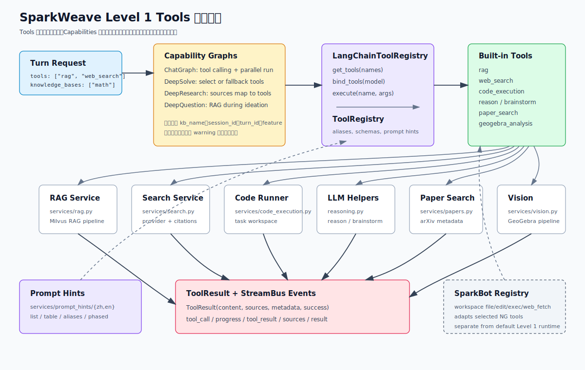

# Tools 工具系统详解

SparkWeave 的 Level 1 Tools 是让 LLM 在一次 turn 中调用的轻量动作：检索知识库、联网搜索、运行代码、做专项推理、找论文或分析图像。它们不负责完整对话流程，完整流程由 Level 2 Capabilities 负责。

本文聚焦默认 NG/LangGraph runtime 使用的共享工具系统，也会说明 SparkBot 的工作区工具为什么是另一条注册路径。

## 一图看懂



工具调用的主链路是：

```text
UnifiedContext.enabled_tools
  -> Capability Graph
  -> LangChainToolRegistry
  -> ToolRegistry
  -> BaseTool wrapper
  -> services/*
  -> ToolResult
  -> StreamBus events
```

## 代码地图

| 文件 | 责任 |
| --- | --- |
| `sparkweave/core/tool_protocol.py` | Tool 协议、参数 schema、prompt hints、统一结果对象 |
| `sparkweave/tools/registry.py` | 共享工具注册表、别名解析、LangChain adapter、OpenAI schema |
| `sparkweave/tools/builtin.py` | 默认内置工具包装层 |
| `sparkweave/services/prompting.py` | 工具 prompt hints 加载和渲染 |
| `sparkweave/services/prompt_hints/{zh,en}/` | 每个工具的中英文使用建议 |
| `sparkweave/graphs/chat.py` | Chat 能力里的 tool calling 主实现 |
| `sparkweave/graphs/deep_solve.py` | 解题能力里的工具选择、fallback、执行 |
| `sparkweave/graphs/deep_question.py` | 出题 ideation 阶段的 RAG 检索 |
| `sparkweave/graphs/deep_research.py` | research source 到工具的映射和执行 |
| `sparkweave/agents/solve/tool_runtime.py` | 兼容 solve agent 的 ReAct 风格工具 runtime |
| `sparkweave/api/routers/plugins_api.py` | Playground 的工具列表、单工具执行、流式执行 |
| `sparkweave/api/main.py` | 启动时校验 capability manifest 引用的 tool 是否已注册 |
| `sparkweave/sparkbot/tools.py` | SparkBot 专用工作区工具注册表 |

## 协议层

所有默认工具都实现 `BaseTool`：

```python
class BaseTool(ABC):
    @abstractmethod
    def get_definition(self) -> ToolDefinition: ...

    @abstractmethod
    async def execute(self, **kwargs: Any) -> ToolResult: ...
```

核心对象：

| 对象 | 用途 |
| --- | --- |
| `ToolParameter` | 描述参数名、类型、是否必填、默认值、枚举 |
| `ToolDefinition` | 描述工具名、说明和参数，并可转成 OpenAI function schema |
| `ToolAlias` | prompt 中暴露的动作别名，例如 `run_code` |
| `ToolPromptHints` | LLM 使用工具时的时机、输入格式、阶段和注意事项 |
| `ToolResult` | 所有工具的统一返回：`content`、`sources`、`metadata`、`success` |
| `ToolEventSink` | 工具内部进度回调，当前主要用于 RAG 把检索进度写回事件流 |

`ToolResult` 是工具层和能力图之间的边界。能力图只需要关心：

```python
ToolResult(
    content="给 LLM 或用户看的文本",
    sources=[{"type": "web", "url": "..."}],
    metadata={"provider": "brave"},
    success=True,
)
```

这让 RAG、搜索、代码执行、论文搜索这些差异很大的后端能力都能被同一种事件协议消费。

## 注册与适配

共享注册表在 `sparkweave/tools/registry.py`：

| 方法 | 说明 |
| --- | --- |
| `register(tool)` | 注册一个 `BaseTool` 实例 |
| `load_builtins()` | 加载 `BUILTIN_TOOL_TYPES` 中的内置工具 |
| `list_tools()` / `names()` | 返回已注册工具名 |
| `get(name)` | 支持别名解析后获取工具 |
| `get_enabled(names)` | 去重并过滤未知工具 |
| `get_definitions(names)` | 返回 `ToolDefinition` |
| `build_openai_schemas(names)` | 生成 function calling schema |
| `build_prompt_text(names, format=...)` | 生成 prompt 中的工具说明 |
| `execute(name, **kwargs)` | 解析别名并执行工具 |

默认单例：

```python
from sparkweave.tools import get_tool_registry

registry = get_tool_registry()
registry.list_tools()
```

`LangChainToolRegistry` 是给 LangGraph / LangChain model binding 使用的 adapter。它把 `ToolDefinition` 转成 `StructuredTool`，内部仍然调用共享 `ToolRegistry.execute()`。

```python
tools = self.tool_registry.get_tools(enabled_tools)
model = model.bind_tools(tools)
```

### 别名解析

当前别名定义在 `sparkweave/tools/builtin.py`：

| 别名 | 实际工具 | 默认参数 |
| --- | --- | --- |
| `rag_hybrid` | `rag` | `mode="hybrid"` |
| `rag_naive` | `rag` | `mode="naive"` |
| `rag_search` | `rag` | 无 |
| `code_execute` | `code_execution` | 无 |
| `run_code` | `code_execution` | 无 |

还有一个兼容细节：如果别名最终解析到 `code_execution`，且入参里有 `query`，注册表会把它改成 `intent`。

```python
await registry.execute("run_code", query="计算 2 + 2")
# 实际传给 code_execution: {"intent": "计算 2 + 2"}
```

### 启动一致性校验

FastAPI 启动时会调用 `validate_tool_consistency()`：

1. 读取 capability manifest 中的 `tools_used`。
2. 读取共享 `ToolRegistry` 的已注册工具。
3. 如果 capability 引用了不存在的工具，启动失败并提示 drift。

所以新增工具后，不能只改能力 manifest；也必须确保工具被注册。

## 内置工具清单

| Tool | 参数 | 服务入口 | 返回重点 | 注意事项 |
| --- | --- | --- | --- | --- |
| `brainstorm` | `topic`、`context?` | `services/reasoning.py` | 多方向想法和 rationale | 单次 LLM 调用，默认偏发散 |
| `rag` | `query`、`kb_name?` | `services/rag.py` | 知识库回答、片段来源 | 没有知识库时返回 `success=false`，不打到后端 RAG |
| `web_search` | `query` | `services/search.py` | 摘要、citations、web sources | provider 解析和回退见设置文档 |
| `code_execution` | `intent`、`code?`、`timeout?` | `services/code_execution.py` | stdout/stderr、artifact、执行目录 | 有 `code` 直接执行；无 `code` 先用 LLM 生成 Python |
| `reason` | `query`、`context?` | `services/reasoning.py` | 专项深度推理文本 | 单次 stateless LLM 调用 |
| `paper_search` | `query`、`max_results?`、`years_limit?`、`sort_by?` | `services/papers.py` | arXiv 题名、作者、摘要、URL | 网络错误或限流时返回友好结果 |
| `geogebra_analysis` | `question`、`image_base64?`、`language?` | `services/vision.py` | GeoGebra commands 和图像分析摘要 | 必须有图片；内部是多阶段视觉流水线 |

视觉输入格式、阶段事件和 OCR/GeoGebra 边界见 [视觉输入、OCR 与 GeoGebra 图像分析](./vision-ocr-geogebra.md)。

### RAG Tool

`RAGTool` 会先检查 `kb_name`。如果没有知识库，返回：

```python
ToolResult(
    success=False,
    metadata={"skipped": True, "reason": "no_kb_selected"},
)
```

能力图也会做上游保护：

- `ChatGraph`：启用 `rag` 但没有 `knowledge_bases` 时，从可绑定工具中移除 `rag` 并发 warning。
- `DeepSolveGraph`：同样移除 `rag` 并发 warning。
- `DeepResearchGraph`：如果 `sources` 包含 `kb` 但没有知识库，会发 `kb_unavailable`；若没有任何可用 source，会发 `no_sources` 并继续生成安全 fallback。
- `DeepQuestionGraph`：只有同时启用 `rag` 且绑定知识库，才在 ideation 阶段检索。

这条规则很重要：RAG 没有知识库时应是可恢复的 skip，而不是 runtime crash。

### Code Execution Tool

`code_execution` 有两条路径：

1. 请求传入 `code`：直接进入 `run_python_code()`。
2. 请求只有 `intent`：先用当前 LLM 生成 Python，再执行。

执行结果会持久化到一个运行目录：

```text
code.py
output.log
用户代码生成的 artifact 文件
```

工作区解析规则：

| 调用场景 | 目录来源 |
| --- | --- |
| `ChatGraph` | `data/user/workspace/chat/chat/<turn_id>/code_runs` 一类 task-scoped 目录 |
| `DeepSolveGraph` | `feature="deep_solve"`，优先用 turn/session 标识 |
| `DeepResearchGraph` | `feature="deep_research"` |
| 显式 `workspace_dir` | 使用调用方传入目录 |
| 无 feature / 无标识 | `_detached_code_execution` |

安全边界是“尽力限制”，不是操作系统级沙箱：

- 只支持 Python。
- AST 阶段限制 import，默认允许 `math`、`numpy`、`pandas`、`matplotlib`、`scipy`、`sympy` 等。
- 禁止 `open`、`exec`、`eval`、`compile`、`__import__`、`input`、`breakpoint`。
- 禁止直接访问 `os`、`sys`、`subprocess`、`socket`、`pathlib`、`shutil` 等模块属性。
- 运行子进程使用当前 Python 的 `-I` isolated mode。
- stdout/stderr、exit code、耗时、artifact 列表都会写入 `ToolResult.metadata`。

如果要执行不可信代码，仍然需要更强的容器级或进程级隔离。

### Web Search Tool

`WebSearchTool` 只是工具包装层，真正 provider 解析在 `services/search_support/` 和 `services/config.py`：

- 返回 dict 时，`answer` 变成 `ToolResult.content`。
- `citations` 被规范成 `sources=[{"type": "web", "url": "...", "title": "..."}]`。
- 配置、fallback、测试入口见 [设置与 Provider 配置](./settings-and-providers.md)。

### Reason 与 Brainstorm

这两个工具都在 `services/reasoning.py`：

- `brainstorm` 使用发散型 system prompt，默认 `temperature=0.8`，适合多个候选方向。
- `reason` 使用严谨分析 prompt，默认 `temperature=0.0`，适合困难子问题。

它们会从 `get_llm_config()` 读取当前 LLM 配置，也允许调用方传 `api_key`、`base_url`、`model`、`max_tokens`、`temperature` 覆盖。

### Paper Search

`paper_search` 使用 `arxiv` 包：

- `max_results` 限制在 1 到 20。
- `years_limit` 默认最近 3 年。
- `sort_by` 支持 `relevance` 和 `date`。
- arXiv 超时、429、网络异常会降级为空列表或友好错误，不应中断整个能力图。

### GeoGebra Analysis

`geogebra_analysis` 是图像几何工具：

```text
question + image_base64
  -> analyze_geogebra_image()
  -> 检测 / 分析 / 脚本生成 / 反思验证
  -> final_ggb_commands
```

它的 prompt hint 明确要求有图片附件。没有图片时工具直接返回 `success=false`。

## Prompt Hints

工具 schema 是给 function calling 的，prompt hints 是给“非严格 function calling”或规划类 agent 的。

目录：

```text
sparkweave/services/prompt_hints/
  en/<tool>.yaml
  zh/<tool>.yaml
```

每个 YAML 通常包含：

```yaml
short_description: "..."
when_to_use: "..."
input_format: "..."
guideline: "..."
note: "..."
phase: "exploration"
aliases:
  - name: run_code
    description: "..."
```

`ToolPromptComposer` 支持四种渲染格式：

| format | 主要用途 |
| --- | --- |
| `list` | 简短列出工具，用在 planner 描述 |
| `table` | ReAct / solve agent 的 action 表 |
| `aliases` | 把别名暴露给模型 |
| `phased` | 按 exploration、expansion、synthesis、verification 分组 |

`SolveToolRuntime` 会用这些 prompt hints 生成 solver 描述，同时加入 `done` 和 `replan` 两个控制动作。

## 能力图如何调用工具

### ChatGraph

`ChatGraph` 是最完整的工具调用实现：

1. 从 `UnifiedContext.enabled_tools` 读取启用工具。
2. 如果 `rag` 启用但没有知识库，移除 `rag` 并发 warning。
3. `LangChainToolRegistry.get_tools()` 生成 LangChain `StructuredTool`。
4. 如果模型支持 `bind_tools()`，把工具绑定到模型。
5. 模型返回 tool calls 后进入 `acting`。
6. 最多并发执行 8 个 tool calls。
7. 每个工具调用发 `tool_call` 事件。
8. RAG 工具会额外注入 `event_sink`，把检索进度变成 `progress` 事件。
9. 执行结束发 `tool_result`。
10. 工具结果作为 `ToolMessage` 追加回对话，让模型继续思考或最终回答。

补参规则在 `_augment_tool_args()`：

| Tool | 自动补充 |
| --- | --- |
| `rag` | 第一个 `knowledge_bases` 作为 `kb_name` |
| `web_search` | 默认 `query=context.user_message` |
| `code_execution` | `intent`、`session_id`、`turn_id`、`feature="chat"` |
| `reason` / `brainstorm` | `context=context.user_message` |

Chat 工具轮次由 `max_tool_rounds` 控制，默认 3 轮。

### DeepSolveGraph

`deep_solve` 的工具阶段更保守：

- planning 后进入工具选择。
- 支持 tool calling 时，让模型最多选择 3 个工具。
- 不支持 tool calling 时，用 fallback 规则：
  - 有 RAG 和知识库，优先 `rag`。
  - 否则有 `web_search`，用网页搜索。
  - 否则问题看起来是计算型，且启用 `code_execution`，用代码执行。
- 工具结果进入草稿求解和验证阶段。

自动补参：

| Tool | 自动补充 |
| --- | --- |
| `rag` | `kb_name` 和默认 query |
| `web_search` / `paper_search` | 默认 query |
| `code_execution` | `intent`、`timeout=30`、`session_id`、`turn_id`、`feature="deep_solve"` |
| `reason` / `brainstorm` | `query` 和 conversation context |

### DeepResearchGraph

`deep_research` 不让模型自由挑所有工具，而是从 research config 的 `sources` 映射：

| source | Tool |
| --- | --- |
| `kb` | `rag` |
| `web` | `web_search` |
| `papers` | `paper_search` |

每个子主题会生成查询，按 depth 控制每个子主题查询数量：

| depth | 每个子主题查询数 |
| --- | --- |
| `quick` | 1 |
| `standard` | 2 |
| `deep` / `manual` | 3 |

代码验证只在这些条件下运行：

```text
code_execution 已启用
并且 (
  config.use_code = true
  或 mode = comparison 且 depth = deep
)
```

### DeepQuestionGraph

`deep_question` 当前只在 ideation 阶段使用 `rag`：

```text
topic
  -> optional RAG retrieval
  -> templates
  -> per-question generation
```

它不会调用 `web_search` 或 `code_execution`，尽管 manifest 和前端默认工具里保留了这些工具名。这里要注意区分“capability 可见工具”和“当前图实现实际调用的工具”。

## Playground 与 API

`sparkweave/api/routers/plugins_api.py` 提供开发调试入口：

| Endpoint | 说明 |
| --- | --- |
| `GET /api/v1/plugins/list` | 列出工具、capabilities、playground plugins |
| `POST /api/v1/plugins/tools/{tool_name}/execute` | 直接执行单个工具 |
| `POST /api/v1/plugins/tools/{tool_name}/execute-stream` | 执行工具并用 SSE 返回 log/result |
| `POST /api/v1/plugins/capabilities/{capability_name}/execute-stream` | 执行 capability 并流式返回 trace |

单工具执行请求：

```json
{
  "params": {
    "query": "Fourier transform tutorial"
  }
}
```

返回结构：

```json
{
  "success": true,
  "content": "...",
  "sources": [],
  "metadata": {}
}
```

## SparkBot 的工具注册表

SparkBot 使用 `sparkweave/sparkbot/tools.py` 构建工作区专用工具注册表。它和默认 Level 1 Tools 共用 `BaseTool` / `ToolResult` 协议，但注册入口不同。

SparkBot 自有工具包括：

| Tool | 说明 |
| --- | --- |
| `read_file` | 读取工作区文件 |
| `write_file` | 写入工作区文件 |
| `edit_file` | 精确替换编辑 |
| `list_dir` | 列目录 |
| `exec` | 执行命令，带超时和 deny pattern |
| `web_fetch` | 抓取 URL 内容 |
| SparkBot `web_search` | 使用 SparkBot config 指定 provider |

同时它会把部分共享 NG 工具包装进去：

```text
brainstorm
rag
web_search
code_execution
reason
paper_search
```

其中 `code_execution` 会被适配到 SparkBot workspace 下的 `.tool_runs/code_execution`。文件工具和命令工具也会做路径约束，禁止访问 workspace 之外的文件。

开发默认聊天/解题/研究工具时，应修改 `sparkweave/tools/builtin.py`；开发 SparkBot 工作区代理工具时，才修改 `sparkweave/sparkbot/tools.py`。

## 新增工具步骤

1. 确认工具是否属于默认 Level 1，还是 SparkBot workspace 专用工具。
2. 如果工具依赖外部系统，先在 `sparkweave/services/` 下做服务封装。
3. 在 `sparkweave/tools/builtin.py` 新增 `BaseTool` 实现。
4. 在 `get_definition()` 中声明稳定的 name、description、参数和 enum。
5. 在 `execute()` 中只返回 `ToolResult`，不要直接操作 `StreamBus`。
6. 如果需要内部进度，接受 `event_sink` 并用 `ToolEventSink` 协议回调。
7. 把工具类加入 `BUILTIN_TOOL_TYPES`。
8. 如需兼容旧 action，加入 `TOOL_ALIASES`。
9. 在 `sparkweave/services/prompt_hints/zh/` 和 `en/` 添加 YAML。
10. 如果某个 capability 默认可使用该工具，更新 `sparkweave/app/facade.py` 的 `tools_used`。
11. 如果前端需要暴露开关，更新 `web/src/lib/capabilities.ts` 的 `TOOL_OPTIONS` 和默认工具。
12. 如果工具有 provider 配置，更新 `docs/settings-and-providers.md`、`.env.example` 和 config resolver。
13. 添加测试。
14. 更新本文档和 [系统架构](./architecture.md) 中的工具清单。

推荐测试位置：

| 改动 | 测试 |
| --- | --- |
| 协议 / registry | `tests/ng/test_tools_registry.py` |
| 内置工具包装 | `tests/core/test_builtin_tools.py` |
| Chat tool calling | `tests/ng/test_chat_graph.py`、`tests/agents/chat/test_agentic_parallel_tools.py` |
| RAG 绑定一致性 | `tests/capabilities/test_rag_consistency.py` |
| Solve runtime prompt / alias | `tests/agents/solve/test_tool_runtime.py` |
| Code runner 安全 | `tests/core/test_code_executor_safety.py`、`tests/tools/test_code_executor.py` |
| Web search provider | `tests/tools/test_web_search.py` |
| API playground | `tests/api/test_plugins_api.py` |

## 常见问题

### 工具注册了，但模型不调用

先检查：

- 请求里的 `tools` 是否包含该工具。
- `ToolRegistry.list_tools()` 是否能看到工具。
- 目标模型是否支持 `bind_tools()`。
- prompt hints 是否描述了明确的使用时机。
- capability 图是否会过滤未知工具或无条件跳过该工具。

### RAG 工具没有执行

RAG 需要两个条件：

```text
tools 包含 "rag"
knowledge_bases 至少有一个库名
```

如果只启用 `rag` 但没有知识库，正确行为是 warning + skip。

### 单工具 API 能跑，capability 里不跑

这通常说明包装层没问题，但能力图没有选择它。重点看：

- `ChatGraph._enabled_tools()`
- `DeepSolveGraph._fallback_tool_calls()`
- `DeepResearchGraph._available_sources()`
- `DeepQuestionGraph._retrieve_knowledge()`

### 代码执行生成了文件，但前端看不到

`code_execution` 会记录 artifact 路径，但静态访问还受 `PathService.is_public_output_path()` 和 `SafeOutputStaticFiles` 控制。不是所有运行目录里的文件都会通过 `/api/outputs` 暴露。

### capability manifest 引用了工具，服务启动失败

这是 `validate_tool_consistency()` 捕获了配置漂移。要么注册缺失工具，要么从 manifest 的 `tools_used` 删除已经废弃的工具名。
