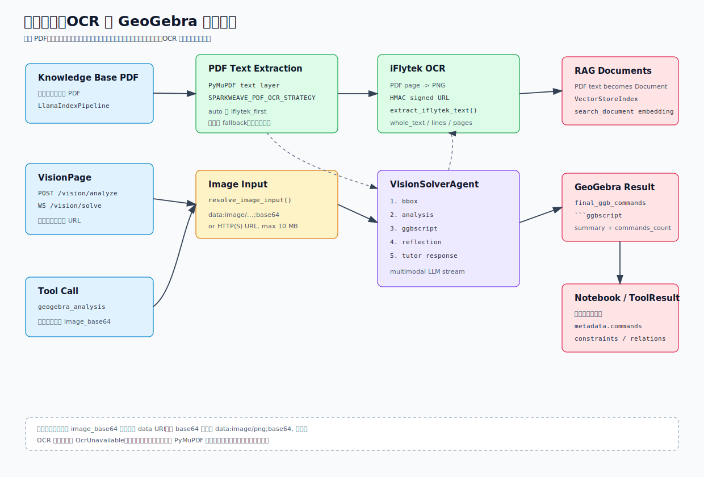

# 视觉输入、OCR 与 GeoGebra 图像分析

SparkWeave 的视觉相关能力分成三条链路：知识库 PDF OCR、独立图像题解析页面、以及聊天工具中的 `geogebra_analysis`。这三条链路共享 LLM 配置、图像输入规范和部分视觉分析服务，但面向的用户场景不同。



## 代码地图

| 文件 | 责任 |
| --- | --- |
| `sparkweave/services/ocr.py` | 讯飞 OCR 签名请求、图片 OCR、PDF 渲染后逐页 OCR、OCR 文本抽取 |
| `sparkweave/services/rag_support/pipelines/llamaindex.py` | 知识库 PDF 文本层解析和 OCR fallback 策略 |
| `sparkweave/services/vision_input.py` | 图像 data URI / URL 输入校验、下载、MIME 推断、大小限制 |
| `sparkweave/services/vision.py` | `VisionSolverAgent`：bbox、analysis、GeoGebra script、reflection、tutor response |
| `sparkweave/api/routers/vision_solver.py` | `/api/v1/vision/analyze` 和 `/api/v1/vision/solve` |
| `sparkweave/tools/builtin.py` | `GeoGebraAnalysisTool`，把视觉 pipeline 暴露为 Level 1 tool |
| `web/src/pages/VisionPage.tsx` | 图像题工作台：上传/URL、快速解析、实时解题、保存 Notebook |
| `web/src/lib/api.ts` | `analyzeVisionImage()`、`visionSolveSocketUrl()` |
| `sparkweave/services/vision_prompts/` | bbox、analysis、ggbscript、reflection、tutor 五段提示词 |
| `tests/services/test_ocr.py` | 讯飞 OCR 响应解析和签名 URL 测试 |
| `tests/ng/test_vision_input.py` | 图像输入规范化测试 |
| `tests/api/test_vision_solver_router.py` | REST 图像分析路由测试 |
| `tests/ng/test_builtin_tool_services.py` | `geogebra_analysis` 工具和 `VisionSolverAgent` 行为测试 |

## 三条链路

| 链路 | 入口 | 输出 | 典型用途 |
| --- | --- | --- | --- |
| 知识库 PDF OCR | 知识库上传 / 增量索引 | 文本 `Document` | 扫描版 PDF 进入 RAG |
| 图像题 REST 分析 | `POST /api/v1/vision/analyze` | GeoGebra commands 和 summary | 快速得到作图结果 |
| 图像题 WebSocket 解题 | `ws /api/v1/vision/solve` | 阶段事件、GeoGebra block、导师讲解流 | 前端实时展示完整过程 |
| 聊天工具调用 | `geogebra_analysis` | `ToolResult` | Chat/DeepSolve 在有图片时生成几何分析 |

这几条链路都依赖当前 LLM runtime 配置。`VisionSolverAgent` 会使用 `get_llm_config()` 得到 `model`、`api_key`、`base_url`、`api_version` 和 `binding`；如果没有单独指定 `vision_model`，视觉阶段和文本导师讲解共用同一个模型。

## 图像输入契约

`sparkweave.services.vision_input` 负责把图像输入统一成 data URI：

```text
data:image/png;base64,<payload>
```

直接传 `image_base64` 时，后端要求它已经是 data URI，必须满足：

```python
data.startswith("data:image/") and ";base64," in data
```

如果调用方只有裸 base64，需要先补 MIME 前缀。否则会抛出：

```text
Invalid base64 image format, should be data:image/...;base64,...
```

传 `image_url` 时，后端会下载并转换成 data URI：

1. 只允许 `http` 和 `https`。
2. `httpx.AsyncClient` 超时为 30 秒，并跟随重定向。
3. 从 `Content-Type` 读取 MIME；如果是空值或 `application/octet-stream`，再从 URL 后缀推断。
4. 支持 `jpeg`、`jpg`、`png`、`gif`、`webp`。
5. 最大图片体积是 10 MB。
6. 下载完成后统一转成 `data:<mime>;base64,...`。

`image_base64` 优先级高于 `image_url`。如果两者都提供且 base64 合法，会直接使用 base64，不再下载 URL。

## VisionSolverAgent

`VisionSolverAgent` 是图像题分析主服务。它加载五份提示词：

| Prompt | 作用 |
| --- | --- |
| `bbox.md` | 识别图中元素、位置、标签和大致边界 |
| `analysis.md` | 分析题目、几何关系、约束、相对位置和构造步骤 |
| `ggbscript.md` | 根据识别结果生成 GeoGebra commands |
| `reflection.md` | 复核命令，修正错误假设和不满足约束的构造 |
| `tutor.md` | 基于最终命令和分析结果生成导师讲解 |

非流式处理：

```text
process()
  -> _process_bbox()
  -> _process_analysis()
  -> _process_ggbscript()
  -> _process_reflection()
  -> final_ggb_commands
```

每个视觉阶段都会调用 `_call_vision_llm()`，以 OpenAI-style multimodal messages 发送：

```json
[
  {
    "role": "user",
    "content": [
      { "type": "text", "text": "..." },
      { "type": "image_url", "image_url": { "url": "data:image/png;base64,..." } }
    ]
  }
]
```

响应会用 `parse_json_response()` 解析。单个阶段失败不会让整个 pipeline 崩溃，而是记录日志并返回空结构：

| 阶段 | fallback |
| --- | --- |
| bbox | `{"image_dimensions": {"width": 0, "height": 0}, "elements": []}` |
| analysis | 空元素、空约束、`image_reference_detected=false` |
| ggbscript | `{"commands": []}` |
| reflection | 空复核结果，最终命令回退到 ggbscript 阶段输出 |

这意味着 REST/WS 调用可能成功返回，但 commands 为空。前端和工具调用方应该看 `commands_count` 或 `final_ggb_commands`，不要只看 HTTP 状态。

## REST 图像分析

```http
POST /api/v1/vision/analyze
```

请求：

```json
{
  "question": "根据图像分析这道几何题",
  "image_base64": "data:image/png;base64,...",
  "image_url": null,
  "session_id": "vision-1"
}
```

返回：

```json
{
  "session_id": "vision-1",
  "has_image": true,
  "final_ggb_commands": [
    { "command": "A=(0,0)", "description": "point A" }
  ],
  "ggb_script": "```ggbscript[analysis;题目图形]\nA=(0,0)\n```",
  "analysis_summary": {
    "image_is_reference": false,
    "elements_count": 1,
    "commands_count": 1
  }
}
```

路由行为：

1. `resolve_image_input()` 统一图片。
2. 读取 LLM 配置，失败返回 500。
3. 读取 UI 语言，默认中文。
4. 初始化 `VisionSolverAgent`。
5. 调用 `agent.process()`。
6. 如果有 commands，用 `format_ggb_block(page_id="analysis")` 包成 fenced block。
7. `ImageError` 返回 400，其他异常返回 500。

## WebSocket 实时解题

```text
ws://<host>/api/v1/vision/solve
```

客户端第一条消息：

```json
{
  "question": "根据图像分析这道几何题",
  "image_base64": "data:image/png;base64,...",
  "image_url": null,
  "session_id": "vision-1"
}
```

事件顺序：

| type | data |
| --- | --- |
| `session` | `{ "session_id": "..." }` |
| `analysis_start` | `{ "session_id": "..." }` |
| `bbox_complete` | 元素数量和前 10 个元素摘要 |
| `analysis_complete` | 约束数量、关系数量、是否参考图、前 10 个约束 |
| `ggbscript_complete` | 命令数量和前 10 条命令 |
| `reflection_complete` | 问题数量、最终命令数量、`final_commands` |
| `analysis_message_complete` | `ggb_block` 和 constraints / relations 摘要 |
| `answer_start` | `{ "has_image_analysis": true }` |
| `text` | 导师讲解增量文本 |
| `done` | 结束 |

如果没有图片，会发送：

```json
{ "type": "no_image", "data": {} }
{ "type": "done" }
```

如果初始消息缺少 `question`，会发送：

```json
{ "type": "error", "content": "Question is required" }
```

WebSocket 路由用 `safe_send_json()` 包装发送，连接断开时会停止继续推送，避免重复抛出 RuntimeError。

## 前端 VisionPage

`web/src/pages/VisionPage.tsx` 提供两个按钮：

| 按钮 | 后端入口 | 前端效果 |
| --- | --- | --- |
| 快速解析 | `POST /api/v1/vision/analyze` | 一次性返回 commands、summary 和 ggb script |
| 实时解题 | `ws /api/v1/vision/solve` | 展示阶段事件，流式累加导师讲解 |

前端会维护：

| 状态 | 含义 |
| --- | --- |
| `events` | 最近 80 条 WebSocket 事件 |
| `analysis` | REST 返回的 `VisionAnalyzeResponse` |
| `liveCommands` | WS 中 `final_commands` 或 `commands` |
| `liveScript` | WS 中 `ggb_block.content` |
| `answer` | WS `text.data.content` 累加 |

保存 Notebook 时，前端写入：

```json
{
  "record_type": "solve",
  "title": "图像题解析",
  "user_query": "<question>",
  "output": "题目 + 导师讲解 + GeoGebra 指令",
  "metadata": {
    "source": "vision_lab",
    "analysis": {},
    "commands": []
  }
}
```

## GeoGebra Analysis Tool

`geogebra_analysis` 是 Level 1 tool，定义在 `sparkweave/tools/builtin.py`。

参数：

| 参数 | 必填 | 说明 |
| --- | --- | --- |
| `question` | 是 | 图像题文字或分析目标 |
| `image_base64` | 否 | 图片 data URI；通过聊天附件调用时通常由上游注入 |
| `language` | 否 | `zh` 或 `en`，默认 `zh` |

执行行为：

1. 没有图片时返回 `success=false`，内容为 `No image provided...`。
2. 调用 `analyze_geogebra_image()`。
3. 如果 pipeline 没有处理图片，返回 `success=false`。
4. 读取 `analysis_output.constraints` 和 `geometric_relations` 生成摘要。
5. 把 GeoGebra fenced block 放入 `ToolResult.content`。
6. metadata 写入 `commands_count`、`final_ggb_commands`、`bbox_elements`、`constraints_count`、`relations_count`、`reflection_issues`。

工具返回示意：

````text
Constraints (2): [...]
Relations (1): [...]

```ggbscript[main;Problem Figure]
A=(0,0)
B=(1,0)
Segment(A,B)
```
````

新增聊天侧视觉能力时，应优先复用这个工具，而不是直接从 graph 内部重复写视觉 pipeline。

## OCR 服务

`sparkweave/services/ocr.py` 当前支持讯飞 OCR。配置对象：

```python
XfyunOcrConfig(
    app_id="...",
    api_key="...",
    api_secret="...",
    url="https://api.xf-yun.com/v1/private/sf8e6aca1",
    service_id="sf8e6aca1",
    category="ch_en_public_cloud",
    timeout=30.0,
)
```

环境变量：

| 变量 | 说明 |
| --- | --- |
| `SPARKWEAVE_OCR_PROVIDER` | `iflytek`、`xunfei`、`xfyun`；其他值会让讯飞 OCR 不可用 |
| `IFLYTEK_OCR_APPID` / `XFYUN_OCR_APPID` | OCR APPID |
| `IFLYTEK_OCR_API_KEY` / `XFYUN_OCR_API_KEY` | OCR APIKey |
| `IFLYTEK_OCR_API_SECRET` / `XFYUN_OCR_API_SECRET` | OCR APISecret |
| `IFLYTEK_OCR_URL` | OCR endpoint |
| `IFLYTEK_OCR_SERVICE_ID` | 默认 `sf8e6aca1` |
| `IFLYTEK_OCR_CATEGORY` | 默认 `ch_en_public_cloud` |
| `SPARKWEAVE_OCR_TIMEOUT` | 请求超时秒数，默认 30 |
| `SPARKWEAVE_OCR_MAX_PAGES` | PDF OCR 最大页数，默认 20 |
| `SPARKWEAVE_OCR_DPI` | PDF 渲染 DPI，默认 180 |

签名方式：

1. `date = formatdate(usegmt=True)`。
2. 构造 request line：`POST <path> HTTP/1.1`。
3. 签名原文是 `host`、`date`、`request-line` 三行。
4. 使用 APISecret 做 HMAC-SHA256。
5. authorization 再 base64 后进入 query string。

图片 OCR：

```text
recognize_image_with_iflytek(image_bytes, encoding="png")
  -> _build_iflytek_payload()
  -> _build_iflytek_auth_url()
  -> urlopen()
  -> extract_iflytek_text()
```

`extract_iflytek_text()` 支持两种响应形态：

| 响应位置 | 场景 |
| --- | --- |
| `payload.result.text` | 标准 OCR 服务 |
| `payload.recognizeDocumentRes.text` | `hh_ocr_recognize_doc` 服务 |

`text` 是 base64 编码的 JSON 或纯文本。解析 JSON 后会递归提取：

- `whole_text`
- `lines[].text`
- `lines[].words[].content`
- `pages[]`

## 知识库 PDF OCR 策略

知识库 LlamaIndex pipeline 中，PDF 解析位于：

```text
LlamaIndexPipeline._extract_pdf_text()
```

策略由 `SPARKWEAVE_PDF_OCR_STRATEGY` 控制。

### auto 默认策略

```text
PyMuPDF 文本层
  -> 若文本长度 >= SPARKWEAVE_OCR_MIN_TEXT_CHARS，直接使用
  -> 若文本太短且讯飞 OCR 已配置，尝试 OCR fallback
  -> OCR 失败时回退到文本层结果
```

`SPARKWEAVE_OCR_MIN_TEXT_CHARS` 默认是 80。

### iflytek_first 策略

```text
iFlytek OCR
  -> 有文本则直接使用
  -> 空结果或 OcrUnavailable 时回退 PyMuPDF
```

PDF OCR 会用 PyMuPDF 把每页渲染成 PNG，再逐页调用 `recognize_image_with_iflytek()`：

```text
ocr_pdf_with_iflytek()
  -> fitz.open(pdf)
  -> page.get_pixmap(dpi=SPARKWEAVE_OCR_DPI)
  -> pixmap.tobytes("png")
  -> recognize_image_with_iflytek()
  -> "## Page N\n<text>"
```

OCR 失败会抛 `OcrUnavailable`，上游知识库解析会记录 warning 并 fallback，不会因为 OCR 不可用直接让整个知识库索引崩溃。

## Visualize Capability 的边界

`visualize` capability 和这里的图像题分析不同：

| 能力 | 输入 | 输出 | 文件 |
| --- | --- | --- | --- |
| `visualize` | 文本描述 | SVG、Mermaid、Chart.js 等可渲染代码 | `sparkweave/graphs/visualize.py` |
| `geogebra_analysis` / VisionPage | 图像 + 题目 | GeoGebra commands 和导师讲解 | `sparkweave/services/vision.py` |

两者都能生成可视化内容，但 `visualize` 是“从文本创建图”，`VisionSolverAgent` 是“从题图还原几何结构并讲解”。

## 排错速查

| 现象 | 优先检查 |
| --- | --- |
| `Invalid base64 image format` | `image_base64` 是否是 data URI；裸 base64 需要补 `data:image/png;base64,` |
| `Unsupported image format` | URL 的 `Content-Type` 或后缀是否是 jpeg/png/gif/webp |
| `Image too large` | 图片超过 10 MB |
| REST 返回成功但没有 commands | 看 `bbox_output`、`analysis_output`、`ggbscript_output`，某个 LLM 阶段可能 fallback 为空 |
| WebSocket 只有 `no_image` | 请求没有合法图片，或图片下载失败后被吞掉为空 |
| GeoGebra tool 返回 `No image provided` | 上游没有把附件注入到 `image_base64` 参数 |
| OCR 配置后没有生效 | `SPARKWEAVE_OCR_PROVIDER` 是否为 `iflytek/xunfei/xfyun`，三件套是否完整 |
| 扫描版 PDF 仍为空 | 调低 `SPARKWEAVE_OCR_MIN_TEXT_CHARS`，或使用 `SPARKWEAVE_PDF_OCR_STRATEGY=iflytek_first` |
| OCR 请求失败 | 检查签名三件套、service_id、category、网络和 `SPARKWEAVE_OCR_TIMEOUT` |

## 测试建议

改 OCR、图像输入、视觉路由或 GeoGebra 工具时优先跑：

```bash
pytest tests/services/test_ocr.py
pytest tests/ng/test_vision_input.py
pytest tests/api/test_vision_solver_router.py
pytest tests/ng/test_builtin_tool_services.py
pytest tests/core/test_builtin_tools.py
```

如果改知识库 PDF OCR fallback，再补：

```bash
pytest tests/services
pytest tests/ng/test_question_mineru_live.py -m live
```

live OCR 和 live vision 依赖真实 provider 凭证，默认不应进入普通 CI。

## 开发检查清单

- 新增图像输入来源时，先接入 `resolve_image_input()`，保持 data URI 输出。
- 新增视觉阶段时，同步更新 `stream_process_with_tutor()` 的事件和前端 `VisionPage` 消费逻辑。
- 改 GeoGebra command 结构时，同步更新 `format_ggb_block()`、`GeoGebraAnalysisTool` metadata 和前端脚本展示。
- 改 OCR provider 时，保证失败抛 `OcrUnavailable`，让知识库 pipeline 可以 fallback。
- 新增 OCR 环境变量时，同步更新 `.env.example`、[环境变量配置](./configuration.md) 和本文档。
- 图像题能力依赖多模态模型；切换 provider 后，优先用 `/vision/analyze` 做一张小图 smoke test。
